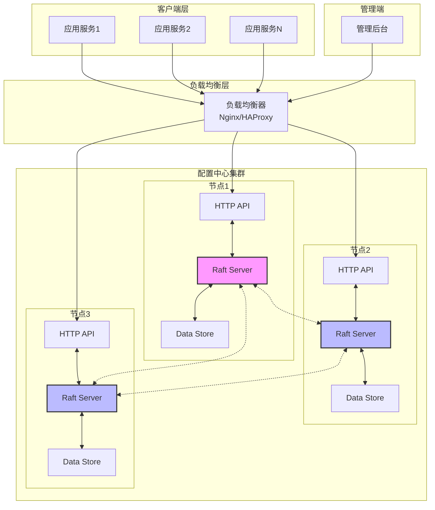
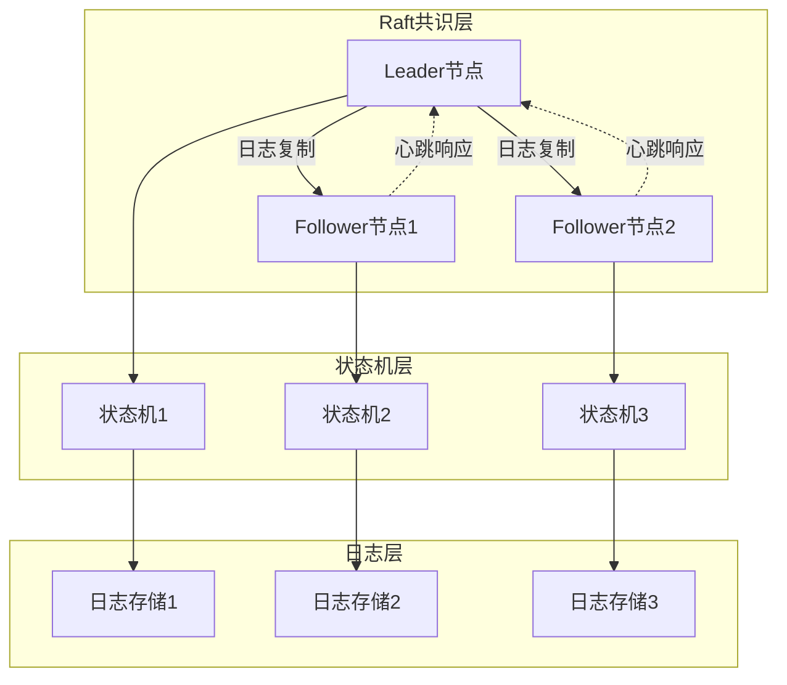
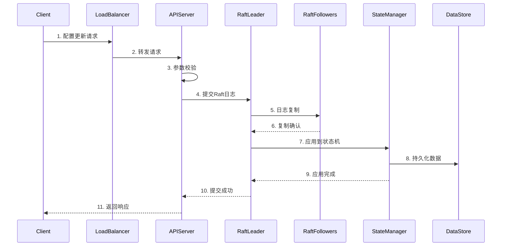
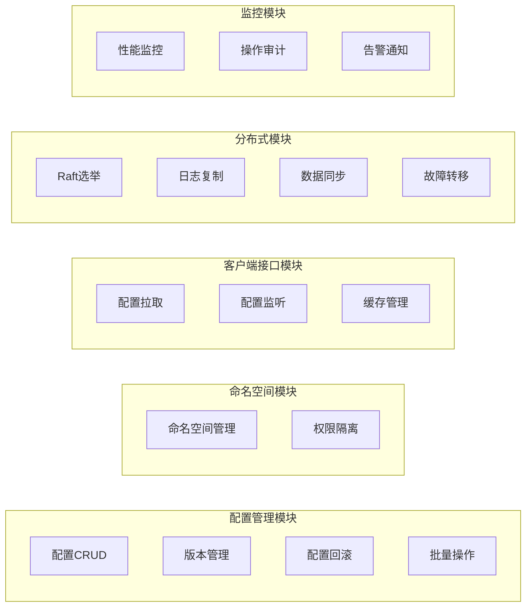
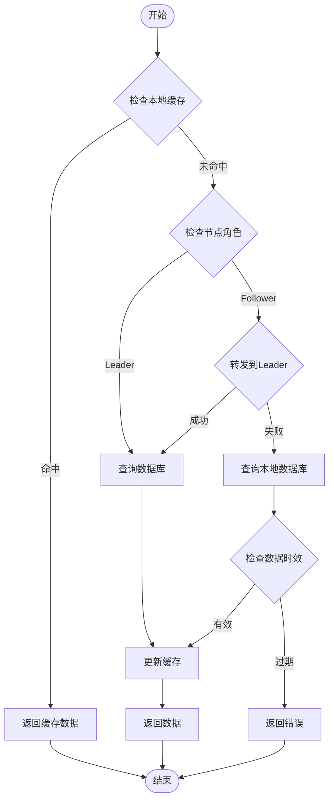
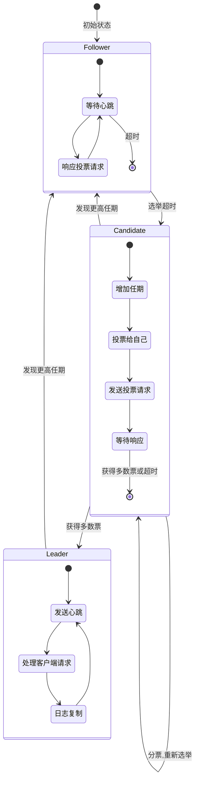

# 分布式配置中心设计文档

## 一、引言

### 文档变更日志

| 版本 | 日期 | 作者 | 变更内容 |
|------|------|------|----------|
| v1.0 | 2024-01-20 | System | 初始版本，完成分布式配置中心整体设计 |

## 二、项目概述

### 2.1 需求背景

随着微服务架构的普及，系统中的服务数量急剧增加，每个服务都有大量的配置需要管理。传统的配置文件管理方式存在以下问题：

1. **配置分散**：配置文件分散在各个服务中，难以统一管理
2. **更新困难**：配置更新需要重启服务，影响服务可用性
3. **版本管理复杂**：难以追踪配置的历史变更
4. **缺乏权限控制**：无法对配置进行精细的权限管理
5. **高可用性要求**：单点配置服务容易成为系统瓶颈

为解决上述问题，我们设计了一个基于Raft协议的分布式配置中心，提供：
- 集中化的配置管理
- 基于namespace的配置隔离
- 实时配置推送能力
- 配置版本管理
- 高可用的分布式架构

## 三、详细设计

### 3.1 系统架构设计

#### 3.1.1 系统架构图



#### 3.1.2 Raft模块架构图



#### 3.1.3 数据流架构图



### 3.2 数据库设计

#### 3.2.1 数据模型

##### 1. namespace表
```sql
CREATE TABLE namespace (
    id BIGINT PRIMARY KEY AUTO_INCREMENT,
    name VARCHAR(128) NOT NULL UNIQUE COMMENT '命名空间名称',
    description VARCHAR(512) COMMENT '描述',
    status TINYINT NOT NULL DEFAULT 1 COMMENT '状态: 1-启用, 0-禁用',
    created_at DATETIME NOT NULL DEFAULT CURRENT_TIMESTAMP,
    updated_at DATETIME NOT NULL DEFAULT CURRENT_TIMESTAMP ON UPDATE CURRENT_TIMESTAMP,
    INDEX idx_name (name),
    INDEX idx_status (status)
) ENGINE=InnoDB DEFAULT CHARSET=utf8mb4 COMMENT='命名空间表';
```

##### 2. config表
```sql
CREATE TABLE config (
    id BIGINT PRIMARY KEY AUTO_INCREMENT,
    namespace_id BIGINT NOT NULL COMMENT '命名空间ID',
    key VARCHAR(256) NOT NULL COMMENT '配置键',
    value TEXT NOT NULL COMMENT '配置值(JSON格式)',
    version INT NOT NULL DEFAULT 1 COMMENT '版本号',
    description VARCHAR(512) COMMENT '配置描述',
    status TINYINT NOT NULL DEFAULT 1 COMMENT '状态: 1-启用, 0-禁用',
    created_by VARCHAR(64) COMMENT '创建人',
    updated_by VARCHAR(64) COMMENT '更新人',
    created_at DATETIME NOT NULL DEFAULT CURRENT_TIMESTAMP,
    updated_at DATETIME NOT NULL DEFAULT CURRENT_TIMESTAMP ON UPDATE CURRENT_TIMESTAMP,
    UNIQUE KEY uk_namespace_key (namespace_id, key),
    INDEX idx_namespace_id (namespace_id),
    INDEX idx_key (key),
    INDEX idx_status (status),
    FOREIGN KEY (namespace_id) REFERENCES namespace(id)
) ENGINE=InnoDB DEFAULT CHARSET=utf8mb4 COMMENT='配置表';
```

##### 3. config_history表
```sql
CREATE TABLE config_history (
    id BIGINT PRIMARY KEY AUTO_INCREMENT,
    config_id BIGINT NOT NULL COMMENT '配置ID',
    namespace_id BIGINT NOT NULL COMMENT '命名空间ID',
    key VARCHAR(256) NOT NULL COMMENT '配置键',
    old_value TEXT COMMENT '旧值',
    new_value TEXT NOT NULL COMMENT '新值',
    version INT NOT NULL COMMENT '版本号',
    operation VARCHAR(32) NOT NULL COMMENT '操作类型: CREATE/UPDATE/DELETE',
    operator VARCHAR(64) COMMENT '操作人',
    created_at DATETIME NOT NULL DEFAULT CURRENT_TIMESTAMP,
    INDEX idx_config_id (config_id),
    INDEX idx_namespace_id (namespace_id),
    INDEX idx_created_at (created_at)
) ENGINE=InnoDB DEFAULT CHARSET=utf8mb4 COMMENT='配置历史表';
```

##### 4. raft_log表
```sql
CREATE TABLE raft_log (
    id BIGINT PRIMARY KEY AUTO_INCREMENT,
    term BIGINT NOT NULL COMMENT 'Raft任期',
    index BIGINT NOT NULL UNIQUE COMMENT 'Raft日志索引',
    type VARCHAR(32) NOT NULL COMMENT '日志类型',
    data BLOB NOT NULL COMMENT '日志数据',
    created_at DATETIME NOT NULL DEFAULT CURRENT_TIMESTAMP,
    INDEX idx_term (term),
    INDEX idx_index (index)
) ENGINE=InnoDB DEFAULT CHARSET=utf8mb4 COMMENT='Raft日志表';
```

##### 5. raft_state表
```sql
CREATE TABLE raft_state (
    node_id VARCHAR(64) PRIMARY KEY COMMENT '节点ID',
    current_term BIGINT NOT NULL DEFAULT 0 COMMENT '当前任期',
    voted_for VARCHAR(64) COMMENT '投票给谁',
    role VARCHAR(32) NOT NULL DEFAULT 'FOLLOWER' COMMENT '角色: LEADER/CANDIDATE/FOLLOWER',
    commit_index BIGINT NOT NULL DEFAULT 0 COMMENT '已提交的日志索引',
    last_applied BIGINT NOT NULL DEFAULT 0 COMMENT '最后应用的日志索引',
    updated_at DATETIME NOT NULL DEFAULT CURRENT_TIMESTAMP ON UPDATE CURRENT_TIMESTAMP
) ENGINE=InnoDB DEFAULT CHARSET=utf8mb4 COMMENT='Raft状态表';
```

### 3.3 系统功能设计

#### 3.3.1 功能模块划分



#### 3.3.2 核心功能流程

##### 1. 配置创建流程


##### 2. 配置读取流程



##### 3. Raft选举流程



### 3.4 接口设计

#### 3.4.1 API设计原则

遵循365 API规范：
1. RESTful风格设计
2. 统一的请求/响应格式
3. 标准的HTTP状态码
4. 版本化管理
5. 统一的错误处理

#### 3.4.2 统一响应格式

```json
{
    "code": 0,
    "message": "success",
    "data": {},
    "request_id": "550e8400-e29b-41d4-a716-446655440000",
    "timestamp": 1705734400
}
```

错误响应格式：
```json
{
    "code": 40001,
    "message": "参数错误",
    "error": {
        "details": "namespace不能为空"
    },
    "request_id": "550e8400-e29b-41d4-a716-446655440000",
    "timestamp": 1705734400
}
```

#### 3.4.3 客户端配置读取接口

##### 1. 获取单个配置

**接口地址**: `GET /api/v1/config/get`

**请求参数**:
| 参数名 | 类型 | 必填 | 说明 |
|--------|------|------|------|
| namespace | string | 是 | 命名空间 |
| key | string | 是 | 配置键 |

**请求示例**:
```bash
GET /api/v1/config/get?namespace=user-service&key=database.mysql.host
```

**响应示例**:
```json
{
    "code": 0,
    "message": "success",
    "data": {
        "namespace": "user-service",
        "key": "database.mysql.host",
        "value": {
            "host": "192.168.1.100",
            "port": 3306,
            "username": "root",
            "database": "user_db"
        },
        "version": 3,
        "updated_at": "2024-01-20T10:00:00Z"
    },
    "request_id": "550e8400-e29b-41d4-a716-446655440000",
    "timestamp": 1705734400
}
```

##### 2. 批量获取配置

**接口地址**: `POST /api/v1/config/batch-get`

**请求参数**:
```json
{
    "namespace": "user-service",
    "keys": ["database.mysql", "redis.cluster", "app.settings"]
}
```

**响应示例**:
```json
{
    "code": 0,
    "message": "success",
    "data": {
        "namespace": "user-service",
        "configs": [
            {
                "key": "database.mysql",
                "value": {
                    "host": "192.168.1.100",
                    "port": 3306
                },
                "version": 3
            },
            {
                "key": "redis.cluster",
                "value": {
                    "nodes": ["192.168.1.101:6379", "192.168.1.102:6379"]
                },
                "version": 2
            }
        ]
    },
    "request_id": "550e8400-e29b-41d4-a716-446655440000",
    "timestamp": 1705734400
}
```

##### 3. 获取命名空间所有配置

**接口地址**: `GET /api/v1/config/namespace/{namespace}`

**请求参数**:
| 参数名 | 类型 | 必填 | 说明 |
|--------|------|------|------|
| namespace | string | 是 | 命名空间(路径参数) |

**响应示例**:
```json
{
    "code": 0,
    "message": "success",
    "data": {
        "namespace": "user-service",
        "configs": {
            "database.mysql": {
                "host": "192.168.1.100",
                "port": 3306
            },
            "redis.cluster": {
                "nodes": ["192.168.1.101:6379"]
            },
            "app.settings": {
                "timeout": 30,
                "retry": 3
            }
        },
        "version": 15,
        "updated_at": "2024-01-20T10:00:00Z"
    },
    "request_id": "550e8400-e29b-41d4-a716-446655440000",
    "timestamp": 1705734400
}
```

#### 3.4.4 后台管理接口

##### 1. 创建配置

**接口地址**: `POST /api/v1/admin/config`

**请求参数**:
```json
{
    "namespace": "user-service",
    "key": "new.config.key",
    "value": {
        "setting1": "value1",
        "setting2": 123
    },
    "description": "新配置项描述"
}
```

**响应示例**:
```json
{
    "code": 0,
    "message": "配置创建成功",
    "data": {
        "id": 12345,
        "namespace": "user-service",
        "key": "new.config.key",
        "version": 1
    },
    "request_id": "550e8400-e29b-41d4-a716-446655440000",
    "timestamp": 1705734400
}
```

##### 2. 更新配置

**接口地址**: `PUT /api/v1/admin/config`

**请求参数**:
```json
{
    "namespace": "user-service",
    "key": "database.mysql",
    "value": {
        "host": "192.168.1.200",
        "port": 3306
    },
    "description": "更新数据库地址"
}
```

**响应示例**:
```json
{
    "code": 0,
    "message": "配置更新成功",
    "data": {
        "id": 12345,
        "namespace": "user-service",
        "key": "database.mysql",
        "version": 4,
        "old_version": 3
    },
    "request_id": "550e8400-e29b-41d4-a716-446655440000",
    "timestamp": 1705734400
}
```

##### 3. 删除配置

**接口地址**: `DELETE /api/v1/admin/config`

**请求参数**:
| 参数名 | 类型 | 必填 | 说明 |
|--------|------|------|------|
| namespace | string | 是 | 命名空间 |
| key | string | 是 | 配置键 |

**响应示例**:
```json
{
    "code": 0,
    "message": "配置删除成功",
    "data": {
        "namespace": "user-service",
        "key": "deprecated.config"
    },
    "request_id": "550e8400-e29b-41d4-a716-446655440000",
    "timestamp": 1705734400
}
```

##### 4. 查询配置列表

**接口地址**: `GET /api/v1/admin/config/list`

**请求参数**:
| 参数名 | 类型 | 必填 | 说明 |
|--------|------|------|------|
| namespace | string | 否 | 命名空间过滤 |
| key | string | 否 | 配置键模糊搜索 |
| page | int | 否 | 页码，默认1 |
| page_size | int | 否 | 每页数量，默认20 |

**响应示例**:
```json
{
    "code": 0,
    "message": "success",
    "data": {
        "list": [
            {
                "id": 12345,
                "namespace": "user-service",
                "key": "database.mysql",
                "value": {
                    "host": "192.168.1.100"
                },
                "version": 3,
                "description": "MySQL配置",
                "status": 1,
                "updated_at": "2024-01-20T10:00:00Z",
                "updated_by": "admin"
            }
        ],
        "pagination": {
            "page": 1,
            "page_size": 20,
            "total": 100,
            "total_pages": 5
        }
    },
    "request_id": "550e8400-e29b-41d4-a716-446655440000",
    "timestamp": 1705734400
}
```

##### 5. 查询配置历史

**接口地址**: `GET /api/v1/admin/config/history`

**请求参数**:
| 参数名 | 类型 | 必填 | 说明 |
|--------|------|------|------|
| namespace | string | 是 | 命名空间 |
| key | string | 是 | 配置键 |
| page | int | 否 | 页码，默认1 |
| page_size | int | 否 | 每页数量，默认20 |

**响应示例**:
```json
{
    "code": 0,
    "message": "success",
    "data": {
        "list": [
            {
                "id": 1001,
                "namespace": "user-service",
                "key": "database.mysql",
                "old_value": {
                    "host": "192.168.1.100"
                },
                "new_value": {
                    "host": "192.168.1.200"
                },
                "version": 4,
                "operation": "UPDATE",
                "operator": "admin",
                "created_at": "2024-01-20T10:00:00Z"
            }
        ],
        "pagination": {
            "page": 1,
            "page_size": 20,
            "total": 15
        }
    },
    "request_id": "550e8400-e29b-41d4-a716-446655440000",
    "timestamp": 1705734400
}
```

##### 6. 配置回滚

**接口地址**: `POST /api/v1/admin/config/rollback`

**请求参数**:
```json
{
    "namespace": "user-service",
    "key": "database.mysql",
    "target_version": 3
}
```

**响应示例**:
```json
{
    "code": 0,
    "message": "配置回滚成功",
    "data": {
        "namespace": "user-service",
        "key": "database.mysql",
        "current_version": 5,
        "previous_version": 4
    },
    "request_id": "550e8400-e29b-41d4-a716-446655440000",
    "timestamp": 1705734400
}
```

#### 3.4.5 命名空间管理接口

##### 1. 创建命名空间

**接口地址**: `POST /api/v1/admin/namespace`

**请求参数**:
```json
{
    "name": "order-service",
    "description": "订单服务配置命名空间"
}
```

**响应示例**:
```json
{
    "code": 0,
    "message": "命名空间创建成功",
    "data": {
        "id": 10,
        "name": "order-service",
        "description": "订单服务配置命名空间",
        "status": 1,
        "created_at": "2024-01-20T10:00:00Z"
    },
    "request_id": "550e8400-e29b-41d4-a716-446655440000",
    "timestamp": 1705734400
}
```

##### 2. 更新命名空间

**接口地址**: `PUT /api/v1/admin/namespace/{id}`

**请求参数**:
```json
{
    "description": "更新后的描述",
    "status": 1
}
```

##### 3. 删除命名空间

**接口地址**: `DELETE /api/v1/admin/namespace/{id}`

**注意**: 只能删除没有配置项的空命名空间

##### 4. 查询命名空间列表

**接口地址**: `GET /api/v1/admin/namespace/list`

**请求参数**:
| 参数名 | 类型 | 必填 | 说明 |
|--------|------|------|------|
| name | string | 否 | 名称模糊搜索 |
| status | int | 否 | 状态过滤 |
| page | int | 否 | 页码 |
| page_size | int | 否 | 每页数量 |

#### 3.4.6 错误码定义

| 错误码 | 说明 | HTTP状态码 |
|--------|------|-------------|
| 0 | 成功 | 200 |
| 40001 | 参数错误 | 400 |
| 40002 | 参数校验失败 | 400 |
| 40101 | 未授权 | 401 |
| 40301 | 无权限 | 403 |
| 40401 | 资源不存在 | 404 |
| 40402 | 命名空间不存在 | 404 |
| 40403 | 配置项不存在 | 404 |
| 40901 | 资源冲突 | 409 |
| 40902 | 配置键已存在 | 409 |
| 50001 | 服务内部错误 | 500 |
| 50002 | 数据库错误 | 500 |
| 50003 | Raft共识失败 | 500 |
| 50301 | 服务不可用 | 503 |
| 50302 | 节点非Leader | 503 |

## 五、附录

### 5.1 名词解释

| 术语 | 说明 |
|------|------|
| Namespace | 命名空间，用于隔离不同业务或服务的配置 |
| Config Key | 配置键，配置项的唯一标识 |
| Config Value | 配置值，支持JSON格式的复杂数据结构 |
| Raft | 一种分布式一致性算法，用于保证集群数据一致性 |
| Leader | Raft集群中的领导者节点，负责处理所有写请求 |
| Follower | Raft集群中的跟随者节点，负责同步Leader的数据 |
| Candidate | Raft选举过程中的候选者节点 |
| Term | Raft协议中的任期概念，每次选举会增加任期号 |
| Log Entry | Raft日志条目，记录每个操作命令 |
| State Machine | 状态机，将Raft日志应用到实际业务数据的组件 |

### 5.2 参考资料

1. [Raft一致性算法论文](https://raft.github.io/raft.pdf)
2. [etcd官方文档](https://etcd.io/docs/)
3. [Apollo配置中心](https://github.com/apolloconfig/apollo)
4. [Consul文档](https://www.consul.io/docs)
5. [分布式系统一致性](https://www.allthingsdistributed.com/2008/12/eventually_consistent.html)
6. [CAP理论](https://en.wikipedia.org/wiki/CAP_theorem)
7. [365 API设计规范](https://365.design/api-guidelines)