# 分布式配置中心设计文档

## 一、引言

### 文档变更日志

| 版本 | 日期 | 作者 | 变更内容 |
|------|------|------|----------|
| v1.0 | 2024-01-20 | System | 初始版本，完成分布式配置中心整体设计 |
| v2.0 | 2024-01-20 | System | 添加性能优化设计：引入Redis缓存层、并发控制、请求限流、多版本配置支持 |
| v3.0 | 2024-01-20 | System | 添加可用性与监控设计：接口埋点、链路跟踪、性能监控、数据库故障降级方案 |

## 二、项目概述

### 2.1 需求背景

随着微服务架构的普及，系统中的服务数量急剧增加，每个服务都有大量的配置需要管理。传统的配置文件管理方式存在以下问题：

1. **配置分散**：配置文件分散在各个服务中，难以统一管理
2. **更新困难**：配置更新需要重启服务，影响服务可用性
3. **版本管理复杂**：难以追踪配置的历史变更
4. **缺乏权限控制**：无法对配置进行精细的权限管理
5. **高可用性要求**：单点配置服务容易成为系统瓶颈

为解决上述问题，我们设计了一个基于Raft协议的分布式配置中心，提供：
- 集中化的配置管理
- 基于namespace的配置隔离
- 实时配置推送能力
- 配置版本管理
- 高可用的分布式架构
- 高性能缓存层支持
- 并发控制与限流保护
- 多版本配置并存能力

## 三、详细设计

### 3.1 系统架构设计

#### 3.1.1 系统架构图

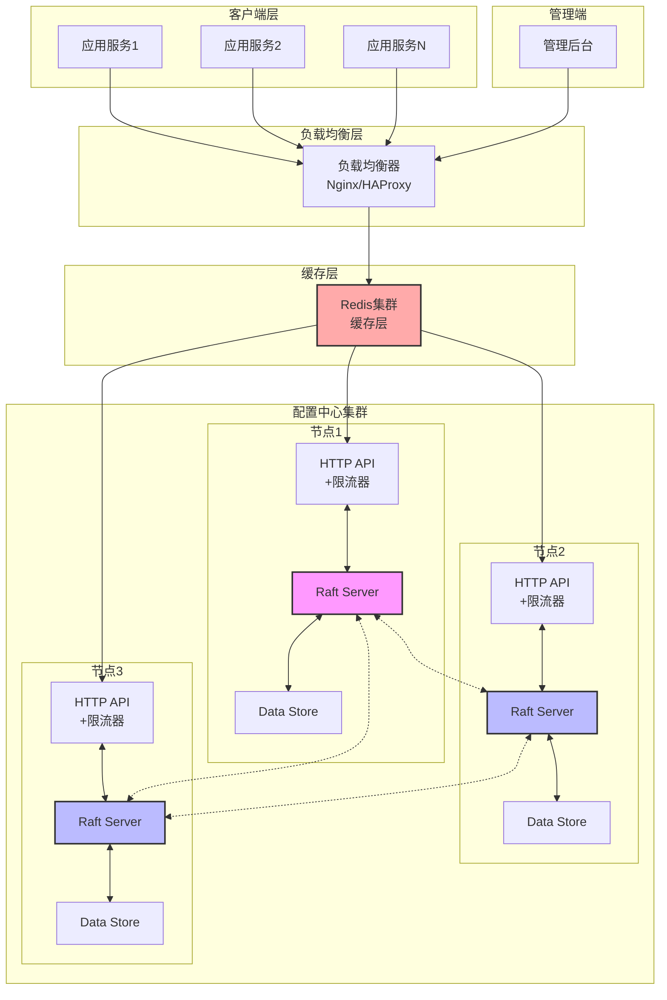

#### 3.1.2 Raft模块架构图

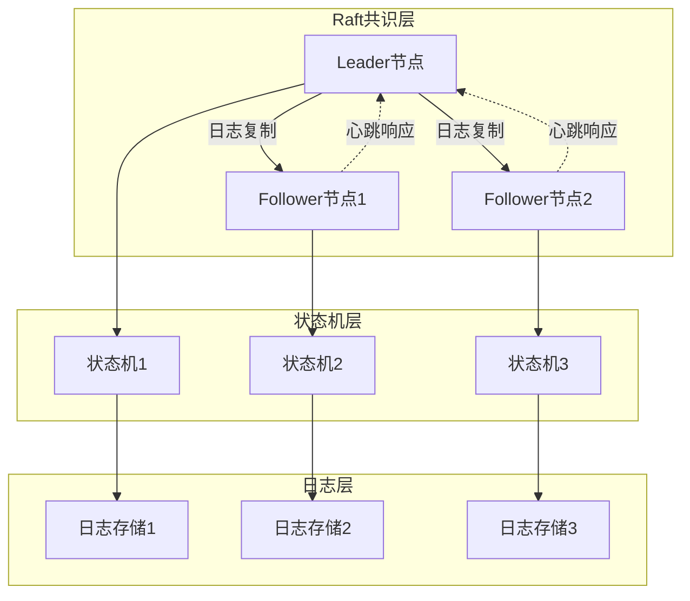

#### 3.1.3 数据流架构图

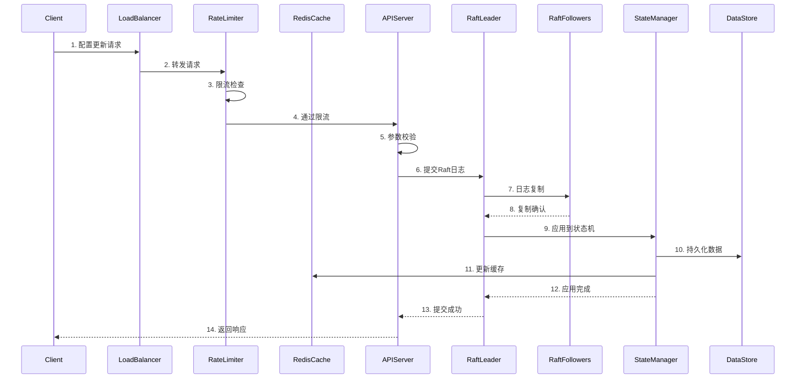

### 3.2 数据库设计

#### 3.2.1 数据模型

##### 1. namespace表
```sql
CREATE TABLE namespace (
    id BIGINT PRIMARY KEY AUTO_INCREMENT,
    name VARCHAR(128) NOT NULL UNIQUE COMMENT '命名空间名称',
    description VARCHAR(512) COMMENT '描述',
    status TINYINT NOT NULL DEFAULT 1 COMMENT '状态: 1-启用, 0-禁用',
    created_at DATETIME NOT NULL DEFAULT CURRENT_TIMESTAMP,
    updated_at DATETIME NOT NULL DEFAULT CURRENT_TIMESTAMP ON UPDATE CURRENT_TIMESTAMP,
    INDEX idx_name (name),
    INDEX idx_status (status)
) ENGINE=InnoDB DEFAULT CHARSET=utf8mb4 COMMENT='命名空间表';
```

##### 2. config表
```sql
CREATE TABLE config (
    id BIGINT PRIMARY KEY AUTO_INCREMENT,
    namespace_id BIGINT NOT NULL COMMENT '命名空间ID',
    key VARCHAR(256) NOT NULL COMMENT '配置键',
    value TEXT NOT NULL COMMENT '配置值(JSON格式)',
    version INT NOT NULL DEFAULT 1 COMMENT '版本号',
    description VARCHAR(512) COMMENT '配置描述',
    status TINYINT NOT NULL DEFAULT 1 COMMENT '状态: 1-启用, 0-禁用',
    created_by VARCHAR(64) COMMENT '创建人',
    updated_by VARCHAR(64) COMMENT '更新人',
    created_at DATETIME NOT NULL DEFAULT CURRENT_TIMESTAMP,
    updated_at DATETIME NOT NULL DEFAULT CURRENT_TIMESTAMP ON UPDATE CURRENT_TIMESTAMP,
    UNIQUE KEY uk_namespace_key (namespace_id, key),
    INDEX idx_namespace_id (namespace_id),
    INDEX idx_key (key),
    INDEX idx_status (status),
    FOREIGN KEY (namespace_id) REFERENCES namespace(id)
) ENGINE=InnoDB DEFAULT CHARSET=utf8mb4 COMMENT='配置表';
```

##### 3. config_history表
```sql
CREATE TABLE config_history (
    id BIGINT PRIMARY KEY AUTO_INCREMENT,
    config_id BIGINT NOT NULL COMMENT '配置ID',
    namespace_id BIGINT NOT NULL COMMENT '命名空间ID',
    key VARCHAR(256) NOT NULL COMMENT '配置键',
    old_value TEXT COMMENT '旧值',
    new_value TEXT NOT NULL COMMENT '新值',
    version INT NOT NULL COMMENT '版本号',
    operation VARCHAR(32) NOT NULL COMMENT '操作类型: CREATE/UPDATE/DELETE',
    operator VARCHAR(64) COMMENT '操作人',
    created_at DATETIME NOT NULL DEFAULT CURRENT_TIMESTAMP,
    INDEX idx_config_id (config_id),
    INDEX idx_namespace_id (namespace_id),
    INDEX idx_created_at (created_at)
) ENGINE=InnoDB DEFAULT CHARSET=utf8mb4 COMMENT='配置历史表';
```

##### 4. raft_log表
```sql
CREATE TABLE raft_log (
    id BIGINT PRIMARY KEY AUTO_INCREMENT,
    term BIGINT NOT NULL COMMENT 'Raft任期',
    index BIGINT NOT NULL UNIQUE COMMENT 'Raft日志索引',
    type VARCHAR(32) NOT NULL COMMENT '日志类型',
    data BLOB NOT NULL COMMENT '日志数据',
    created_at DATETIME NOT NULL DEFAULT CURRENT_TIMESTAMP,
    INDEX idx_term (term),
    INDEX idx_index (index)
) ENGINE=InnoDB DEFAULT CHARSET=utf8mb4 COMMENT='Raft日志表';
```

##### 5. raft_state表
```sql
CREATE TABLE raft_state (
    node_id VARCHAR(64) PRIMARY KEY COMMENT '节点ID',
    current_term BIGINT NOT NULL DEFAULT 0 COMMENT '当前任期',
    voted_for VARCHAR(64) COMMENT '投票给谁',
    role VARCHAR(32) NOT NULL DEFAULT 'FOLLOWER' COMMENT '角色: LEADER/CANDIDATE/FOLLOWER',
    commit_index BIGINT NOT NULL DEFAULT 0 COMMENT '已提交的日志索引',
    last_applied BIGINT NOT NULL DEFAULT 0 COMMENT '最后应用的日志索引',
    updated_at DATETIME NOT NULL DEFAULT CURRENT_TIMESTAMP ON UPDATE CURRENT_TIMESTAMP
) ENGINE=InnoDB DEFAULT CHARSET=utf8mb4 COMMENT='Raft状态表';
```

##### 6. config_version表（新增）
```sql
CREATE TABLE config_version (
    id BIGINT PRIMARY KEY AUTO_INCREMENT,
    config_id BIGINT NOT NULL COMMENT '配置ID',
    namespace_id BIGINT NOT NULL COMMENT '命名空间ID',
    key VARCHAR(256) NOT NULL COMMENT '配置键',
    value TEXT NOT NULL COMMENT '配置值(JSON格式)',
    version INT NOT NULL COMMENT '版本号',
    status TINYINT NOT NULL DEFAULT 1 COMMENT '状态: 1-启用, 0-禁用',
    created_by VARCHAR(64) COMMENT '创建人',
    created_at DATETIME NOT NULL DEFAULT CURRENT_TIMESTAMP,
    INDEX idx_config_id (config_id),
    INDEX idx_namespace_key_version (namespace_id, key, version),
    INDEX idx_status (status),
    UNIQUE KEY uk_config_version (config_id, version)
) ENGINE=InnoDB DEFAULT CHARSET=utf8mb4 COMMENT='配置版本表，存储所有历史版本';
```

### 3.3 系统功能设计

#### 3.3.1 功能模块划分

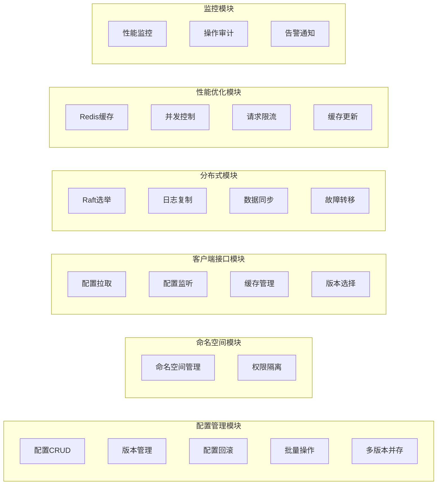

#### 3.3.2 核心功能流程

##### 1. 配置创建流程

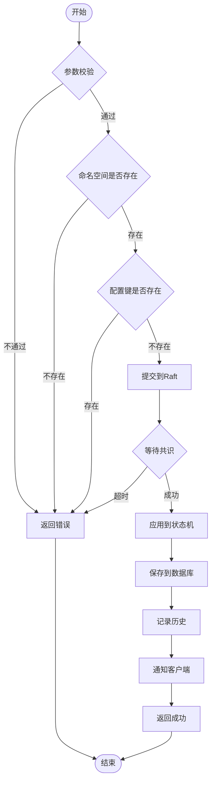

##### 2. 配置读取流程（优化后）

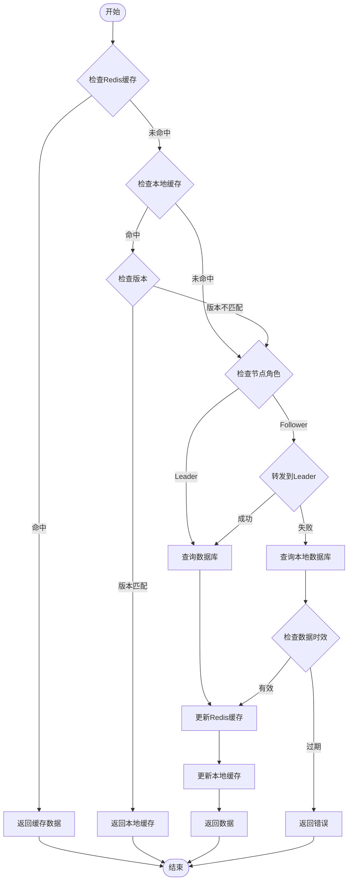

##### 3. Raft选举流程

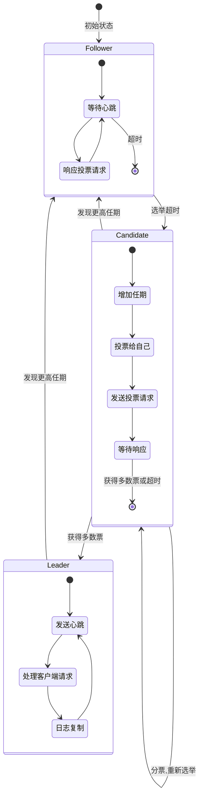

### 3.4 缓存设计（新增）

#### 3.4.1 Redis缓存策略

##### 1. 缓存数据结构设计

```
# 配置缓存
Key: config:{namespace}:{key}
Value: {
    "value": {...},      # 配置值
    "version": 3,        # 当前版本
    "updated_at": "...", # 更新时间
    "ttl": 3600         # 过期时间(秒)
}
TTL: 1小时（热点数据自动续期）

# 配置版本缓存
Key: config:version:{namespace}:{key}:{version}
Value: {
    "value": {...},      # 该版本的配置值
    "created_at": "..."  # 创建时间
}
TTL: 24小时

# 命名空间配置集合
Key: namespace:configs:{namespace}
Type: Hash
Field: {key}
Value: {
    "version": 3,
    "value": {...}
}
TTL: 1小时

# 配置版本列表
Key: config:versions:{namespace}:{key}
Type: Sorted Set
Member: version
Score: timestamp
TTL: 永不过期
```

##### 2. 缓存更新策略

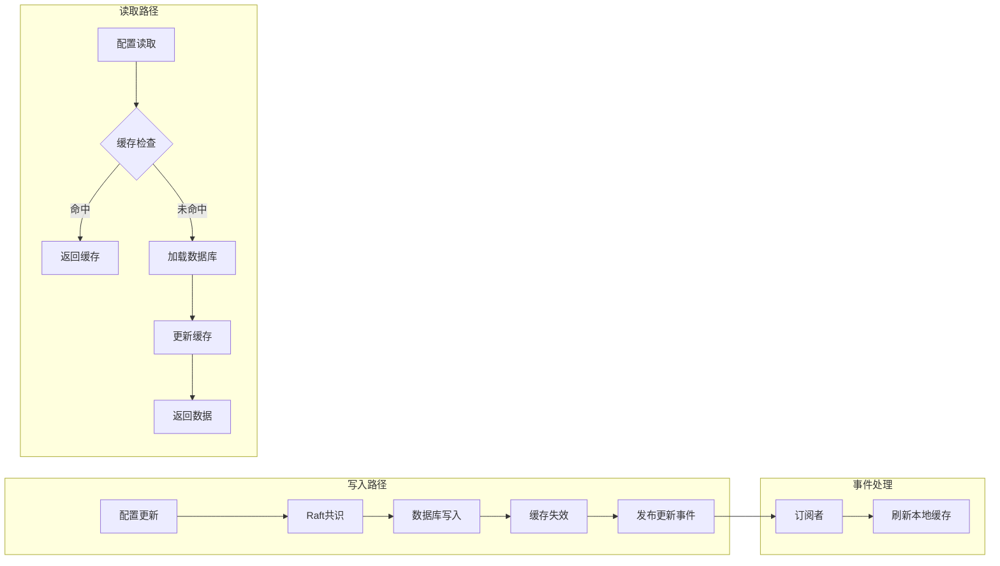

#### 3.4.2 缓存一致性保证

##### 1. 缓存更新机制

采用**Cache-Aside Pattern**结合**发布订阅**模式：
- 写操作：先更新数据库，再删除缓存，最后发布更新事件
- 读操作：先查缓存，未命中则查数据库并更新缓存
- 事件通知：通过Redis Pub/Sub通知所有节点更新本地缓存

##### 2. 分布式锁机制

```go
// 使用Redis分布式锁防止缓存击穿
lockKey := fmt.Sprintf("lock:config:%s:%s", namespace, key)
lock := redis.SetNX(lockKey, nodeID, 5*time.Second)
if lock {
    defer redis.Del(lockKey)
    // 加载数据并更新缓存
}
```

##### 3. 缓存预热

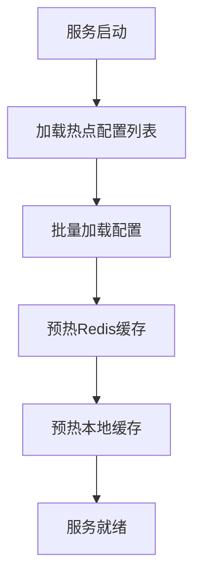

### 3.5 并发控制与限流设计（新增）

#### 3.5.1 并发控制

##### 1. 请求级并发控制

```go
// 使用令牌桶算法实现请求限流
type RateLimiter struct {
    rate       int           // 每秒允许的请求数
    capacity   int           // 桶容量
    tokens     int           // 当前令牌数
    lastUpdate time.Time     // 上次更新时间
    mu         sync.Mutex    // 互斥锁
}

// 全局限流配置
var limiters = map[string]*RateLimiter{
    "read":  NewRateLimiter(10000, 20000),  // 读请求：10000 QPS
    "write": NewRateLimiter(1000, 2000),    // 写请求：1000 QPS
    "admin": NewRateLimiter(100, 200),      // 管理请求：100 QPS
}
```

##### 2. 客户端级限流

```yaml
# 限流规则配置
rate_limits:
  default:
    read_qps: 1000      # 默认每客户端读QPS
    write_qps: 100      # 默认每客户端写QPS
  
  vip_clients:         # VIP客户端配置
    - client_id: "core-service"
      read_qps: 5000
      write_qps: 500
```

#### 3.5.2 限流实现

##### 1. 限流中间件

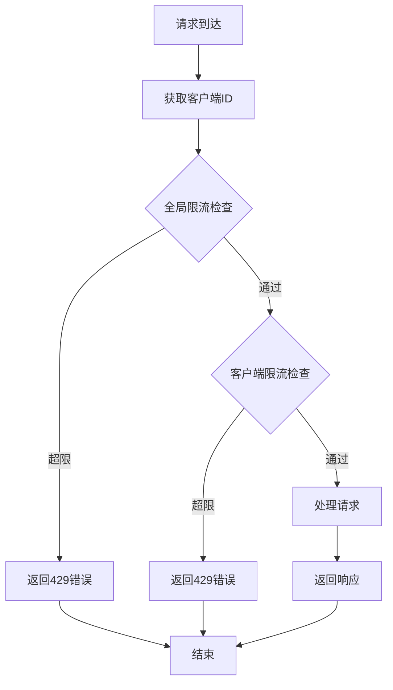

##### 2. 限流响应

```json
{
    "code": 42901,
    "message": "请求过于频繁，请稍后重试",
    "error": {
        "retry_after": 1,        // 建议重试时间(秒)
        "limit": 1000,          // 限流阈值
        "remaining": 0,         // 剩余配额
        "reset": 1705734460     // 配额重置时间
    },
    "request_id": "550e8400-e29b-41d4-a716-446655440000",
    "timestamp": 1705734400
}
```

### 3.6 多版本配置管理（新增）

#### 3.6.1 版本管理策略

##### 1. 版本存储

- 每次配置更新生成新版本，保留历史版本
- 支持按版本号、时间戳查询历史配置
- 可配置版本保留策略（如保留最近30个版本）

##### 2. 版本清理策略

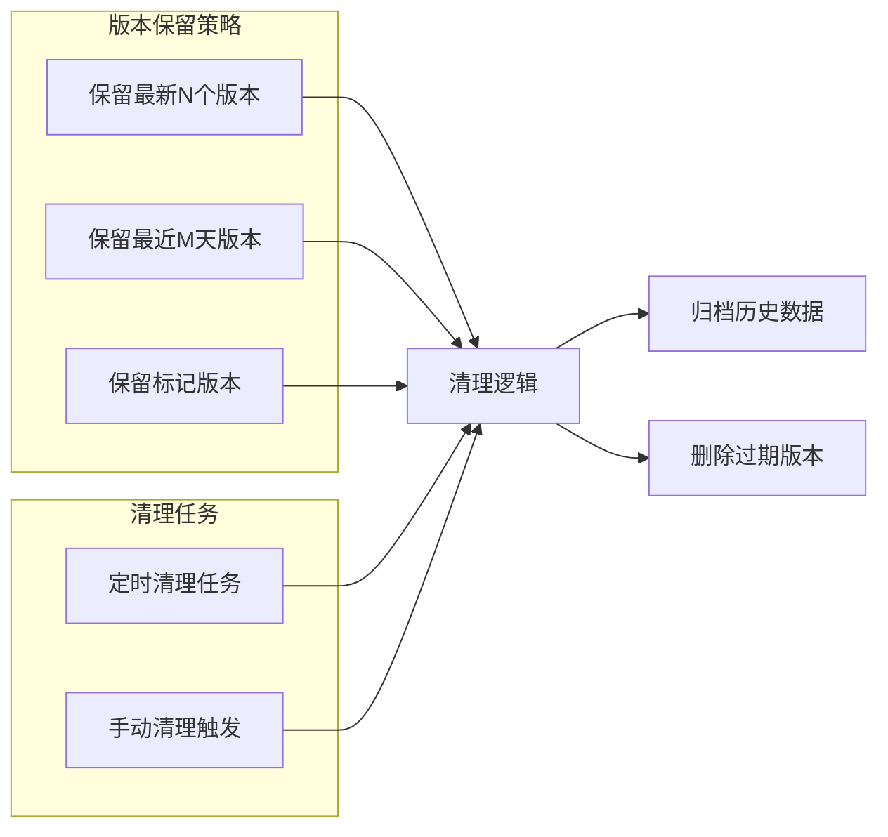

#### 3.6.2 版本访问接口

##### 1. 指定版本获取

```bash
# 获取特定版本配置
GET /api/v1/config/get?namespace=user-service&key=database.mysql&version=3
```

##### 2. 版本范围查询

```bash
# 获取版本列表
GET /api/v1/config/versions?namespace=user-service&key=database.mysql&limit=10
```

##### 3. 版本对比

```bash
# 对比两个版本差异
GET /api/v1/config/diff?namespace=user-service&key=database.mysql&from=3&to=5
```

### 3.7 监控与可用性设计（新增）

#### 3.7.1 监控体系架构

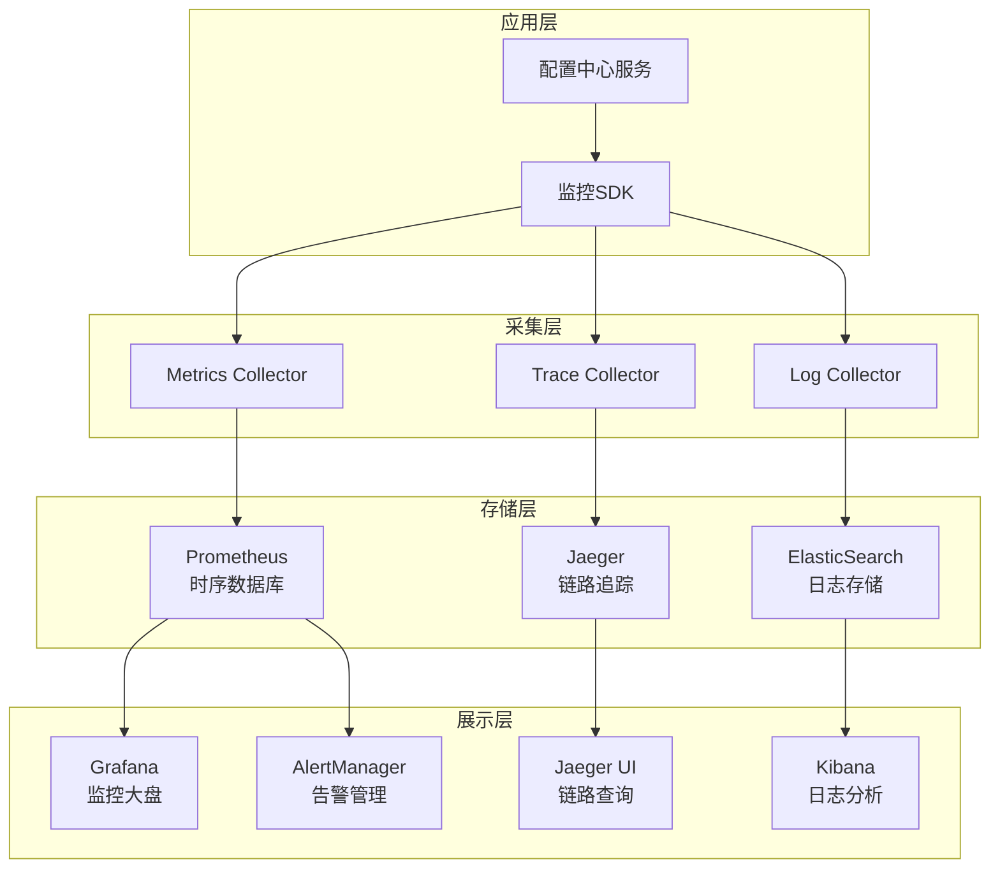

#### 3.7.2 接口埋点设计

##### 1. 埋点数据结构

```go
type MetricsPoint struct {
    // 基础信息
    RequestID    string    `json:"request_id"`
    TraceID      string    `json:"trace_id"`
    SpanID       string    `json:"span_id"`
    
    // 接口信息
    API          string    `json:"api"`           // 接口路径
    Method       string    `json:"method"`        // HTTP方法
    Namespace    string    `json:"namespace"`     // 命名空间
    ConfigKey    string    `json:"config_key"`    // 配置键
    
    // 性能指标
    Duration     int64     `json:"duration_ms"`   // 响应时间(ms)
    StatusCode   int       `json:"status_code"`   // HTTP状态码
    ErrorCode    int       `json:"error_code"`    // 业务错误码
    
    // 客户端信息
    ClientID     string    `json:"client_id"`     // 客户端标识
    ClientIP     string    `json:"client_ip"`     // 客户端IP
    UserAgent    string    `json:"user_agent"`    // User-Agent
    
    // 服务端信息
    NodeID       string    `json:"node_id"`       // 节点ID
    Version      string    `json:"version"`       // 服务版本
    
    // 时间戳
    StartTime    time.Time `json:"start_time"`
    EndTime      time.Time `json:"end_time"`
}
```

##### 2. 埋点中间件实现

```go
func MetricsMiddleware(next http.Handler) http.Handler {
    return http.HandlerFunc(func(w http.ResponseWriter, r *http.Request) {
        // 生成追踪信息
        traceID := r.Header.Get("X-Trace-ID")
        if traceID == "" {
            traceID = uuid.New().String()
        }
        
        // 创建span
        span := tracer.StartSpan(r.URL.Path,
            opentracing.Tag{Key: "http.method", Value: r.Method},
            opentracing.Tag{Key: "http.url", Value: r.URL.String()},
        )
        defer span.Finish()
        
        // 记录开始时间
        startTime := time.Now()
        
        // 包装ResponseWriter以捕获状态码
        wrapped := &responseWriter{ResponseWriter: w}
        
        // 处理请求
        next.ServeHTTP(wrapped, r)
        
        // 计算耗时
        duration := time.Since(startTime).Milliseconds()
        
        // 记录指标
        metrics.RecordAPICall(r.URL.Path, r.Method, wrapped.statusCode, duration)
        
        // 异步发送埋点数据
        go sendMetrics(buildMetricsPoint(r, wrapped, startTime, duration))
    })
}
```

#### 3.7.3 链路跟踪设计

##### 1. 分布式追踪实现

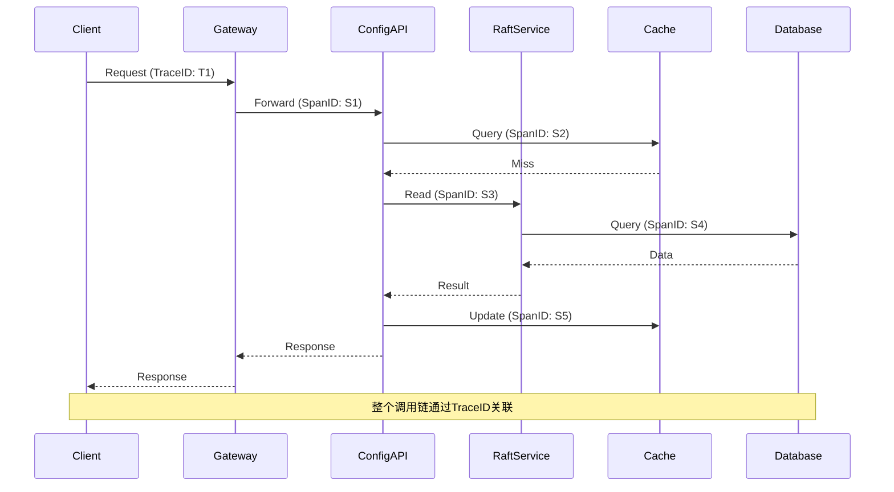

##### 2. Trace上下文传递

```go
// 注入trace上下文
func InjectTraceContext(ctx context.Context, req *http.Request) {
    span := opentracing.SpanFromContext(ctx)
    if span != nil {
        opentracing.GlobalTracer().Inject(
            span.Context(),
            opentracing.HTTPHeaders,
            opentracing.HTTPHeadersCarrier(req.Header),
        )
    }
}

// 提取trace上下文
func ExtractTraceContext(req *http.Request) opentracing.SpanContext {
    spanCtx, _ := opentracing.GlobalTracer().Extract(
        opentracing.HTTPHeaders,
        opentracing.HTTPHeadersCarrier(req.Header),
    )
    return spanCtx
}
```

#### 3.7.4 性能监控指标

##### 1. 核心监控指标

| 指标类型 | 指标名称 | 说明 | 单位 |
|---------|---------|------|------|
| 接口性能 | api_request_duration | 接口响应时间 | ms |
| 接口性能 | api_request_qps | 接口请求QPS | 次/秒 |
| 接口性能 | api_error_rate | 接口错误率 | % |
| 系统资源 | cpu_usage | CPU使用率 | % |
| 系统资源 | memory_usage | 内存使用率 | % |
| 系统资源 | goroutine_count | Goroutine数量 | 个 |
| 缓存性能 | cache_hit_rate | 缓存命中率 | % |
| 缓存性能 | cache_operation_duration | 缓存操作耗时 | ms |
| 数据库性能 | db_connection_count | 数据库连接数 | 个 |
| 数据库性能 | db_query_duration | 数据库查询耗时 | ms |
| Raft性能 | raft_commit_duration | Raft提交耗时 | ms |
| Raft性能 | raft_apply_duration | Raft应用耗时 | ms |

##### 2. Prometheus指标定义

```go
var (
    // 接口请求计数器
    apiRequestCounter = prometheus.NewCounterVec(
        prometheus.CounterOpts{
            Name: "config_center_api_requests_total",
            Help: "Total number of API requests",
        },
        []string{"api", "method", "status"},
    )
    
    // 接口响应时间直方图
    apiRequestDuration = prometheus.NewHistogramVec(
        prometheus.HistogramOpts{
            Name:    "config_center_api_request_duration_milliseconds",
            Help:    "API request duration in milliseconds",
            Buckets: []float64{1, 5, 10, 25, 50, 100, 250, 500, 1000, 2500, 5000},
        },
        []string{"api", "method"},
    )
    
    // 缓存命中率
    cacheHitCounter = prometheus.NewCounterVec(
        prometheus.CounterOpts{
            Name: "config_center_cache_hits_total",
            Help: "Total number of cache hits",
        },
        []string{"cache_type", "hit"},
    )
)
```

#### 3.7.5 数据库故障降级方案

##### 1. 降级策略设计

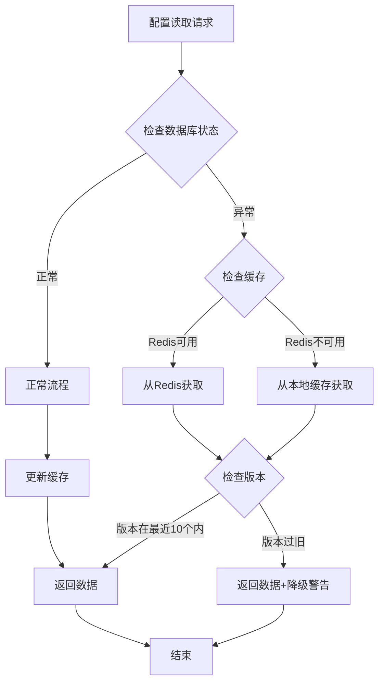

##### 2. 本地缓存设计

```go
type LocalCache struct {
    mu              sync.RWMutex
    configs         map[string]*ConfigCache  // namespace:key -> config
    versionHistory  map[string]*VersionRing  // namespace:key -> 最近10个版本
}

type ConfigCache struct {
    Value      interface{} `json:"value"`
    Version    int         `json:"version"`
    UpdatedAt  time.Time   `json:"updated_at"`
}

type VersionRing struct {
    versions  [10]*ConfigCache  // 环形缓冲区存储最近10个版本
    head      int               // 当前写入位置
    count     int               // 实际版本数
}

// 降级读取逻辑
func (c *ConfigService) GetWithFallback(namespace, key string, version int) (*Config, error) {
    // 1. 尝试正常读取
    config, err := c.normalGet(namespace, key, version)
    if err == nil {
        return config, nil
    }
    
    // 2. 数据库异常，尝试Redis
    if isDBError(err) {
        config, err = c.getFromRedis(namespace, key, version)
        if err == nil {
            return config, nil
        }
    }
    
    // 3. Redis也异常，使用本地缓存
    config, isStale := c.getFromLocalCache(namespace, key, version)
    if config != nil {
        if isStale {
            // 添加降级标记
            config.Metadata["degraded"] = true
            config.Metadata["degraded_reason"] = "database_unavailable"
        }
        return config, nil
    }
    
    return nil, ErrConfigNotFound
}
```

##### 3. 健康检查机制

```go
type HealthChecker struct {
    dbHealthy     atomic.Bool
    redisHealthy  atomic.Bool
    checkInterval time.Duration
}

func (h *HealthChecker) Start() {
    ticker := time.NewTicker(h.checkInterval)
    go func() {
        for range ticker.C {
            // 检查数据库健康状态
            if err := h.checkDatabase(); err != nil {
                h.dbHealthy.Store(false)
                metrics.RecordHealthCheck("database", "unhealthy")
            } else {
                h.dbHealthy.Store(true)
                metrics.RecordHealthCheck("database", "healthy")
            }
            
            // 检查Redis健康状态
            if err := h.checkRedis(); err != nil {
                h.redisHealthy.Store(false)
                metrics.RecordHealthCheck("redis", "unhealthy")
            } else {
                h.redisHealthy.Store(true)
                metrics.RecordHealthCheck("redis", "healthy")
            }
        }
    }()
}
```

#### 3.7.6 监控告警规则

##### 1. 告警规则配置

```yaml
groups:
  - name: config_center_alerts
    interval: 30s
    rules:
      # API性能告警
      - alert: HighAPILatency
        expr: histogram_quantile(0.95, api_request_duration) > 1000
        for: 5m
        labels:
          severity: warning
        annotations:
          summary: "API响应时间过高"
          description: "{{ $labels.api }} 接口95分位响应时间超过1秒"
      
      # 错误率告警
      - alert: HighErrorRate
        expr: rate(api_requests_total{status!="200"}[5m]) / rate(api_requests_total[5m]) > 0.05
        for: 5m
        labels:
          severity: critical
        annotations:
          summary: "接口错误率过高"
          description: "{{ $labels.api }} 接口错误率超过5%"
      
      # 缓存命中率告警
      - alert: LowCacheHitRate
        expr: rate(cache_hits_total{hit="true"}[5m]) / rate(cache_hits_total[5m]) < 0.8
        for: 10m
        labels:
          severity: warning
        annotations:
          summary: "缓存命中率过低"
          description: "缓存命中率低于80%"
      
      # 数据库故障告警
      - alert: DatabaseDown
        expr: health_check_status{component="database"} == 0
        for: 1m
        labels:
          severity: critical
        annotations:
          summary: "数据库连接异常"
          description: "数据库健康检查失败，已启用降级模式"
```

##### 2. 监控大盘设计

```json
{
  "dashboard": {
    "title": "配置中心监控大盘",
    "panels": [
      {
        "title": "API QPS",
        "targets": [{
          "expr": "sum(rate(api_requests_total[1m])) by (api)"
        }]
      },
      {
        "title": "API响应时间",
        "targets": [{
          "expr": "histogram_quantile(0.95, api_request_duration)"
        }]
      },
      {
        "title": "缓存命中率",
        "targets": [{
          "expr": "rate(cache_hits_total{hit=\"true\"}[5m]) / rate(cache_hits_total[5m])"
        }]
      },
      {
        "title": "系统健康状态",
        "targets": [{
          "expr": "health_check_status"
        }]
      }
    ]
  }
}
```

### 3.8 接口设计

#### 3.8.1 API设计原则

遵循365 API规范：
1. RESTful风格设计
2. 统一的请求/响应格式
3. 标准的HTTP状态码
4. 版本化管理
5. 统一的错误处理

#### 3.8.2 统一响应格式

```json
{
    "code": 0,
    "message": "success",
    "data": {},
    "request_id": "550e8400-e29b-41d4-a716-446655440000",
    "timestamp": 1705734400
}
```

错误响应格式：
```json
{
    "code": 40001,
    "message": "参数错误",
    "error": {
        "details": "namespace不能为空"
    },
    "request_id": "550e8400-e29b-41d4-a716-446655440000",
    "timestamp": 1705734400
}
```

#### 3.8.3 客户端配置读取接口

##### 1. 获取单个配置

**接口地址**: `GET /api/v1/config/get`

**请求参数**:
| 参数名 | 类型 | 必填 | 说明 |
|--------|------|------|------|
| namespace | string | 是 | 命名空间 |
| key | string | 是 | 配置键 |
| version | int | 否 | 配置版本号，不传则返回最新版本 |

**请求示例**:
```bash
# 获取最新版本
GET /api/v1/config/get?namespace=user-service&key=database.mysql.host

# 获取指定版本
GET /api/v1/config/get?namespace=user-service&key=database.mysql.host&version=3
```

**响应示例**:
```json
{
    "code": 0,
    "message": "success",
    "data": {
        "namespace": "user-service",
        "key": "database.mysql.host",
        "value": {
            "host": "192.168.1.100",
            "port": 3306,
            "username": "root",
            "database": "user_db"
        },
        "version": 3,
        "updated_at": "2024-01-20T10:00:00Z"
    },
    "request_id": "550e8400-e29b-41d4-a716-446655440000",
    "timestamp": 1705734400
}
```

##### 2. 批量获取配置

**接口地址**: `POST /api/v1/config/batch-get`

**请求参数**:
```json
{
    "namespace": "user-service",
    "keys": ["database.mysql", "redis.cluster", "app.settings"]
}
```

**响应示例**:
```json
{
    "code": 0,
    "message": "success",
    "data": {
        "namespace": "user-service",
        "configs": [
            {
                "key": "database.mysql",
                "value": {
                    "host": "192.168.1.100",
                    "port": 3306
                },
                "version": 3
            },
            {
                "key": "redis.cluster",
                "value": {
                    "nodes": ["192.168.1.101:6379", "192.168.1.102:6379"]
                },
                "version": 2
            }
        ]
    },
    "request_id": "550e8400-e29b-41d4-a716-446655440000",
    "timestamp": 1705734400
}
```

##### 3. 获取命名空间所有配置

**接口地址**: `GET /api/v1/config/namespace/{namespace}`

**请求参数**:
| 参数名 | 类型 | 必填 | 说明 |
|--------|------|------|------|
| namespace | string | 是 | 命名空间(路径参数) |

**响应示例**:
```json
{
    "code": 0,
    "message": "success",
    "data": {
        "namespace": "user-service",
        "configs": {
            "database.mysql": {
                "host": "192.168.1.100",
                "port": 3306
            },
            "redis.cluster": {
                "nodes": ["192.168.1.101:6379"]
            },
            "app.settings": {
                "timeout": 30,
                "retry": 3
            }
        },
        "version": 15,
        "updated_at": "2024-01-20T10:00:00Z"
    },
    "request_id": "550e8400-e29b-41d4-a716-446655440000",
    "timestamp": 1705734400
}
```

#### 3.8.4 后台管理接口（增强版本管理）

##### 1. 创建配置

**接口地址**: `POST /api/v1/admin/config`

**请求参数**:
```json
{
    "namespace": "user-service",
    "key": "new.config.key",
    "value": {
        "setting1": "value1",
        "setting2": 123
    },
    "description": "新配置项描述"
}
```

**响应示例**:
```json
{
    "code": 0,
    "message": "配置创建成功",
    "data": {
        "id": 12345,
        "namespace": "user-service",
        "key": "new.config.key",
        "version": 1
    },
    "request_id": "550e8400-e29b-41d4-a716-446655440000",
    "timestamp": 1705734400
}
```

##### 2. 更新配置

**接口地址**: `PUT /api/v1/admin/config`

**请求参数**:
```json
{
    "namespace": "user-service",
    "key": "database.mysql",
    "value": {
        "host": "192.168.1.200",
        "port": 3306
    },
    "description": "更新数据库地址"
}
```

**响应示例**:
```json
{
    "code": 0,
    "message": "配置更新成功",
    "data": {
        "id": 12345,
        "namespace": "user-service",
        "key": "database.mysql",
        "version": 4,
        "old_version": 3
    },
    "request_id": "550e8400-e29b-41d4-a716-446655440000",
    "timestamp": 1705734400
}
```

##### 3. 删除配置

**接口地址**: `DELETE /api/v1/admin/config`

**请求参数**:
| 参数名 | 类型 | 必填 | 说明 |
|--------|------|------|------|
| namespace | string | 是 | 命名空间 |
| key | string | 是 | 配置键 |

**响应示例**:
```json
{
    "code": 0,
    "message": "配置删除成功",
    "data": {
        "namespace": "user-service",
        "key": "deprecated.config"
    },
    "request_id": "550e8400-e29b-41d4-a716-446655440000",
    "timestamp": 1705734400
}
```

##### 4. 查询配置列表

**接口地址**: `GET /api/v1/admin/config/list`

**请求参数**:
| 参数名 | 类型 | 必填 | 说明 |
|--------|------|------|------|
| namespace | string | 否 | 命名空间过滤 |
| key | string | 否 | 配置键模糊搜索 |
| page | int | 否 | 页码，默认1 |
| page_size | int | 否 | 每页数量，默认20 |

**响应示例**:
```json
{
    "code": 0,
    "message": "success",
    "data": {
        "list": [
            {
                "id": 12345,
                "namespace": "user-service",
                "key": "database.mysql",
                "value": {
                    "host": "192.168.1.100"
                },
                "version": 3,
                "description": "MySQL配置",
                "status": 1,
                "updated_at": "2024-01-20T10:00:00Z",
                "updated_by": "admin"
            }
        ],
        "pagination": {
            "page": 1,
            "page_size": 20,
            "total": 100,
            "total_pages": 5
        }
    },
    "request_id": "550e8400-e29b-41d4-a716-446655440000",
    "timestamp": 1705734400
}
```

##### 5. 查询配置历史

**接口地址**: `GET /api/v1/admin/config/history`

**请求参数**:
| 参数名 | 类型 | 必填 | 说明 |
|--------|------|------|------|
| namespace | string | 是 | 命名空间 |
| key | string | 是 | 配置键 |
| page | int | 否 | 页码，默认1 |
| page_size | int | 否 | 每页数量，默认20 |

**响应示例**:
```json
{
    "code": 0,
    "message": "success",
    "data": {
        "list": [
            {
                "id": 1001,
                "namespace": "user-service",
                "key": "database.mysql",
                "old_value": {
                    "host": "192.168.1.100"
                },
                "new_value": {
                    "host": "192.168.1.200"
                },
                "version": 4,
                "operation": "UPDATE",
                "operator": "admin",
                "created_at": "2024-01-20T10:00:00Z"
            }
        ],
        "pagination": {
            "page": 1,
            "page_size": 20,
            "total": 15
        }
    },
    "request_id": "550e8400-e29b-41d4-a716-446655440000",
    "timestamp": 1705734400
}
```

##### 6. 配置回滚

**接口地址**: `POST /api/v1/admin/config/rollback`

**请求参数**:
```json
{
    "namespace": "user-service",
    "key": "database.mysql",
    "target_version": 3
}
```

**响应示例**:
```json
{
    "code": 0,
    "message": "配置回滚成功",
    "data": {
        "namespace": "user-service",
        "key": "database.mysql",
        "current_version": 5,
        "previous_version": 4
    },
    "request_id": "550e8400-e29b-41d4-a716-446655440000",
    "timestamp": 1705734400
}
```

#### 3.8.5 版本管理接口（新增）

##### 1. 获取配置版本列表

**接口地址**: `GET /api/v1/config/versions`

**请求参数**:
| 参数名 | 类型 | 必填 | 说明 |
|--------|------|------|------|
| namespace | string | 是 | 命名空间 |
| key | string | 是 | 配置键 |
| page | int | 否 | 页码，默认1 |
| page_size | int | 否 | 每页数量，默认20 |

**响应示例**:
```json
{
    "code": 0,
    "message": "success",
    "data": {
        "list": [
            {
                "version": 5,
                "value": {
                    "host": "192.168.1.200"
                },
                "created_by": "admin",
                "created_at": "2024-01-20T12:00:00Z",
                "is_current": true
            },
            {
                "version": 4,
                "value": {
                    "host": "192.168.1.150"
                },
                "created_by": "admin",
                "created_at": "2024-01-20T11:00:00Z",
                "is_current": false
            }
        ],
        "pagination": {
            "page": 1,
            "page_size": 20,
            "total": 5
        }
    },
    "request_id": "550e8400-e29b-41d4-a716-446655440000",
    "timestamp": 1705734400
}
```

##### 2. 配置版本对比

**接口地址**: `GET /api/v1/config/diff`

**请求参数**:
| 参数名 | 类型 | 必填 | 说明 |
|--------|------|------|------|
| namespace | string | 是 | 命名空间 |
| key | string | 是 | 配置键 |
| from_version | int | 是 | 起始版本号 |
| to_version | int | 是 | 目标版本号 |

**响应示例**:
```json
{
    "code": 0,
    "message": "success",
    "data": {
        "namespace": "user-service",
        "key": "database.mysql",
        "from_version": 3,
        "to_version": 5,
        "changes": [
            {
                "path": "host",
                "from": "192.168.1.100",
                "to": "192.168.1.200",
                "type": "modified"
            },
            {
                "path": "max_connections",
                "from": null,
                "to": 100,
                "type": "added"
            }
        ]
    },
    "request_id": "550e8400-e29b-41d4-a716-446655440000",
    "timestamp": 1705734400
}
```

#### 3.8.6 命名空间管理接口

##### 1. 创建命名空间

**接口地址**: `POST /api/v1/admin/namespace`

**请求参数**:
```json
{
    "name": "order-service",
    "description": "订单服务配置命名空间"
}
```

**响应示例**:
```json
{
    "code": 0,
    "message": "命名空间创建成功",
    "data": {
        "id": 10,
        "name": "order-service",
        "description": "订单服务配置命名空间",
        "status": 1,
        "created_at": "2024-01-20T10:00:00Z"
    },
    "request_id": "550e8400-e29b-41d4-a716-446655440000",
    "timestamp": 1705734400
}
```

##### 2. 更新命名空间

**接口地址**: `PUT /api/v1/admin/namespace/{id}`

**请求参数**:
```json
{
    "description": "更新后的描述",
    "status": 1
}
```

##### 3. 删除命名空间

**接口地址**: `DELETE /api/v1/admin/namespace/{id}`

**注意**: 只能删除没有配置项的空命名空间

##### 4. 查询命名空间列表

**接口地址**: `GET /api/v1/admin/namespace/list`

**请求参数**:
| 参数名 | 类型 | 必填 | 说明 |
|--------|------|------|------|
| name | string | 否 | 名称模糊搜索 |
| status | int | 否 | 状态过滤 |
| page | int | 否 | 页码 |
| page_size | int | 否 | 每页数量 |

#### 3.8.7 监控接口（新增）

##### 1. 健康检查接口

**接口地址**: `GET /api/v1/health`

**响应示例**:
```json
{
    "code": 0,
    "message": "success",
    "data": {
        "status": "healthy",
        "components": {
            "database": {
                "status": "healthy",
                "latency_ms": 5
            },
            "redis": {
                "status": "healthy",
                "latency_ms": 2
            },
            "raft": {
                "status": "healthy",
                "role": "leader",
                "term": 42
            }
        },
        "degraded": false,
        "uptime_seconds": 86400
    },
    "timestamp": 1705734400
}
```

##### 2. 指标查询接口

**接口地址**: `GET /api/v1/metrics`

**响应示例**:
```
# HELP config_center_api_requests_total Total number of API requests
# TYPE config_center_api_requests_total counter
config_center_api_requests_total{api="/api/v1/config/get",method="GET",status="200"} 10234
config_center_api_requests_total{api="/api/v1/config/get",method="GET",status="404"} 123

# HELP config_center_api_request_duration_milliseconds API request duration
# TYPE config_center_api_request_duration_milliseconds histogram
config_center_api_request_duration_milliseconds_bucket{api="/api/v1/config/get",method="GET",le="10"} 8234
config_center_api_request_duration_milliseconds_bucket{api="/api/v1/config/get",method="GET",le="50"} 9834
```

#### 3.8.8 错误码定义（更新）

| 错误码 | 说明 | HTTP状态码 |
|--------|------|-------------|
| 0 | 成功 | 200 |
| 40001 | 参数错误 | 400 |
| 40002 | 参数校验失败 | 400 |
| 40101 | 未授权 | 401 |
| 40301 | 无权限 | 403 |
| 40401 | 资源不存在 | 404 |
| 40402 | 命名空间不存在 | 404 |
| 40403 | 配置项不存在 | 404 |
| 40901 | 资源冲突 | 409 |
| 40902 | 配置键已存在 | 409 |
| 50001 | 服务内部错误 | 500 |
| 50002 | 数据库错误 | 500 |
| 50003 | Raft共识失败 | 500 |
| 50004 | 缓存服务异常 | 500 |
| 42901 | 请求频率超限 | 429 |
| 42902 | 客户端配额超限 | 429 |
| 50301 | 服务不可用 | 503 |
| 50302 | 节点非Leader | 503 |

## 五、附录

### 5.1 名词解释

| 术语 | 说明 |
|------|------|
| Namespace | 命名空间，用于隔离不同业务或服务的配置 |
| Config Key | 配置键，配置项的唯一标识 |
| Config Value | 配置值，支持JSON格式的复杂数据结构 |
| Raft | 一种分布式一致性算法，用于保证集群数据一致性 |
| Leader | Raft集群中的领导者节点，负责处理所有写请求 |
| Follower | Raft集群中的跟随者节点，负责同步Leader的数据 |
| Candidate | Raft选举过程中的候选者节点 |
| Term | Raft协议中的任期概念，每次选举会增加任期号 |
| Log Entry | Raft日志条目，记录每个操作命令 |
| State Machine | 状态机，将Raft日志应用到实际业务数据的组件 |
| Redis | 开源的内存数据结构存储系统，用作缓存层 |
| Cache-Aside Pattern | 缓存模式，应用程序负责从数据源加载数据到缓存 |
| Rate Limiting | 限流，控制请求频率的技术 |
| Token Bucket | 令牌桶算法，一种常用的限流算法 |
| TTL | Time To Live，数据的存活时间 |
| QPS | Queries Per Second，每秒查询数 |
| Prometheus | 开源的监控和告警系统，使用时序数据库 |
| Jaeger | 分布式追踪系统，用于微服务架构的性能监控 |
| OpenTracing | 分布式追踪的标准API规范 |
| Trace ID | 分布式追踪中的全局唯一标识符 |
| Span | 分布式追踪中的一个工作单元 |
| Metrics | 度量指标，用于监控系统性能 |
| Health Check | 健康检查，用于监控服务可用性 |
| Degraded Mode | 降级模式，系统部分功能不可用时的运行模式 |
| Circuit Breaker | 熔断器，防止故障扩散的保护机制 |

### 5.2 参考资料

1. [Raft一致性算法论文](https://raft.github.io/raft.pdf)
2. [etcd官方文档](https://etcd.io/docs/)
3. [Apollo配置中心](https://github.com/apolloconfig/apollo)
4. [Consul文档](https://www.consul.io/docs)
5. [分布式系统一致性](https://www.allthingsdistributed.com/2008/12/eventually_consistent.html)
6. [CAP理论](https://en.wikipedia.org/wiki/CAP_theorem)
7. [365 API设计规范](https://365.design/api-guidelines)
8. [Redis官方文档](https://redis.io/documentation)
9. [分布式缓存最佳实践](https://docs.microsoft.com/en-us/azure/architecture/best-practices/caching)
10. [Rate Limiting算法详解](https://www.cloudflare.com/learning/bots/what-is-rate-limiting/)
11. [高并发系统设计](https://github.com/donnemartin/system-design-primer)
12. [Prometheus官方文档](https://prometheus.io/docs/)
13. [Jaeger分布式追踪](https://www.jaegertracing.io/docs/)
14. [OpenTracing规范](https://opentracing.io/specification/)
15. [监控系统设计模式](https://sre.google/sre-book/monitoring-distributed-systems/)
16. [服务降级最佳实践](https://martinfowler.com/bliki/CircuitBreaker.html)