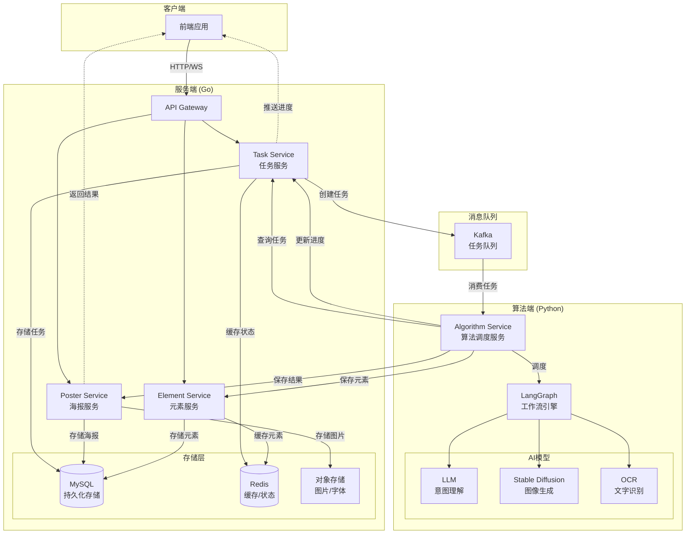
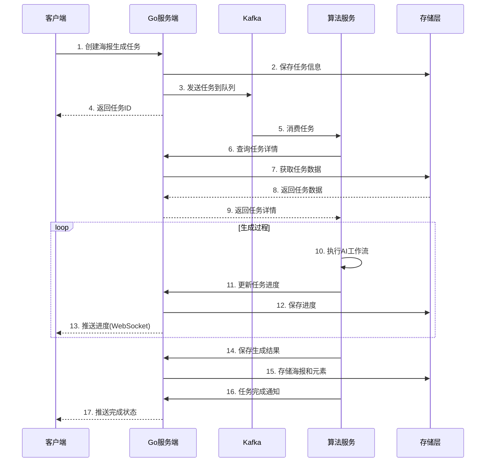

# 服务端与算法端交互设计

## 1. 系统架构图



## 2. 数据流程图



## 3. 核心数据结构设计

### 3.1 任务（Task）结构

```go
// models/task.go
package models

import (
    "time"
    "database/sql/driver"
    "encoding/json"
)

// Task 任务模型
type Task struct {
    ID          string         `gorm:"primaryKey" json:"id"`
    UserID      string         `gorm:"index" json:"user_id"`
    Type        string         `json:"type"`        // poster_generation
    Status      string         `gorm:"index" json:"status"`
    Priority    int            `json:"priority"`
    
    // 输入参数
    InputParams TaskParams     `gorm:"type:json" json:"input_params"`
    
    // 进度信息
    Progress    TaskProgress   `gorm:"type:json" json:"progress"`
    
    // 结果信息
    Result      *TaskResult    `gorm:"type:json" json:"result,omitempty"`
    
    // 错误信息
    Error       *TaskError     `gorm:"type:json" json:"error,omitempty"`
    
    // 时间戳
    CreatedAt   time.Time      `json:"created_at"`
    StartedAt   *time.Time     `json:"started_at,omitempty"`
    CompletedAt *time.Time     `json:"completed_at,omitempty"`
    UpdatedAt   time.Time      `json:"updated_at"`
}

// TaskParams 任务参数
type TaskParams struct {
    Prompt      string              `json:"prompt"`       // 用户输入的描述
    Style       string              `json:"style"`        // 风格：business/cartoon/minimalist
    Size        Size                `json:"size"`         // 尺寸
    Elements    []ElementRequirement `json:"elements"`    // 必需元素
    ColorScheme []string            `json:"color_scheme"` // 配色方案
    Reference   []string            `json:"reference"`    // 参考图片URL
}

// Size 尺寸
type Size struct {
    Width  int `json:"width"`
    Height int `json:"height"`
}

// ElementRequirement 元素需求
type ElementRequirement struct {
    Type     string `json:"type"`     // text/image/shape
    Content  string `json:"content"`  // 内容
    Position string `json:"position"` // top/center/bottom
    Style    map[string]interface{} `json:"style"`
}

// TaskProgress 任务进度
type TaskProgress struct {
    Phase      string  `json:"phase"`      // 当前阶段
    Percentage float64 `json:"percentage"` // 完成百分比
    Message    string  `json:"message"`    // 进度消息
    Details    map[string]interface{} `json:"details"`
}

// TaskResult 任务结果
type TaskResult struct {
    PosterID string   `json:"poster_id"` // 生成的海报ID
    Preview  string   `json:"preview"`   // 预览图URL
    Layers   []string `json:"layers"`    // 图层ID列表
}

// TaskError 任务错误
type TaskError struct {
    Code    string `json:"code"`
    Message string `json:"message"`
    Details map[string]interface{} `json:"details,omitempty"`
}

// Value 实现 driver.Valuer 接口
func (t TaskParams) Value() (driver.Value, error) {
    return json.Marshal(t)
}

// Scan 实现 sql.Scanner 接口
func (t *TaskParams) Scan(value interface{}) error {
    bytes, ok := value.([]byte)
    if !ok {
        return nil
    }
    return json.Unmarshal(bytes, t)
}
```

### 3.2 海报（Poster）结构

```go
// models/poster.go
package models

import (
    "time"
)

// Poster 海报模型
type Poster struct {
    ID          string    `gorm:"primaryKey" json:"id"`
    TaskID      string    `gorm:"index" json:"task_id"`
    UserID      string    `gorm:"index" json:"user_id"`
    Title       string    `json:"title"`
    Description string    `json:"description"`
    
    // 海报属性
    Width       int       `json:"width"`
    Height      int       `json:"height"`
    Background  string    `json:"background"`  // 背景色或渐变
    
    // 存储信息
    PreviewURL  string    `json:"preview_url"` // 预览图
    SourceURL   string    `json:"source_url"`  // 原始文件
    
    // 元数据
    Metadata    PosterMetadata `gorm:"type:json" json:"metadata"`
    
    // 时间戳
    CreatedAt   time.Time `json:"created_at"`
    UpdatedAt   time.Time `json:"updated_at"`
}

// PosterMetadata 海报元数据
type PosterMetadata struct {
    Style       string                 `json:"style"`
    ColorScheme []string              `json:"color_scheme"`
    Fonts       []string              `json:"fonts"`
    Tags        []string              `json:"tags"`
    AIParams    map[string]interface{} `json:"ai_params"` // AI生成参数
}

// PosterLayer 海报图层关联
type PosterLayer struct {
    ID        string    `gorm:"primaryKey" json:"id"`
    PosterID  string    `gorm:"index" json:"poster_id"`
    LayerID   string    `json:"layer_id"`
    Order     int       `json:"order"`      // 图层顺序
    CreatedAt time.Time `json:"created_at"`
}
```

### 3.3 元素（Element）结构

```go
// models/element.go
package models

import (
    "time"
    "encoding/json"
    "database/sql/driver"
)

// Element 元素模型（图层中的单个元素）
type Element struct {
    ID         string      `gorm:"primaryKey" json:"id"`
    LayerID    string      `gorm:"index" json:"layer_id"`
    Type       string      `json:"type"` // text/image/shape/group
    
    // 位置和变换
    Transform  Transform   `gorm:"type:json" json:"transform"`
    
    // 样式
    Style      ElementStyle `gorm:"type:json" json:"style"`
    
    // 内容
    Content    ElementContent `gorm:"type:json" json:"content"`
    
    // 交互属性
    Locked     bool        `json:"locked"`
    Visible    bool        `json:"visible"`
    Selectable bool        `json:"selectable"`
    
    CreatedAt  time.Time   `json:"created_at"`
    UpdatedAt  time.Time   `json:"updated_at"`
}

// Layer 图层模型
type Layer struct {
    ID        string    `gorm:"primaryKey" json:"id"`
    Name      string    `json:"name"`
    Type      string    `json:"type"` // background/content/decoration
    Order     int       `json:"order"`
    Opacity   float64   `json:"opacity"`
    BlendMode string    `json:"blend_mode"`
    Locked    bool      `json:"locked"`
    Visible   bool      `json:"visible"`
    
    CreatedAt time.Time `json:"created_at"`
    UpdatedAt time.Time `json:"updated_at"`
}

// Transform 变换信息
type Transform struct {
    X        float64 `json:"x"`
    Y        float64 `json:"y"`
    Width    float64 `json:"width"`
    Height   float64 `json:"height"`
    Rotation float64 `json:"rotation"`
    ScaleX   float64 `json:"scale_x"`
    ScaleY   float64 `json:"scale_y"`
    SkewX    float64 `json:"skew_x"`
    SkewY    float64 `json:"skew_y"`
}

// ElementStyle 元素样式
type ElementStyle struct {
    // 通用样式
    Opacity     float64         `json:"opacity"`
    BlendMode   string          `json:"blend_mode"`
    
    // 填充
    Fill        *Fill           `json:"fill,omitempty"`
    
    // 描边
    Stroke      *Stroke         `json:"stroke,omitempty"`
    
    // 阴影
    Shadow      *Shadow         `json:"shadow,omitempty"`
    
    // 滤镜
    Filters     []Filter        `json:"filters,omitempty"`
    
    // 文字专用
    TextStyle   *TextStyle      `json:"text_style,omitempty"`
}

// Fill 填充样式
type Fill struct {
    Type     string          `json:"type"` // solid/gradient/pattern/image
    Color    string          `json:"color,omitempty"`
    Gradient *Gradient       `json:"gradient,omitempty"`
    Image    *ImageFill      `json:"image,omitempty"`
}

// Stroke 描边样式
type Stroke struct {
    Color     string   `json:"color"`
    Width     float64  `json:"width"`
    DashArray []float64 `json:"dash_array,omitempty"`
    LineCap   string   `json:"line_cap"`
    LineJoin  string   `json:"line_join"`
}

// Shadow 阴影
type Shadow struct {
    Color   string  `json:"color"`
    OffsetX float64 `json:"offset_x"`
    OffsetY float64 `json:"offset_y"`
    Blur    float64 `json:"blur"`
    Spread  float64 `json:"spread"`
}

// TextStyle 文字样式
type TextStyle struct {
    FontFamily   string  `json:"font_family"`
    FontSize     float64 `json:"font_size"`
    FontWeight   string  `json:"font_weight"`
    FontStyle    string  `json:"font_style"`
    LineHeight   float64 `json:"line_height"`
    LetterSpace  float64 `json:"letter_space"`
    TextAlign    string  `json:"text_align"`
    TextDecoration string `json:"text_decoration"`
}

// ElementContent 元素内容
type ElementContent struct {
    // 文字内容
    Text      string          `json:"text,omitempty"`
    
    // 图片内容
    ImageURL  string          `json:"image_url,omitempty"`
    
    // 形状内容
    ShapeType string          `json:"shape_type,omitempty"`
    ShapePath string          `json:"shape_path,omitempty"`
    
    // 组合内容
    Children  []string        `json:"children,omitempty"` // 子元素ID列表
}

// Value 实现 driver.Valuer 接口
func (t Transform) Value() (driver.Value, error) {
    return json.Marshal(t)
}

// Scan 实现 sql.Scanner 接口
func (t *Transform) Scan(value interface{}) error {
    bytes, ok := value.([]byte)
    if !ok {
        return nil
    }
    return json.Unmarshal(bytes, t)
}
```

### 3.4 示例数据

```json
// 任务示例
{
  "id": "task_a1b2c3d4e5f6",
  "user_id": "user_123456",
  "type": "poster_generation",
  "status": "completed",
  "priority": 1,
  "input_params": {
    "prompt": "创建一个蓝色商务风格的招聘海报，包含公司logo和职位信息",
    "style": "business",
    "size": {
      "width": 1080,
      "height": 1920
    },
    "elements": [
      {
        "type": "text",
        "content": "诚聘英才",
        "position": "top",
        "style": {
          "fontSize": 48,
          "fontWeight": "bold"
        }
      },
      {
        "type": "text",
        "content": "高级软件工程师",
        "position": "center",
        "style": {
          "fontSize": 36
        }
      }
    ],
    "color_scheme": ["#1890ff", "#ffffff", "#f0f2f5"]
  },
  "progress": {
    "phase": "completed",
    "percentage": 100,
    "message": "海报生成完成",
    "details": {
      "stages_completed": ["intent_parsing", "layout_generation", "image_generation", "text_rendering", "quality_check"]
    }
  },
  "result": {
    "poster_id": "poster_xyz789",
    "preview": "https://oss.example.com/posters/preview/poster_xyz789.jpg",
    "layers": ["layer_bg_001", "layer_main_002", "layer_text_003"]
  },
  "created_at": "2024-01-01T10:00:00Z",
  "completed_at": "2024-01-01T10:00:30Z"
}

// 海报示例
{
  "id": "poster_xyz789",
  "task_id": "task_a1b2c3d4e5f6",
  "user_id": "user_123456",
  "title": "招聘海报",
  "description": "蓝色商务风格招聘海报",
  "width": 1080,
  "height": 1920,
  "background": "linear-gradient(180deg, #1890ff 0%, #096dd9 100%)",
  "preview_url": "https://oss.example.com/posters/preview/poster_xyz789.jpg",
  "source_url": "https://oss.example.com/posters/source/poster_xyz789.psd",
  "metadata": {
    "style": "business",
    "color_scheme": ["#1890ff", "#ffffff", "#f0f2f5"],
    "fonts": ["PingFang SC", "Arial"],
    "tags": ["招聘", "商务", "蓝色"],
    "ai_params": {
      "model": "stable_diffusion_xl",
      "steps": 30,
      "guidance_scale": 7.5
    }
  }
}

// 元素示例 - 标题文字
{
  "id": "elem_title_001",
  "layer_id": "layer_text_003",
  "type": "text",
  "transform": {
    "x": 540,
    "y": 300,
    "width": 400,
    "height": 80,
    "rotation": 0,
    "scale_x": 1,
    "scale_y": 1
  },
  "style": {
    "opacity": 1,
    "fill": {
      "type": "solid",
      "color": "#ffffff"
    },
    "shadow": {
      "color": "rgba(0,0,0,0.3)",
      "offset_x": 0,
      "offset_y": 4,
      "blur": 12
    },
    "text_style": {
      "font_family": "PingFang SC",
      "font_size": 48,
      "font_weight": "bold",
      "text_align": "center",
      "line_height": 1.2
    }
  },
  "content": {
    "text": "诚聘英才"
  },
  "locked": false,
  "visible": true,
  "selectable": true
}

// 元素示例 - 装饰图形
{
  "id": "elem_shape_002",
  "layer_id": "layer_main_002",
  "type": "shape",
  "transform": {
    "x": 100,
    "y": 500,
    "width": 880,
    "height": 600,
    "rotation": 0
  },
  "style": {
    "opacity": 0.9,
    "fill": {
      "type": "solid",
      "color": "#ffffff"
    },
    "stroke": {
      "color": "#e8e8e8",
      "width": 1
    },
    "shadow": {
      "color": "rgba(0,0,0,0.1)",
      "offset_x": 0,
      "offset_y": 10,
      "blur": 30
    }
  },
  "content": {
    "shape_type": "rounded_rect",
    "shape_path": "M20,0 L860,0 Q880,0 880,20 L880,580 Q880,600 860,600 L20,600 Q0,600 0,580 L0,20 Q0,0 20,0 Z"
  }
}
```

## 4. 服务端API设计

### 4.1 任务管理API

```go
// api/task_api.go
package api

import (
    "github.com/gin-gonic/gin"
)

// TaskAPI 任务相关API
type TaskAPI struct {
    taskService    *service.TaskService
    storageService *service.StorageService
}

// CreateTask 创建任务
// POST /api/v1/tasks
func (api *TaskAPI) CreateTask(c *gin.Context) {
    var req CreateTaskRequest
    if err := c.ShouldBindJSON(&req); err != nil {
        c.JSON(400, gin.H{"error": err.Error()})
        return
    }
    
    task, err := api.taskService.CreateTask(c.Request.Context(), &req)
    if err != nil {
        c.JSON(500, gin.H{"error": err.Error()})
        return
    }
    
    c.JSON(200, gin.H{
        "code": 0,
        "data": task,
    })
}

// GetTaskStatus 获取任务状态
// GET /api/v1/tasks/:taskId/status
func (api *TaskAPI) GetTaskStatus(c *gin.Context) {
    taskID := c.Param("taskId")
    
    status, err := api.taskService.GetTaskStatus(c.Request.Context(), taskID)
    if err != nil {
        c.JSON(404, gin.H{"error": "task not found"})
        return
    }
    
    c.JSON(200, gin.H{
        "code": 0,
        "data": status,
    })
}

// UpdateTaskProgress 更新任务进度（算法端调用）
// PUT /api/v1/tasks/:taskId/progress
func (api *TaskAPI) UpdateTaskProgress(c *gin.Context) {
    taskID := c.Param("taskId")
    
    var req UpdateProgressRequest
    if err := c.ShouldBindJSON(&req); err != nil {
        c.JSON(400, gin.H{"error": err.Error()})
        return
    }
    
    err := api.taskService.UpdateProgress(c.Request.Context(), taskID, &req)
    if err != nil {
        c.JSON(500, gin.H{"error": err.Error()})
        return
    }
    
    c.JSON(200, gin.H{
        "code": 0,
        "message": "progress updated",
    })
}

// CompleteTask 完成任务（算法端调用）
// POST /api/v1/tasks/:taskId/complete
func (api *TaskAPI) CompleteTask(c *gin.Context) {
    taskID := c.Param("taskId")
    
    var req CompleteTaskRequest
    if err := c.ShouldBindJSON(&req); err != nil {
        c.JSON(400, gin.H{"error": err.Error()})
        return
    }
    
    err := api.taskService.CompleteTask(c.Request.Context(), taskID, &req)
    if err != nil {
        c.JSON(500, gin.H{"error": err.Error()})
        return
    }
    
    c.JSON(200, gin.H{
        "code": 0,
        "message": "task completed",
    })
}
```

### 4.2 海报管理API

```go
// api/poster_api.go
package api

// PosterAPI 海报相关API
type PosterAPI struct {
    posterService *service.PosterService
}

// CreatePoster 创建海报（算法端调用）
// POST /api/v1/posters
func (api *PosterAPI) CreatePoster(c *gin.Context) {
    var req CreatePosterRequest
    if err := c.ShouldBindJSON(&req); err != nil {
        c.JSON(400, gin.H{"error": err.Error()})
        return
    }
    
    poster, err := api.posterService.CreatePoster(c.Request.Context(), &req)
    if err != nil {
        c.JSON(500, gin.H{"error": err.Error()})
        return
    }
    
    c.JSON(200, gin.H{
        "code": 0,
        "data": poster,
    })
}

// GetPoster 获取海报详情
// GET /api/v1/posters/:posterId
func (api *PosterAPI) GetPoster(c *gin.Context) {
    posterID := c.Param("posterId")
    
    poster, err := api.posterService.GetPoster(c.Request.Context(), posterID)
    if err != nil {
        c.JSON(404, gin.H{"error": "poster not found"})
        return
    }
    
    c.JSON(200, gin.H{
        "code": 0,
        "data": poster,
    })
}

// GetPosterWithElements 获取海报及其所有元素
// GET /api/v1/posters/:posterId/full
func (api *PosterAPI) GetPosterWithElements(c *gin.Context) {
    posterID := c.Param("posterId")
    
    result, err := api.posterService.GetPosterWithElements(c.Request.Context(), posterID)
    if err != nil {
        c.JSON(404, gin.H{"error": "poster not found"})
        return
    }
    
    c.JSON(200, gin.H{
        "code": 0,
        "data": result,
    })
}
```

### 4.3 元素管理API

```go
// api/element_api.go
package api

// ElementAPI 元素相关API
type ElementAPI struct {
    elementService *service.ElementService
}

// CreateElements 批量创建元素（算法端调用）
// POST /api/v1/elements/batch
func (api *ElementAPI) CreateElements(c *gin.Context) {
    var req CreateElementsRequest
    if err := c.ShouldBindJSON(&req); err != nil {
        c.JSON(400, gin.H{"error": err.Error()})
        return
    }
    
    elements, err := api.elementService.CreateElements(c.Request.Context(), &req)
    if err != nil {
        c.JSON(500, gin.H{"error": err.Error()})
        return
    }
    
    c.JSON(200, gin.H{
        "code": 0,
        "data": elements,
    })
}

// GetElement 获取元素详情
// GET /api/v1/elements/:elementId
func (api *ElementAPI) GetElement(c *gin.Context) {
    elementID := c.Param("elementId")
    
    element, err := api.elementService.GetElement(c.Request.Context(), elementID)
    if err != nil {
        c.JSON(404, gin.H{"error": "element not found"})
        return
    }
    
    c.JSON(200, gin.H{
        "code": 0,
        "data": element,
    })
}

// UpdateElement 更新元素
// PUT /api/v1/elements/:elementId
func (api *ElementAPI) UpdateElement(c *gin.Context) {
    elementID := c.Param("elementId")
    
    var req UpdateElementRequest
    if err := c.ShouldBindJSON(&req); err != nil {
        c.JSON(400, gin.H{"error": err.Error()})
        return
    }
    
    element, err := api.elementService.UpdateElement(c.Request.Context(), elementID, &req)
    if err != nil {
        c.JSON(500, gin.H{"error": err.Error()})
        return
    }
    
    c.JSON(200, gin.H{
        "code": 0,
        "data": element,
    })
}
```

## 5. 算法端调用服务端的接口

### 5.1 Python客户端SDK

```python
# algorithm/sdk/backend_client.py
import aiohttp
import asyncio
from typing import Dict, List, Any, Optional
from dataclasses import dataclass
import json

@dataclass
class TaskProgress:
    phase: str
    percentage: float
    message: str
    details: Dict[str, Any] = None

@dataclass
class PosterData:
    task_id: str
    width: int
    height: int
    background: str
    preview_url: str
    source_url: str
    metadata: Dict[str, Any]

@dataclass
class ElementData:
    layer_id: str
    type: str
    transform: Dict[str, float]
    style: Dict[str, Any]
    content: Dict[str, Any]

class BackendClient:
    """服务端API客户端"""
    
    def __init__(self, base_url: str, api_key: str):
        self.base_url = base_url
        self.api_key = api_key
        self.session = None
    
    async def __aenter__(self):
        self.session = aiohttp.ClientSession(
            headers={
                "Authorization": f"Bearer {self.api_key}",
                "Content-Type": "application/json"
            }
        )
        return self
    
    async def __aexit__(self, exc_type, exc_val, exc_tb):
        if self.session:
            await self.session.close()
    
    async def get_task(self, task_id: str) -> Dict[str, Any]:
        """获取任务详情"""
        async with self.session.get(f"{self.base_url}/api/v1/tasks/{task_id}") as resp:
            data = await resp.json()
            return data["data"]
    
    async def update_progress(self, task_id: str, progress: TaskProgress):
        """更新任务进度"""
        payload = {
            "phase": progress.phase,
            "percentage": progress.percentage,
            "message": progress.message,
            "details": progress.details or {}
        }
        
        async with self.session.put(
            f"{self.base_url}/api/v1/tasks/{task_id}/progress",
            json=payload
        ) as resp:
            return await resp.json()
    
    async def create_poster(self, poster_data: PosterData) -> Dict[str, Any]:
        """创建海报"""
        payload = {
            "task_id": poster_data.task_id,
            "width": poster_data.width,
            "height": poster_data.height,
            "background": poster_data.background,
            "preview_url": poster_data.preview_url,
            "source_url": poster_data.source_url,
            "metadata": poster_data.metadata
        }
        
        async with self.session.post(
            f"{self.base_url}/api/v1/posters",
            json=payload
        ) as resp:
            data = await resp.json()
            return data["data"]
    
    async def create_elements(self, elements: List[ElementData]) -> List[Dict[str, Any]]:
        """批量创建元素"""
        payload = {
            "elements": [
                {
                    "layer_id": elem.layer_id,
                    "type": elem.type,
                    "transform": elem.transform,
                    "style": elem.style,
                    "content": elem.content
                }
                for elem in elements
            ]
        }
        
        async with self.session.post(
            f"{self.base_url}/api/v1/elements/batch",
            json=payload
        ) as resp:
            data = await resp.json()
            return data["data"]
    
    async def complete_task(self, task_id: str, poster_id: str, layers: List[str]):
        """完成任务"""
        payload = {
            "poster_id": poster_id,
            "preview": f"{self.base_url}/posters/{poster_id}/preview",
            "layers": layers
        }
        
        async with self.session.post(
            f"{self.base_url}/api/v1/tasks/{task_id}/complete",
            json=payload
        ) as resp:
            return await resp.json()
    
    async def upload_image(self, image_data: bytes, filename: str) -> str:
        """上传图片到OSS"""
        data = aiohttp.FormData()
        data.add_field('file', image_data, filename=filename)
        
        async with self.session.post(
            f"{self.base_url}/api/v1/storage/upload",
            data=data
        ) as resp:
            result = await resp.json()
            return result["data"]["url"]
```

### 5.2 算法端工作流集成

```python
# algorithm/workflow/poster_generation.py
from typing import Dict, Any
import asyncio
from algorithm.sdk.backend_client import BackendClient, TaskProgress, PosterData, ElementData

class PosterGenerationWorkflow:
    """海报生成工作流"""
    
    def __init__(self, backend_client: BackendClient):
        self.backend = backend_client
    
    async def execute(self, task_id: str):
        """执行海报生成工作流"""
        try:
            # 1. 获取任务详情
            await self.backend.update_progress(
                task_id,
                TaskProgress("fetching_task", 0, "获取任务信息")
            )
            
            task = await self.backend.get_task(task_id)
            params = task["input_params"]
            
            # 2. 解析用户意图
            await self.backend.update_progress(
                task_id,
                TaskProgress("parsing_intent", 10, "解析设计需求", {
                    "prompt": params["prompt"],
                    "style": params["style"]
                })
            )
            
            intent = await self.parse_intent(params["prompt"], params["style"])
            
            # 3. 生成布局
            await self.backend.update_progress(
                task_id,
                TaskProgress("generating_layout", 20, "生成布局方案")
            )
            
            layout = await self.generate_layout(intent, params["size"])
            
            # 4. 生成背景
            await self.backend.update_progress(
                task_id,
                TaskProgress("generating_background", 40, "生成背景图")
            )
            
            background = await self.generate_background(
                layout, 
                params["color_scheme"]
            )
            
            # 5. 生成元素
            await self.backend.update_progress(
                task_id,
                TaskProgress("generating_elements", 60, "生成设计元素")
            )
            
            elements = await self.generate_elements(
                layout,
                params["elements"],
                intent
            )
            
            # 6. 渲染文字
            await self.backend.update_progress(
                task_id,
                TaskProgress("rendering_text", 80, "渲染文字内容")
            )
            
            text_elements = await self.render_text_elements(
                elements,
                params["style"]
            )
            
            # 7. 质量检查
            await self.backend.update_progress(
                task_id,
                TaskProgress("quality_check", 90, "质量检查")
            )
            
            await self.quality_check(elements)
            
            # 8. 保存结果
            await self.backend.update_progress(
                task_id,
                TaskProgress("saving_result", 95, "保存生成结果")
            )
            
            poster_id = await self.save_results(
                task_id,
                background,
                elements,
                params
            )
            
            # 9. 完成任务
            await self.backend.update_progress(
                task_id,
                TaskProgress("completed", 100, "生成完成")
            )
            
            await self.backend.complete_task(
                task_id,
                poster_id,
                [layer["id"] for layer in elements["layers"]]
            )
            
        except Exception as e:
            # 错误处理
            await self.backend.update_progress(
                task_id,
                TaskProgress("failed", -1, f"生成失败: {str(e)}", {
                    "error": str(e),
                    "type": type(e).__name__
                })
            )
            raise
    
    async def save_results(
        self,
        task_id: str,
        background: Dict[str, Any],
        elements: Dict[str, Any],
        params: Dict[str, Any]
    ) -> str:
        """保存生成结果到服务端"""
        # 1. 上传预览图
        preview_url = await self.backend.upload_image(
            background["preview_data"],
            f"poster_{task_id}_preview.jpg"
        )
        
        # 2. 上传源文件
        source_url = await self.backend.upload_image(
            background["source_data"],
            f"poster_{task_id}_source.psd"
        )
        
        # 3. 创建海报记录
        poster_data = PosterData(
            task_id=task_id,
            width=params["size"]["width"],
            height=params["size"]["height"],
            background=background["style"],
            preview_url=preview_url,
            source_url=source_url,
            metadata={
                "style": params["style"],
                "color_scheme": params["color_scheme"],
                "fonts": elements["fonts_used"],
                "ai_params": background["generation_params"]
            }
        )
        
        poster = await self.backend.create_poster(poster_data)
        
        # 4. 创建元素记录
        element_list = []
        for layer in elements["layers"]:
            for elem in layer["elements"]:
                element_list.append(ElementData(
                    layer_id=layer["id"],
                    type=elem["type"],
                    transform=elem["transform"],
                    style=elem["style"],
                    content=elem["content"]
                ))
        
        await self.backend.create_elements(element_list)
        
        return poster["id"]
```

## 6. 服务端存储服务实现

### 6.1 任务存储服务

```go
// service/task_service.go
package service

import (
    "context"
    "encoding/json"
    "fmt"
    "time"
    
    "github.com/go-redis/redis/v8"
    "gorm.io/gorm"
)

type TaskService struct {
    db    *gorm.DB
    redis *redis.Client
    kafka *KafkaProducer
}

// CreateTask 创建任务
func (s *TaskService) CreateTask(ctx context.Context, req *CreateTaskRequest) (*models.Task, error) {
    task := &models.Task{
        ID:       GenerateID("task"),
        UserID:   req.UserID,
        Type:     "poster_generation",
        Status:   "pending",
        Priority: req.Priority,
        InputParams: models.TaskParams{
            Prompt:      req.Prompt,
            Style:       req.Style,
            Size:        req.Size,
            Elements:    req.Elements,
            ColorScheme: req.ColorScheme,
            Reference:   req.Reference,
        },
        Progress: models.TaskProgress{
            Phase:      "init",
            Percentage: 0,
            Message:    "任务已创建",
        },
        CreatedAt: time.Now(),
        UpdatedAt: time.Now(),
    }
    
    // 保存到数据库
    if err := s.db.Create(task).Error; err != nil {
        return nil, err
    }
    
    // 缓存任务状态
    if err := s.cacheTaskStatus(ctx, task); err != nil {
        // 记录错误但不影响主流程
        log.Printf("Failed to cache task status: %v", err)
    }
    
    // 发送到Kafka
    if err := s.kafka.SendTask(task); err != nil {
        // 更新任务状态为失败
        task.Status = "failed"
        task.Error = &models.TaskError{
            Code:    "QUEUE_ERROR",
            Message: "Failed to enqueue task",
        }
        s.db.Save(task)
        return nil, err
    }
    
    return task, nil
}

// UpdateProgress 更新任务进度
func (s *TaskService) UpdateProgress(ctx context.Context, taskID string, req *UpdateProgressRequest) error {
    // 更新数据库
    progress := models.TaskProgress{
        Phase:      req.Phase,
        Percentage: req.Percentage,
        Message:    req.Message,
        Details:    req.Details,
    }
    
    err := s.db.Model(&models.Task{}).
        Where("id = ?", taskID).
        Updates(map[string]interface{}{
            "progress":   progress,
            "updated_at": time.Now(),
        }).Error
    
    if err != nil {
        return err
    }
    
    // 更新Redis缓存
    progressKey := fmt.Sprintf("task:progress:%s", taskID)
    progressData := map[string]interface{}{
        "phase":      req.Phase,
        "percentage": req.Percentage,
        "message":    req.Message,
        "details":    req.Details,
        "updated_at": time.Now().Format(time.RFC3339),
    }
    
    pipe := s.redis.Pipeline()
    pipe.HMSet(ctx, progressKey, progressData)
    pipe.Expire(ctx, progressKey, 24*time.Hour)
    
    // 发布进度更新事件
    eventData, _ := json.Marshal(progressData)
    pipe.Publish(ctx, fmt.Sprintf("task:progress:%s", taskID), eventData)
    
    _, err = pipe.Exec(ctx)
    return err
}

// CompleteTask 完成任务
func (s *TaskService) CompleteTask(ctx context.Context, taskID string, req *CompleteTaskRequest) error {
    result := models.TaskResult{
        PosterID: req.PosterID,
        Preview:  req.Preview,
        Layers:   req.Layers,
    }
    
    err := s.db.Model(&models.Task{}).
        Where("id = ?", taskID).
        Updates(map[string]interface{}{
            "status":       "completed",
            "result":       result,
            "completed_at": time.Now(),
            "updated_at":   time.Now(),
        }).Error
    
    if err != nil {
        return err
    }
    
    // 清理缓存
    s.redis.Del(ctx, fmt.Sprintf("task:progress:%s", taskID))
    
    // 发布完成事件
    s.redis.Publish(ctx, fmt.Sprintf("task:complete:%s", taskID), taskID)
    
    return nil
}

// cacheTaskStatus 缓存任务状态
func (s *TaskService) cacheTaskStatus(ctx context.Context, task *models.Task) error {
    key := fmt.Sprintf("task:status:%s", task.ID)
    data := map[string]interface{}{
        "id":         task.ID,
        "status":     task.Status,
        "created_at": task.CreatedAt.Format(time.RFC3339),
        "updated_at": task.UpdatedAt.Format(time.RFC3339),
    }
    
    return s.redis.HMSet(ctx, key, data).Err()
}
```

### 6.2 海报存储服务

```go
// service/poster_service.go
package service

import (
    "context"
    "fmt"
    "time"
    
    "gorm.io/gorm"
)

type PosterService struct {
    db             *gorm.DB
    elementService *ElementService
}

// CreatePoster 创建海报
func (s *PosterService) CreatePoster(ctx context.Context, req *CreatePosterRequest) (*models.Poster, error) {
    poster := &models.Poster{
        ID:          GenerateID("poster"),
        TaskID:      req.TaskID,
        UserID:      req.UserID,
        Title:       req.Title,
        Description: req.Description,
        Width:       req.Width,
        Height:      req.Height,
        Background:  req.Background,
        PreviewURL:  req.PreviewURL,
        SourceURL:   req.SourceURL,
        Metadata:    req.Metadata,
        CreatedAt:   time.Now(),
        UpdatedAt:   time.Now(),
    }
    
    // 开启事务
    tx := s.db.Begin()
    defer func() {
        if r := recover(); r != nil {
            tx.Rollback()
        }
    }()
    
    // 创建海报
    if err := tx.Create(poster).Error; err != nil {
        tx.Rollback()
        return nil, err
    }
    
    // 创建图层关联
    for i, layerID := range req.Layers {
        posterLayer := &models.PosterLayer{
            ID:        GenerateID("pl"),
            PosterID:  poster.ID,
            LayerID:   layerID,
            Order:     i,
            CreatedAt: time.Now(),
        }
        
        if err := tx.Create(posterLayer).Error; err != nil {
            tx.Rollback()
            return nil, err
        }
    }
    
    // 提交事务
    if err := tx.Commit().Error; err != nil {
        return nil, err
    }
    
    return poster, nil
}

// GetPosterWithElements 获取海报及其所有元素
func (s *PosterService) GetPosterWithElements(ctx context.Context, posterID string) (*PosterWithElements, error) {
    // 获取海报基本信息
    var poster models.Poster
    if err := s.db.Where("id = ?", posterID).First(&poster).Error; err != nil {
        return nil, err
    }
    
    // 获取图层信息
    var posterLayers []models.PosterLayer
    if err := s.db.Where("poster_id = ?", posterID).Order("order").Find(&posterLayers).Error; err != nil {
        return nil, err
    }
    
    // 获取所有图层
    layerIDs := make([]string, len(posterLayers))
    for i, pl := range posterLayers {
        layerIDs[i] = pl.LayerID
    }
    
    var layers []models.Layer
    if err := s.db.Where("id IN ?", layerIDs).Find(&layers).Error; err != nil {
        return nil, err
    }
    
    // 获取所有元素
    elements := make(map[string][]models.Element)
    for _, layer := range layers {
        var layerElements []models.Element
        if err := s.db.Where("layer_id = ?", layer.ID).Find(&layerElements).Error; err != nil {
            continue
        }
        elements[layer.ID] = layerElements
    }
    
    return &PosterWithElements{
        Poster:   poster,
        Layers:   layers,
        Elements: elements,
    }, nil
}
```

### 6.3 元素存储服务

```go
// service/element_service.go
package service

import (
    "context"
    "time"
    
    "gorm.io/gorm"
)

type ElementService struct {
    db    *gorm.DB
    cache *redis.Client
}

// CreateElements 批量创建元素
func (s *ElementService) CreateElements(ctx context.Context, req *CreateElementsRequest) ([]models.Element, error) {
    elements := make([]models.Element, len(req.Elements))
    
    // 开启事务
    tx := s.db.Begin()
    defer func() {
        if r := recover(); r != nil {
            tx.Rollback()
        }
    }()
    
    // 首先创建图层（如果不存在）
    layerMap := make(map[string]bool)
    for _, elem := range req.Elements {
        layerMap[elem.LayerID] = true
    }
    
    for layerID := range layerMap {
        layer := &models.Layer{
            ID:        layerID,
            Name:      fmt.Sprintf("Layer %s", layerID),
            Type:      "content",
            Order:     0,
            Opacity:   1.0,
            Visible:   true,
            Locked:    false,
            CreatedAt: time.Now(),
            UpdatedAt: time.Now(),
        }
        
        // 使用 FirstOrCreate 避免重复创建
        tx.FirstOrCreate(layer, "id = ?", layerID)
    }
    
    // 批量创建元素
    for i, elemReq := range req.Elements {
        element := models.Element{
            ID:         GenerateID("elem"),
            LayerID:    elemReq.LayerID,
            Type:       elemReq.Type,
            Transform:  elemReq.Transform,
            Style:      elemReq.Style,
            Content:    elemReq.Content,
            Locked:     false,
            Visible:    true,
            Selectable: true,
            CreatedAt:  time.Now(),
            UpdatedAt:  time.Now(),
        }
        
        if err := tx.Create(&element).Error; err != nil {
            tx.Rollback()
            return nil, err
        }
        
        elements[i] = element
    }
    
    // 提交事务
    if err := tx.Commit().Error; err != nil {
        return nil, err
    }
    
    // 缓存元素数据（可选）
    go s.cacheElements(ctx, elements)
    
    return elements, nil
}

// UpdateElement 更新元素
func (s *ElementService) UpdateElement(ctx context.Context, elementID string, req *UpdateElementRequest) (*models.Element, error) {
    var element models.Element
    
    // 获取现有元素
    if err := s.db.Where("id = ?", elementID).First(&element).Error; err != nil {
        return nil, err
    }
    
    // 更新字段
    updates := map[string]interface{}{
        "updated_at": time.Now(),
    }
    
    if req.Transform != nil {
        updates["transform"] = req.Transform
    }
    if req.Style != nil {
        updates["style"] = req.Style
    }
    if req.Content != nil {
        updates["content"] = req.Content
    }
    if req.Locked != nil {
        updates["locked"] = *req.Locked
    }
    if req.Visible != nil {
        updates["visible"] = *req.Visible
    }
    
    // 执行更新
    if err := s.db.Model(&element).Updates(updates).Error; err != nil {
        return nil, err
    }
    
    // 清除缓存
    s.cache.Del(ctx, fmt.Sprintf("element:%s", elementID))
    
    return &element, nil
}

// cacheElements 缓存元素数据
func (s *ElementService) cacheElements(ctx context.Context, elements []models.Element) {
    pipe := s.cache.Pipeline()
    
    for _, elem := range elements {
        key := fmt.Sprintf("element:%s", elem.ID)
        data, _ := json.Marshal(elem)
        pipe.Set(ctx, key, data, 1*time.Hour)
    }
    
    pipe.Exec(ctx)
}
```

## 7. 数据库初始化脚本

```sql
-- 创建数据库
CREATE DATABASE IF NOT EXISTS design_agent DEFAULT CHARACTER SET utf8mb4 COLLATE utf8mb4_unicode_ci;

USE design_agent;

-- 任务表
CREATE TABLE `tasks` (
  `id` VARCHAR(50) PRIMARY KEY,
  `user_id` VARCHAR(50) NOT NULL,
  `type` VARCHAR(50) NOT NULL,
  `status` VARCHAR(20) NOT NULL,
  `priority` INT DEFAULT 0,
  `input_params` JSON NOT NULL,
  `progress` JSON,
  `result` JSON,
  `error` JSON,
  `created_at` TIMESTAMP NOT NULL DEFAULT CURRENT_TIMESTAMP,
  `started_at` TIMESTAMP NULL,
  `completed_at` TIMESTAMP NULL,
  `updated_at` TIMESTAMP NOT NULL DEFAULT CURRENT_TIMESTAMP ON UPDATE CURRENT_TIMESTAMP,
  INDEX `idx_user_id` (`user_id`),
  INDEX `idx_status` (`status`),
  INDEX `idx_created_at` (`created_at`)
) ENGINE=InnoDB DEFAULT CHARSET=utf8mb4 COLLATE=utf8mb4_unicode_ci;

-- 海报表
CREATE TABLE `posters` (
  `id` VARCHAR(50) PRIMARY KEY,
  `task_id` VARCHAR(50) NOT NULL,
  `user_id` VARCHAR(50) NOT NULL,
  `title` VARCHAR(200),
  `description` TEXT,
  `width` INT NOT NULL,
  `height` INT NOT NULL,
  `background` VARCHAR(500),
  `preview_url` VARCHAR(500),
  `source_url` VARCHAR(500),
  `metadata` JSON,
  `created_at` TIMESTAMP NOT NULL DEFAULT CURRENT_TIMESTAMP,
  `updated_at` TIMESTAMP NOT NULL DEFAULT CURRENT_TIMESTAMP ON UPDATE CURRENT_TIMESTAMP,
  INDEX `idx_task_id` (`task_id`),
  INDEX `idx_user_id` (`user_id`)
) ENGINE=InnoDB DEFAULT CHARSET=utf8mb4 COLLATE=utf8mb4_unicode_ci;

-- 图层表
CREATE TABLE `layers` (
  `id` VARCHAR(50) PRIMARY KEY,
  `name` VARCHAR(100),
  `type` VARCHAR(50),
  `order` INT DEFAULT 0,
  `opacity` FLOAT DEFAULT 1.0,
  `blend_mode` VARCHAR(50),
  `locked` BOOLEAN DEFAULT FALSE,
  `visible` BOOLEAN DEFAULT TRUE,
  `created_at` TIMESTAMP NOT NULL DEFAULT CURRENT_TIMESTAMP,
  `updated_at` TIMESTAMP NOT NULL DEFAULT CURRENT_TIMESTAMP ON UPDATE CURRENT_TIMESTAMP
) ENGINE=InnoDB DEFAULT CHARSET=utf8mb4 COLLATE=utf8mb4_unicode_ci;

-- 海报图层关联表
CREATE TABLE `poster_layers` (
  `id` VARCHAR(50) PRIMARY KEY,
  `poster_id` VARCHAR(50) NOT NULL,
  `layer_id` VARCHAR(50) NOT NULL,
  `order` INT DEFAULT 0,
  `created_at` TIMESTAMP NOT NULL DEFAULT CURRENT_TIMESTAMP,
  INDEX `idx_poster_id` (`poster_id`),
  UNIQUE KEY `uk_poster_layer` (`poster_id`, `layer_id`)
) ENGINE=InnoDB DEFAULT CHARSET=utf8mb4 COLLATE=utf8mb4_unicode_ci;

-- 元素表
CREATE TABLE `elements` (
  `id` VARCHAR(50) PRIMARY KEY,
  `layer_id` VARCHAR(50) NOT NULL,
  `type` VARCHAR(50) NOT NULL,
  `transform` JSON NOT NULL,
  `style` JSON NOT NULL,
  `content` JSON NOT NULL,
  `locked` BOOLEAN DEFAULT FALSE,
  `visible` BOOLEAN DEFAULT TRUE,
  `selectable` BOOLEAN DEFAULT TRUE,
  `created_at` TIMESTAMP NOT NULL DEFAULT CURRENT_TIMESTAMP,
  `updated_at` TIMESTAMP NOT NULL DEFAULT CURRENT_TIMESTAMP ON UPDATE CURRENT_TIMESTAMP,
  INDEX `idx_layer_id` (`layer_id`)
) ENGINE=InnoDB DEFAULT CHARSET=utf8mb4 COLLATE=utf8mb4_unicode_ci;
```

这个设计方案聚焦于服务端和算法端的交互，提供了：

1. **清晰的架构设计**：使用Mermaid绘制了系统架构图和数据流程图
2. **完整的数据模型**：包括任务、海报、图层、元素的详细结构
3. **丰富的API接口**：服务端提供的所有必要接口
4. **算法端SDK**：Python客户端方便算法端调用
5. **存储服务实现**：完整的CRUD操作和事务处理
6. **示例数据**：展示了实际的数据结构

这个方案确保了服务端能够为算法端提供完善的存储能力和状态管理功能。