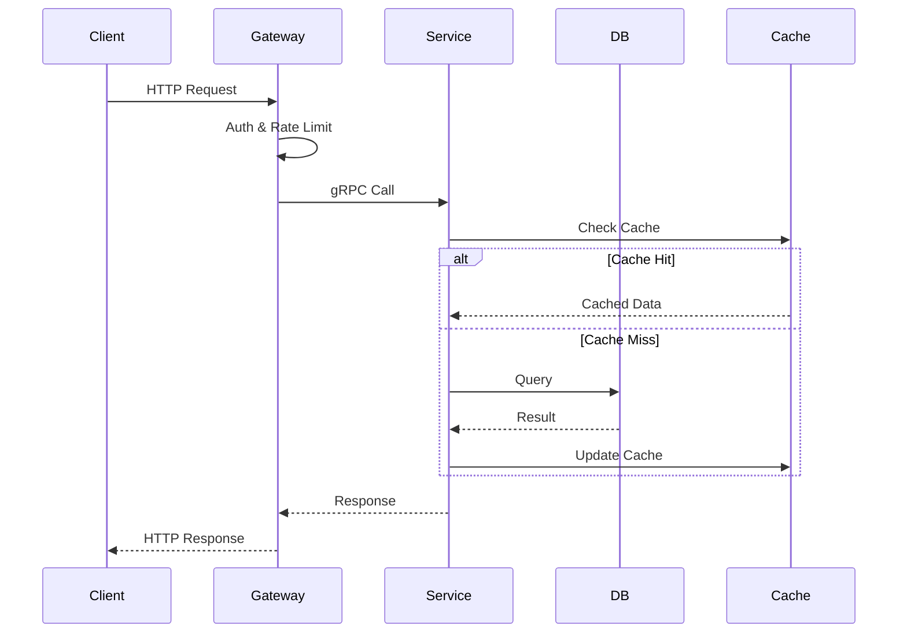
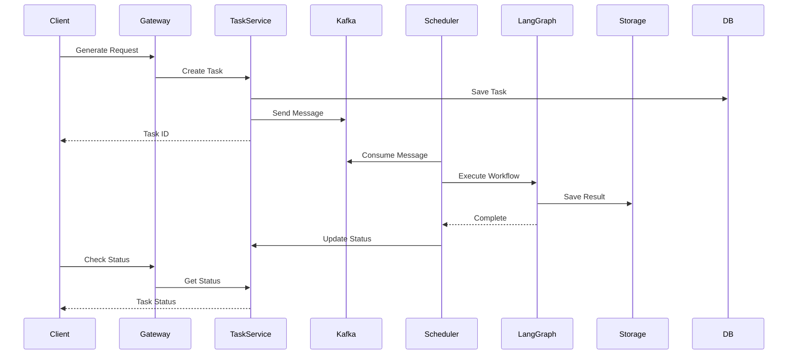

# 服务端技术方案设计

## 1. 技术栈选型

### 1.1 核心技术栈

#### Go服务
- **Go 1.21+**：高性能、高并发
- **Gin**：Web框架
- **gRPC**：服务间通信
- **Wire**：依赖注入
- **GORM**：ORM框架

#### Python服务
- **Python 3.11+**：算法调度服务
- **FastAPI**：异步Web框架
- **Celery**：分布式任务队列
- **SQLAlchemy**：ORM框架

### 1.2 中间件
- **MySQL 8.0**：业务数据存储
- **Redis 7.0**：缓存、会话管理
- **Kafka**：消息队列
- **MinIO**：对象存储
- **Elasticsearch**：搜索引擎

### 1.3 基础设施
- **Docker**：容器化
- **Kubernetes**：容器编排
- **Istio**：服务网格
- **Prometheus + Grafana**：监控
- **ELK Stack**：日志收集分析

## 2. 微服务架构设计

### 2.1 服务划分

```
backend/
├── services/
│   ├── gateway/              # API网关服务 (Go)
│   │   ├── internal/
│   │   │   ├── handler/      # HTTP处理器
│   │   │   ├── middleware/   # 中间件
│   │   │   ├── router/       # 路由
│   │   │   └── config/       # 配置
│   │   ├── cmd/
│   │   └── Dockerfile
│   │
│   ├── user/                 # 用户服务 (Go)
│   │   ├── internal/
│   │   │   ├── api/          # gRPC接口
│   │   │   ├── service/      # 业务逻辑
│   │   │   ├── repository/   # 数据访问
│   │   │   └── model/        # 数据模型
│   │   ├── cmd/
│   │   └── Dockerfile
│   │
│   ├── project/              # 项目服务 (Go)
│   │   ├── internal/
│   │   │   ├── api/
│   │   │   ├── service/
│   │   │   ├── repository/
│   │   │   └── model/
│   │   ├── cmd/
│   │   └── Dockerfile
│   │
│   ├── task/                 # 任务服务 (Go)
│   │   ├── internal/
│   │   │   ├── api/
│   │   │   ├── service/
│   │   │   ├── repository/
│   │   │   ├── queue/        # 消息队列
│   │   │   └── model/
│   │   ├── cmd/
│   │   └── Dockerfile
│   │
│   └── algorithm/            # 算法调度服务 (Python)
│       ├── app/
│       │   ├── api/          # FastAPI路由
│       │   ├── service/      # 业务逻辑
│       │   ├── celery/       # Celery任务
│       │   ├── models/       # 数据模型
│       │   └── utils/        # 工具函数
│       ├── main.py
│       └── Dockerfile
│
├── pkg/                      # 公共包
│   ├── common/               # 通用工具
│   │   ├── logger/           # 日志
│   │   ├── errors/           # 错误处理
│   │   ├── response/         # 响应格式
│   │   └── utils/            # 工具函数
│   ├── middleware/           # 公共中间件
│   │   ├── auth/             # 认证
│   │   ├── cors/             # 跨域
│   │   ├── ratelimit/        # 限流
│   │   └── trace/            # 链路追踪
│   └── config/               # 配置管理
│
└── deployments/              # 部署配置
    ├── docker-compose/       # 开发环境
    ├── kubernetes/           # K8s配置
    └── scripts/              # 部署脚本
```

### 2.2 API网关设计

```go
// gateway/internal/middleware/auth.go
package middleware

import (
    "github.com/gin-gonic/gin"
    "github.com/golang-jwt/jwt/v5"
)

func AuthMiddleware() gin.HandlerFunc {
    return func(c *gin.Context) {
        token := c.GetHeader("Authorization")
        if token == "" {
            c.JSON(401, gin.H{"error": "unauthorized"})
            c.Abort()
            return
        }
        
        // 验证JWT token
        claims, err := validateToken(token)
        if err != nil {
            c.JSON(401, gin.H{"error": "invalid token"})
            c.Abort()
            return
        }
        
        // 设置用户信息到上下文
        c.Set("userId", claims.UserId)
        c.Set("username", claims.Username)
        c.Next()
    }
}

// gateway/internal/router/router.go
func SetupRouter(r *gin.Engine) {
    // 公开接口
    public := r.Group("/api/v1")
    {
        public.POST("/auth/login", authHandler.Login)
        public.POST("/auth/register", authHandler.Register)
    }
    
    // 需要认证的接口
    protected := r.Group("/api/v1")
    protected.Use(middleware.AuthMiddleware())
    {
        // 用户相关
        protected.GET("/users/profile", userHandler.GetProfile)
        protected.PUT("/users/profile", userHandler.UpdateProfile)
        
        // 项目相关
        protected.GET("/projects", projectHandler.List)
        protected.POST("/projects", projectHandler.Create)
        protected.GET("/projects/:id", projectHandler.Get)
        
        // 设计生成
        protected.POST("/designs/generate", designHandler.Generate)
        protected.GET("/designs/:taskId/status", designHandler.GetStatus)
    }
}
```

### 2.3 用户服务设计

```go
// user/internal/service/user_service.go
package service

type UserService struct {
    repo repository.UserRepository
    cache cache.Cache
}

func (s *UserService) CreateUser(ctx context.Context, req *CreateUserRequest) (*User, error) {
    // 验证用户名是否存在
    exists, err := s.repo.ExistsByUsername(ctx, req.Username)
    if err != nil {
        return nil, err
    }
    if exists {
        return nil, errors.New("username already exists")
    }
    
    // 密码加密
    hashedPassword, err := bcrypt.GenerateFromPassword([]byte(req.Password), bcrypt.DefaultCost)
    if err != nil {
        return nil, err
    }
    
    // 创建用户
    user := &model.User{
        Username: req.Username,
        Email:    req.Email,
        Password: string(hashedPassword),
    }
    
    if err := s.repo.Create(ctx, user); err != nil {
        return nil, err
    }
    
    // 缓存用户信息
    s.cache.Set(fmt.Sprintf("user:%d", user.ID), user, 1*time.Hour)
    
    return user, nil
}

// user/internal/api/user.proto
syntax = "proto3";

service UserService {
    rpc GetUser(GetUserRequest) returns (User);
    rpc CreateUser(CreateUserRequest) returns (User);
    rpc UpdateUser(UpdateUserRequest) returns (User);
    rpc DeleteUser(DeleteUserRequest) returns (Empty);
}

message User {
    int64 id = 1;
    string username = 2;
    string email = 3;
    string avatar = 4;
    int64 created_at = 5;
}
```

### 2.4 任务服务设计

```go
// task/internal/service/task_service.go
package service

type TaskService struct {
    repo     repository.TaskRepository
    producer kafka.Producer
    cache    cache.Cache
}

func (s *TaskService) CreateGenerationTask(ctx context.Context, req *GenerationRequest) (*Task, error) {
    // 创建任务记录
    task := &model.Task{
        UserID:      req.UserID,
        ProjectID:   req.ProjectID,
        Type:        "image_generation",
        Status:      "pending",
        Params:      req.Params,
        CreatedAt:   time.Now(),
    }
    
    if err := s.repo.Create(ctx, task); err != nil {
        return nil, err
    }
    
    // 发送到消息队列
    message := &TaskMessage{
        TaskID:    task.ID,
        Type:      task.Type,
        Params:    task.Params,
        Timestamp: time.Now().Unix(),
    }
    
    if err := s.producer.Send("generation-tasks", message); err != nil {
        // 更新任务状态为失败
        task.Status = "failed"
        s.repo.Update(ctx, task)
        return nil, err
    }
    
    // 缓存任务状态
    s.cacheTaskStatus(task)
    
    return task, nil
}

func (s *TaskService) UpdateTaskStatus(ctx context.Context, taskID string, status string, result map[string]interface{}) error {
    task, err := s.repo.GetByID(ctx, taskID)
    if err != nil {
        return err
    }
    
    task.Status = status
    task.Result = result
    task.UpdatedAt = time.Now()
    
    if err := s.repo.Update(ctx, task); err != nil {
        return err
    }
    
    // 更新缓存
    s.cacheTaskStatus(task)
    
    // 如果是最终状态，发送WebSocket通知
    if status == "completed" || status == "failed" {
        s.notifyTaskComplete(task)
    }
    
    return nil
}
```

### 2.5 算法调度服务设计（Python）

```python
# algorithm/app/service/scheduler_service.py
from celery import Celery
from app.models import Task, GenerationResult
from app.utils.kafka import KafkaConsumer
import asyncio

class SchedulerService:
    def __init__(self):
        self.celery = Celery('tasks', broker='redis://redis:6379')
        self.consumer = KafkaConsumer('generation-tasks')
        
    async def start(self):
        """启动任务调度器"""
        async for message in self.consumer:
            await self.handle_task(message)
    
    async def handle_task(self, message):
        """处理任务"""
        task_data = message.value
        task_id = task_data['task_id']
        task_type = task_data['type']
        params = task_data['params']
        
        # 更新任务状态为处理中
        await self.update_task_status(task_id, 'processing')
        
        # 根据任务类型分发到不同的Celery任务
        if task_type == 'image_generation':
            self.celery.send_task(
                'generate_image',
                args=[task_id, params],
                queue='generation'
            )
        elif task_type == 'style_transfer':
            self.celery.send_task(
                'style_transfer',
                args=[task_id, params],
                queue='style'
            )
    
    async def update_task_status(self, task_id: str, status: str, result=None):
        """更新任务状态"""
        # 调用Go任务服务的gRPC接口
        async with grpc.aio.insecure_channel('task-service:50051') as channel:
            stub = task_pb2_grpc.TaskServiceStub(channel)
            request = task_pb2.UpdateStatusRequest(
                task_id=task_id,
                status=status,
                result=result
            )
            await stub.UpdateTaskStatus(request)

# algorithm/app/celery/tasks.py
from celery import Task
from app.langgraph import ImageGenerationGraph

class GenerateImageTask(Task):
    """图像生成任务"""
    
    def run(self, task_id: str, params: dict):
        try:
            # 创建LangGraph工作流
            graph = ImageGenerationGraph()
            
            # 执行生成流程
            result = graph.run({
                'prompt': params['prompt'],
                'style': params.get('style', 'default'),
                'size': params.get('size', '1024x1024'),
                'options': params.get('options', {})
            })
            
            # 保存结果
            self.save_result(task_id, result)
            
            # 更新任务状态
            self.update_status(task_id, 'completed', result)
            
        except Exception as e:
            self.update_status(task_id, 'failed', {'error': str(e)})
            raise
```

## 3. 数据流设计

### 3.1 同步请求流程



### 3.2 异步生成流程



## 4. 高可用设计

### 4.1 服务注册与发现

```yaml
# kubernetes/services/user-service.yaml
apiVersion: v1
kind: Service
metadata:
  name: user-service
  labels:
    app: user-service
spec:
  ports:
  - port: 50051
    name: grpc
  selector:
    app: user-service
---
apiVersion: apps/v1
kind: Deployment
metadata:
  name: user-service
spec:
  replicas: 3
  selector:
    matchLabels:
      app: user-service
  template:
    metadata:
      labels:
        app: user-service
    spec:
      containers:
      - name: user-service
        image: user-service:latest
        ports:
        - containerPort: 50051
        env:
        - name: DB_HOST
          valueFrom:
            configMapKeyRef:
              name: db-config
              key: host
        livenessProbe:
          grpc:
            port: 50051
          initialDelaySeconds: 10
        readinessProbe:
          grpc:
            port: 50051
          initialDelaySeconds: 5
```

### 4.2 熔断与限流

```go
// pkg/middleware/circuit_breaker.go
package middleware

import (
    "github.com/sony/gobreaker"
)

func CircuitBreakerMiddleware() gin.HandlerFunc {
    cb := gobreaker.NewCircuitBreaker(gobreaker.Settings{
        Name:        "API",
        MaxRequests: 10,
        Interval:    time.Minute,
        Timeout:     30 * time.Second,
        ReadyToTrip: func(counts gobreaker.Counts) bool {
            failureRatio := float64(counts.TotalFailures) / float64(counts.Requests)
            return counts.Requests >= 3 && failureRatio >= 0.6
        },
    })
    
    return func(c *gin.Context) {
        _, err := cb.Execute(func() (interface{}, error) {
            c.Next()
            if c.Writer.Status() >= 500 {
                return nil, errors.New("server error")
            }
            return nil, nil
        })
        
        if err != nil {
            c.JSON(503, gin.H{"error": "service unavailable"})
            c.Abort()
        }
    }
}
```

### 4.3 消息队列可靠性

```go
// task/internal/queue/kafka_producer.go
package queue

type ReliableProducer struct {
    producer sarama.AsyncProducer
    config   *ProducerConfig
}

func (p *ReliableProducer) SendWithRetry(topic string, message interface{}) error {
    data, err := json.Marshal(message)
    if err != nil {
        return err
    }
    
    msg := &sarama.ProducerMessage{
        Topic: topic,
        Key:   sarama.StringEncoder(message.ID),
        Value: sarama.ByteEncoder(data),
        Headers: []sarama.RecordHeader{
            {Key: []byte("timestamp"), Value: []byte(time.Now().Format(time.RFC3339))},
        },
    }
    
    // 重试策略
    retries := 3
    for i := 0; i < retries; i++ {
        select {
        case p.producer.Input() <- msg:
            return nil
        case err := <-p.producer.Errors():
            log.Printf("Failed to send message (attempt %d/%d): %v", i+1, retries, err)
            if i == retries-1 {
                // 保存到失败队列
                p.saveToDeadLetter(msg, err)
                return err
            }
            time.Sleep(time.Second * time.Duration(i+1))
        }
    }
    
    return nil
}
```

## 5. 监控与日志

### 5.1 Prometheus指标

```go
// pkg/metrics/metrics.go
package metrics

import (
    "github.com/prometheus/client_golang/prometheus"
    "github.com/prometheus/client_golang/prometheus/promauto"
)

var (
    RequestDuration = promauto.NewHistogramVec(prometheus.HistogramOpts{
        Name: "http_request_duration_seconds",
        Help: "Duration of HTTP requests.",
    }, []string{"path", "method", "status"})
    
    RequestCount = promauto.NewCounterVec(prometheus.CounterOpts{
        Name: "http_requests_total",
        Help: "Total number of HTTP requests.",
    }, []string{"path", "method", "status"})
    
    ActiveTasks = promauto.NewGauge(prometheus.GaugeOpts{
        Name: "active_generation_tasks",
        Help: "Number of active generation tasks.",
    })
)

// middleware/metrics.go
func MetricsMiddleware() gin.HandlerFunc {
    return func(c *gin.Context) {
        start := time.Now()
        
        c.Next()
        
        duration := time.Since(start).Seconds()
        status := strconv.Itoa(c.Writer.Status())
        
        RequestDuration.WithLabelValues(c.FullPath(), c.Request.Method, status).Observe(duration)
        RequestCount.WithLabelValues(c.FullPath(), c.Request.Method, status).Inc()
    }
}
```

### 5.2 结构化日志

```go
// pkg/logger/logger.go
package logger

import (
    "go.uber.org/zap"
)

type Logger struct {
    *zap.SugaredLogger
}

func NewLogger() *Logger {
    config := zap.NewProductionConfig()
    config.OutputPaths = []string{"stdout"}
    config.ErrorOutputPaths = []string{"stderr"}
    
    logger, _ := config.Build()
    return &Logger{logger.Sugar()}
}

func (l *Logger) WithFields(fields map[string]interface{}) *Logger {
    return &Logger{l.SugaredLogger.With(fields)}
}

// 使用示例
func (s *UserService) CreateUser(ctx context.Context, req *CreateUserRequest) (*User, error) {
    logger := logger.WithFields(map[string]interface{}{
        "action": "create_user",
        "username": req.Username,
    })
    
    logger.Info("Creating new user")
    
    user, err := s.repo.Create(ctx, req)
    if err != nil {
        logger.Error("Failed to create user", "error", err)
        return nil, err
    }
    
    logger.Info("User created successfully", "user_id", user.ID)
    return user, nil
}
```

## 6. 安全设计

### 6.1 API安全

```go
// pkg/security/security.go
package security

// SQL注入防护
func SanitizeInput(input string) string {
    // 使用参数化查询，不直接拼接SQL
    return strings.ReplaceAll(input, "'", "''")
}

// XSS防护
func SanitizeHTML(input string) string {
    p := bluemonday.UGCPolicy()
    return p.Sanitize(input)
}

// CSRF防护
func GenerateCSRFToken() string {
    b := make([]byte, 32)
    rand.Read(b)
    return base64.URLEncoding.EncodeToString(b)
}
```

### 6.2 数据加密

```go
// pkg/crypto/crypto.go
package crypto

import (
    "crypto/aes"
    "crypto/cipher"
)

type Encryptor struct {
    block cipher.Block
}

func NewEncryptor(key []byte) (*Encryptor, error) {
    block, err := aes.NewCipher(key)
    if err != nil {
        return nil, err
    }
    return &Encryptor{block: block}, nil
}

func (e *Encryptor) Encrypt(plaintext []byte) ([]byte, error) {
    gcm, err := cipher.NewGCM(e.block)
    if err != nil {
        return nil, err
    }
    
    nonce := make([]byte, gcm.NonceSize())
    if _, err := io.ReadFull(rand.Reader, nonce); err != nil {
        return nil, err
    }
    
    return gcm.Seal(nonce, nonce, plaintext, nil), nil
}
```