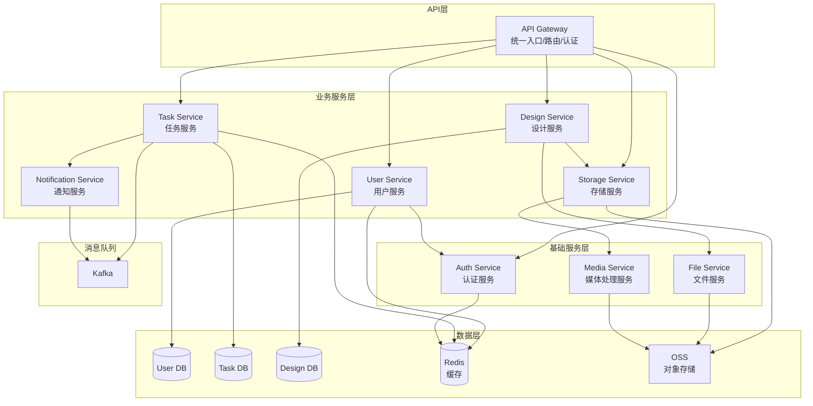
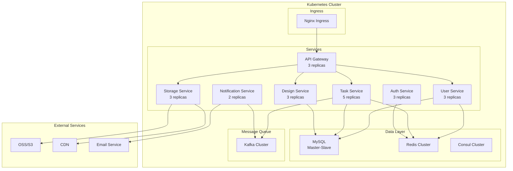

# 服务端微服务架构设计

## 1. 微服务划分原则

- **单一职责**：每个服务负责一个明确的业务领域
- **数据独立**：每个服务管理自己的数据
- **松耦合**：服务间通过API或消息队列通信
- **可独立部署**：每个服务可以独立开发、测试和部署

## 2. 微服务架构图



## 3. 各微服务详细设计

### 3.1 API Gateway（API网关）

**职责**：
- 统一入口点
- 请求路由
- 认证授权
- 限流熔断
- 日志记录

**技术选型**：
- Kong / Nginx + Lua
- 或自研 Go 网关

**主要功能**：
```go
// 路由配置示例
routes:
  - path: /api/v1/users/*
    service: user-service
    methods: [GET, POST, PUT, DELETE]
    
  - path: /api/v1/tasks/*
    service: task-service
    methods: [GET, POST, PUT]
    
  - path: /api/v1/designs/*
    service: design-service
    methods: [GET, POST, PUT, DELETE]
```

### 3.2 User Service（用户服务）

**职责**：
- 用户注册/登录
- 用户信息管理
- 用户权限管理
- 用户配额管理

**数据模型**：
```go
// User 用户模型
type User struct {
    ID          string    `json:"id"`
    Username    string    `json:"username"`
    Email       string    `json:"email"`
    Avatar      string    `json:"avatar"`
    Role        string    `json:"role"`        // user/vip/admin
    Status      string    `json:"status"`      // active/blocked
    Quota       UserQuota `json:"quota"`
    CreatedAt   time.Time `json:"created_at"`
}

// UserQuota 用户配额
type UserQuota struct {
    MaxTasks        int   `json:"max_tasks"`         // 最大任务数/月
    UsedTasks       int   `json:"used_tasks"`        // 已用任务数
    MaxStorage      int64 `json:"max_storage"`       // 最大存储空间
    UsedStorage     int64 `json:"used_storage"`      // 已用存储空间
    ResetAt         time.Time `json:"reset_at"`      // 配额重置时间
}
```

**API接口**：
```yaml
# 用户注册
POST /api/v1/users/register

# 用户登录
POST /api/v1/users/login

# 获取用户信息
GET /api/v1/users/{userId}

# 更新用户信息
PUT /api/v1/users/{userId}

# 获取用户配额
GET /api/v1/users/{userId}/quota

# 检查用户权限
POST /api/v1/users/{userId}/check-permission
```

### 3.3 Task Service（任务服务）

**职责**：
- 任务创建和管理
- 任务状态跟踪
- 任务进度更新
- 任务调度分发

**核心功能**：
```go
// TaskService 任务服务接口
type TaskService interface {
    // 创建任务
    CreateTask(ctx context.Context, req *CreateTaskRequest) (*Task, error)
    
    // 获取任务状态
    GetTaskStatus(ctx context.Context, taskID string) (*TaskStatus, error)
    
    // 更新任务进度（算法端调用）
    UpdateProgress(ctx context.Context, taskID string, progress *Progress) error
    
    // 完成任务（算法端调用）
    CompleteTask(ctx context.Context, taskID string, result *TaskResult) error
    
    // 取消任务
    CancelTask(ctx context.Context, taskID string) error
    
    // 重试任务
    RetryTask(ctx context.Context, taskID string) error
    
    // 获取用户任务列表
    ListUserTasks(ctx context.Context, userID string, filter *TaskFilter) ([]*Task, error)
}
```

**与其他服务交互**：
```go
// 创建任务时的交互流程
func (s *taskServiceImpl) CreateTask(ctx context.Context, req *CreateTaskRequest) (*Task, error) {
    // 1. 调用用户服务检查配额
    quotaOK, err := s.userClient.CheckQuota(ctx, req.UserID, "task")
    if err != nil || !quotaOK {
        return nil, ErrQuotaExceeded
    }
    
    // 2. 创建任务记录
    task := &Task{
        ID:     generateTaskID(),
        UserID: req.UserID,
        Type:   req.Type,
        Params: req.Params,
        Status: TaskStatusPending,
    }
    
    if err := s.taskRepo.Create(ctx, task); err != nil {
        return nil, err
    }
    
    // 3. 发送到消息队列
    if err := s.kafkaProducer.SendTask(task); err != nil {
        // 失败则更新状态
        task.Status = TaskStatusFailed
        s.taskRepo.Update(ctx, task)
        return nil, err
    }
    
    // 4. 更新用户配额
    s.userClient.UpdateQuota(ctx, req.UserID, "task", 1)
    
    // 5. 发送通知
    s.notifyClient.SendNotification(ctx, &Notification{
        UserID: req.UserID,
        Type:   "task_created",
        Data:   map[string]interface{}{"task_id": task.ID},
    })
    
    return task, nil
}
```

### 3.4 Design Service（设计服务）

**职责**：
- 海报信息管理
- 图层管理
- 元素管理
- 模板管理

**数据模型**：
```go
// DesignService 设计服务接口
type DesignService interface {
    // 海报相关
    CreatePoster(ctx context.Context, req *CreatePosterRequest) (*Poster, error)
    GetPoster(ctx context.Context, posterID string) (*Poster, error)
    UpdatePoster(ctx context.Context, posterID string, req *UpdatePosterRequest) error
    DeletePoster(ctx context.Context, posterID string) error
    
    // 图层相关
    CreateLayer(ctx context.Context, posterID string, req *CreateLayerRequest) (*Layer, error)
    UpdateLayerOrder(ctx context.Context, posterID string, orders []LayerOrder) error
    
    // 元素相关
    CreateElements(ctx context.Context, req *CreateElementsRequest) ([]*Element, error)
    UpdateElement(ctx context.Context, elementID string, req *UpdateElementRequest) error
    DeleteElement(ctx context.Context, elementID string) error
    
    // 模板相关
    SaveAsTemplate(ctx context.Context, posterID string, req *SaveTemplateRequest) (*Template, error)
    GetTemplate(ctx context.Context, templateID string) (*Template, error)
    ListTemplates(ctx context.Context, filter *TemplateFilter) ([]*Template, error)
}
```

**服务间通信**：
```go
// 保存海报时的处理流程
func (s *designServiceImpl) CreatePoster(ctx context.Context, req *CreatePosterRequest) (*Poster, error) {
    // 1. 创建海报记录
    poster := &Poster{
        ID:         generatePosterID(),
        TaskID:     req.TaskID,
        UserID:     req.UserID,
        Width:      req.Width,
        Height:     req.Height,
        Background: req.Background,
    }
    
    // 开启事务
    tx := s.db.BeginTx(ctx, nil)
    defer tx.Rollback()
    
    // 2. 保存海报
    if err := s.posterRepo.CreateTx(tx, poster); err != nil {
        return nil, err
    }
    
    // 3. 创建图层
    for i, layerReq := range req.Layers {
        layer := &Layer{
            ID:       generateLayerID(),
            PosterID: poster.ID,
            Name:     layerReq.Name,
            Order:    i,
        }
        if err := s.layerRepo.CreateTx(tx, layer); err != nil {
            return nil, err
        }
    }
    
    // 4. 调用存储服务保存预览图
    if req.PreviewData != nil {
        previewURL, err := s.storageClient.UploadImage(ctx, &UploadRequest{
            Data:     req.PreviewData,
            FileName: fmt.Sprintf("poster_%s_preview.jpg", poster.ID),
            Path:     fmt.Sprintf("posters/%s/", poster.ID),
        })
        if err != nil {
            return nil, err
        }
        poster.PreviewURL = previewURL
    }
    
    // 5. 提交事务
    if err := tx.Commit(); err != nil {
        return nil, err
    }
    
    // 6. 更新缓存
    s.cache.Set(ctx, fmt.Sprintf("poster:%s", poster.ID), poster, 1*time.Hour)
    
    return poster, nil
}
```

### 3.5 Storage Service（存储服务）

**职责**：
- 文件上传下载
- 存储空间管理
- CDN加速
- 存储配额控制

**核心功能**：
```go
// StorageService 存储服务接口
type StorageService interface {
    // 上传文件
    UploadFile(ctx context.Context, req *UploadRequest) (*FileInfo, error)
    
    // 获取文件
    GetFile(ctx context.Context, fileID string) (*FileInfo, error)
    
    // 删除文件
    DeleteFile(ctx context.Context, fileID string) error
    
    // 获取上传凭证（直传OSS）
    GetUploadToken(ctx context.Context, req *UploadTokenRequest) (*UploadToken, error)
    
    // 获取用户存储统计
    GetUserStorage(ctx context.Context, userID string) (*StorageStats, error)
}

// 存储策略
type StorageStrategy interface {
    Upload(ctx context.Context, data []byte, key string) (string, error)
    Download(ctx context.Context, key string) ([]byte, error)
    Delete(ctx context.Context, key string) error
    GenerateURL(key string, expires time.Duration) (string, error)
}

// OSS存储实现
type OSSStorage struct {
    client *oss.Client
    bucket string
    cdnURL string
}

func (s *OSSStorage) Upload(ctx context.Context, data []byte, key string) (string, error) {
    // 上传到OSS
    err := s.client.PutObject(s.bucket, key, bytes.NewReader(data))
    if err != nil {
        return "", err
    }
    
    // 返回CDN URL
    return fmt.Sprintf("%s/%s", s.cdnURL, key), nil
}
```

### 3.6 Notification Service（通知服务）

**职责**：
- 实时消息推送
- 邮件通知
- 站内信管理
- WebSocket连接管理

**核心功能**：
```go
// NotificationService 通知服务接口
type NotificationService interface {
    // 发送实时通知
    SendRealtime(ctx context.Context, userID string, msg *Message) error
    
    // 发送邮件
    SendEmail(ctx context.Context, req *EmailRequest) error
    
    // 发送站内信
    SendInbox(ctx context.Context, req *InboxRequest) error
    
    // 批量发送
    SendBatch(ctx context.Context, req *BatchRequest) error
    
    // WebSocket管理
    RegisterWebSocket(userID string, conn *websocket.Conn)
    UnregisterWebSocket(userID string)
}

// WebSocket Hub
type Hub struct {
    clients    map[string]*Client
    broadcast  chan *Message
    register   chan *Client
    unregister chan *Client
}

func (h *Hub) Run() {
    for {
        select {
        case client := <-h.register:
            h.clients[client.userID] = client
            
        case client := <-h.unregister:
            if _, ok := h.clients[client.userID]; ok {
                delete(h.clients, client.userID)
                close(client.send)
            }
            
        case message := <-h.broadcast:
            if client, ok := h.clients[message.UserID]; ok {
                select {
                case client.send <- message:
                default:
                    close(client.send)
                    delete(h.clients, client.userID)
                }
            }
        }
    }
}
```

### 3.7 Auth Service（认证服务）

**职责**：
- 用户认证
- Token管理
- 权限验证
- 单点登录

**核心功能**：
```go
// AuthService 认证服务接口
type AuthService interface {
    // 生成Token
    GenerateToken(userID string, claims map[string]interface{}) (string, error)
    
    // 验证Token
    VerifyToken(token string) (*TokenClaims, error)
    
    // 刷新Token
    RefreshToken(refreshToken string) (string, error)
    
    // 撤销Token
    RevokeToken(token string) error
    
    // 检查权限
    CheckPermission(userID string, resource string, action string) (bool, error)
}

// JWT实现
type JWTAuth struct {
    secretKey   []byte
    tokenExpiry time.Duration
    redis       *redis.Client
}

func (a *JWTAuth) GenerateToken(userID string, claims map[string]interface{}) (string, error) {
    // 创建claims
    jwtClaims := jwt.MapClaims{
        "user_id": userID,
        "exp":     time.Now().Add(a.tokenExpiry).Unix(),
        "iat":     time.Now().Unix(),
    }
    
    // 合并自定义claims
    for k, v := range claims {
        jwtClaims[k] = v
    }
    
    // 生成token
    token := jwt.NewWithClaims(jwt.SigningMethodHS256, jwtClaims)
    tokenString, err := token.SignedString(a.secretKey)
    if err != nil {
        return "", err
    }
    
    // 存储到Redis（用于撤销）
    a.redis.Set(context.Background(), 
        fmt.Sprintf("token:%s", tokenString), 
        userID, 
        a.tokenExpiry,
    )
    
    return tokenString, nil
}
```

### 3.8 File Service（文件服务）

**职责**：
- 文件格式转换
- 图片处理
- 字体管理
- 素材库管理

**核心功能**：
```go
// FileService 文件服务接口
type FileService interface {
    // 图片处理
    ResizeImage(ctx context.Context, req *ResizeRequest) (*ProcessedImage, error)
    CompressImage(ctx context.Context, req *CompressRequest) (*ProcessedImage, error)
    ConvertFormat(ctx context.Context, req *ConvertRequest) (*ProcessedFile, error)
    
    // 字体管理
    UploadFont(ctx context.Context, req *UploadFontRequest) (*Font, error)
    ListFonts(ctx context.Context, filter *FontFilter) ([]*Font, error)
    
    // 素材管理
    UploadAsset(ctx context.Context, req *UploadAssetRequest) (*Asset, error)
    SearchAssets(ctx context.Context, query string) ([]*Asset, error)
}
```

### 3.9 Media Service（媒体处理服务）

**职责**：
- 图片智能裁剪
- 背景移除
- 水印添加
- 图片优化

**核心功能**：
```go
// MediaService 媒体处理服务接口
type MediaService interface {
    // 智能处理
    RemoveBackground(ctx context.Context, imageURL string) (*ProcessResult, error)
    SmartCrop(ctx context.Context, req *SmartCropRequest) (*ProcessResult, error)
    AddWatermark(ctx context.Context, req *WatermarkRequest) (*ProcessResult, error)
    
    // 批量处理
    BatchProcess(ctx context.Context, req *BatchProcessRequest) (*BatchResult, error)
}
```

## 4. 服务间通信

### 4.1 同步通信（gRPC）

```protobuf
// proto/user.proto
syntax = "proto3";

package user;

service UserService {
    rpc GetUser(GetUserRequest) returns (User);
    rpc CheckQuota(CheckQuotaRequest) returns (CheckQuotaResponse);
    rpc UpdateQuota(UpdateQuotaRequest) returns (UpdateQuotaResponse);
}

message GetUserRequest {
    string user_id = 1;
}

message User {
    string id = 1;
    string username = 2;
    string email = 3;
    UserQuota quota = 4;
}

message CheckQuotaRequest {
    string user_id = 1;
    string resource_type = 2;
    int32 amount = 3;
}

message CheckQuotaResponse {
    bool allowed = 1;
    string reason = 2;
}
```

### 4.2 异步通信（Kafka）

```go
// 任务事件
type TaskEvent struct {
    EventType string    `json:"event_type"` // created/updated/completed/failed
    TaskID    string    `json:"task_id"`
    UserID    string    `json:"user_id"`
    Timestamp time.Time `json:"timestamp"`
    Data      map[string]interface{} `json:"data"`
}

// 事件生产者
func (p *EventProducer) PublishTaskEvent(event *TaskEvent) error {
    data, err := json.Marshal(event)
    if err != nil {
        return err
    }
    
    return p.kafka.WriteMessages(context.Background(), kafka.Message{
        Topic: "task-events",
        Key:   []byte(event.TaskID),
        Value: data,
        Headers: []kafka.Header{
            {Key: "event_type", Value: []byte(event.EventType)},
            {Key: "user_id", Value: []byte(event.UserID)},
        },
    })
}

// 事件消费者
func (c *EventConsumer) ConsumeTaskEvents() {
    for {
        msg, err := c.reader.ReadMessage(context.Background())
        if err != nil {
            log.Printf("Error reading message: %v", err)
            continue
        }
        
        var event TaskEvent
        if err := json.Unmarshal(msg.Value, &event); err != nil {
            log.Printf("Error unmarshaling event: %v", err)
            continue
        }
        
        // 处理事件
        switch event.EventType {
        case "task_completed":
            // 通知用户
            c.notificationService.SendRealtime(event.UserID, &Message{
                Type: "task_completed",
                Data: event.Data,
            })
            
        case "task_failed":
            // 发送失败通知
            c.notificationService.SendEmail(&EmailRequest{
                UserID:  event.UserID,
                Subject: "任务执行失败",
                Content: fmt.Sprintf("您的任务 %s 执行失败", event.TaskID),
            })
        }
    }
}
```

## 5. 服务发现与注册

### 5.1 使用Consul

```go
// 服务注册
func RegisterService(consulClient *consul.Client, service *ServiceInfo) error {
    registration := &consul.AgentServiceRegistration{
        ID:      service.ID,
        Name:    service.Name,
        Port:    service.Port,
        Address: service.Address,
        Tags:    service.Tags,
        Check: &consul.AgentServiceCheck{
            HTTP:                           fmt.Sprintf("http://%s:%d/health", service.Address, service.Port),
            Interval:                       "10s",
            DeregisterCriticalServiceAfter: "30s",
        },
    }
    
    return consulClient.Agent().ServiceRegister(registration)
}

// 服务发现
func DiscoverService(consulClient *consul.Client, serviceName string) ([]*ServiceEndpoint, error) {
    services, _, err := consulClient.Health().Service(serviceName, "", true, nil)
    if err != nil {
        return nil, err
    }
    
    endpoints := make([]*ServiceEndpoint, 0, len(services))
    for _, service := range services {
        endpoints = append(endpoints, &ServiceEndpoint{
            ID:      service.Service.ID,
            Address: service.Service.Address,
            Port:    service.Service.Port,
        })
    }
    
    return endpoints, nil
}
```

### 5.2 使用Kubernetes Service

```yaml
# user-service.yaml
apiVersion: v1
kind: Service
metadata:
  name: user-service
  namespace: design-agent
spec:
  selector:
    app: user-service
  ports:
  - name: http
    port: 80
    targetPort: 8080
  - name: grpc
    port: 9090
    targetPort: 9090
  type: ClusterIP

---
apiVersion: apps/v1
kind: Deployment
metadata:
  name: user-service
  namespace: design-agent
spec:
  replicas: 3
  selector:
    matchLabels:
      app: user-service
  template:
    metadata:
      labels:
        app: user-service
    spec:
      containers:
      - name: user-service
        image: design-agent/user-service:latest
        ports:
        - containerPort: 8080
          name: http
        - containerPort: 9090
          name: grpc
        env:
        - name: SERVICE_NAME
          value: "user-service"
        - name: DB_HOST
          valueFrom:
            secretKeyRef:
              name: db-secret
              key: host
```

## 6. 配置管理

### 6.1 集中配置中心（使用Consul KV）

```go
// 配置结构
type ServiceConfig struct {
    Database DatabaseConfig `json:"database"`
    Redis    RedisConfig    `json:"redis"`
    Kafka    KafkaConfig    `json:"kafka"`
    Service  ServiceInfo    `json:"service"`
}

// 配置加载
func LoadConfig(consulClient *consul.Client, serviceName string) (*ServiceConfig, error) {
    kv := consulClient.KV()
    
    // 获取配置
    pair, _, err := kv.Get(fmt.Sprintf("config/%s", serviceName), nil)
    if err != nil {
        return nil, err
    }
    
    var config ServiceConfig
    if err := json.Unmarshal(pair.Value, &config); err != nil {
        return nil, err
    }
    
    return &config, nil
}

// 配置监听
func WatchConfig(consulClient *consul.Client, serviceName string, callback func(*ServiceConfig)) {
    kv := consulClient.KV()
    key := fmt.Sprintf("config/%s", serviceName)
    
    var lastIndex uint64
    for {
        pair, meta, err := kv.Get(key, &consul.QueryOptions{
            WaitIndex: lastIndex,
            WaitTime:  10 * time.Minute,
        })
        
        if err != nil {
            log.Printf("Error watching config: %v", err)
            time.Sleep(5 * time.Second)
            continue
        }
        
        if meta.LastIndex != lastIndex {
            lastIndex = meta.LastIndex
            
            var config ServiceConfig
            if err := json.Unmarshal(pair.Value, &config); err == nil {
                callback(&config)
            }
        }
    }
}
```

## 7. 部署架构



## 8. 微服务最佳实践

### 8.1 服务边界划分原则

1. **业务能力**：每个服务对应一个独立的业务能力
2. **数据所有权**：每个服务拥有自己的数据，不直接访问其他服务的数据库
3. **团队组织**：每个服务可以由一个小团队独立开发和维护
4. **变更频率**：将变更频率相近的功能放在同一个服务中

### 8.2 服务通信原则

1. **同步调用**：使用gRPC进行服务间的同步调用
2. **异步消息**：使用Kafka进行事件驱动的异步通信
3. **服务降级**：实现熔断器和降级策略
4. **超时控制**：设置合理的超时时间

### 8.3 数据一致性

1. **最终一致性**：接受短暂的数据不一致，通过事件驱动达到最终一致
2. **Saga模式**：使用Saga模式处理分布式事务
3. **事件溯源**：记录所有状态变更事件，支持回放和审计

### 8.4 监控和追踪

1. **分布式追踪**：使用Jaeger或Zipkin进行链路追踪
2. **日志聚合**：使用ELK Stack收集和分析日志
3. **指标监控**：使用Prometheus + Grafana监控服务指标
4. **健康检查**：每个服务暴露健康检查端点

这个微服务架构设计遵循了领域驱动设计（DDD）的原则，每个服务负责一个明确的业务领域，服务之间通过明确的接口进行通信，确保了系统的可扩展性和可维护性。