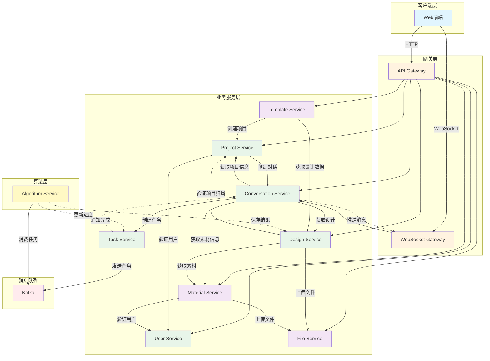
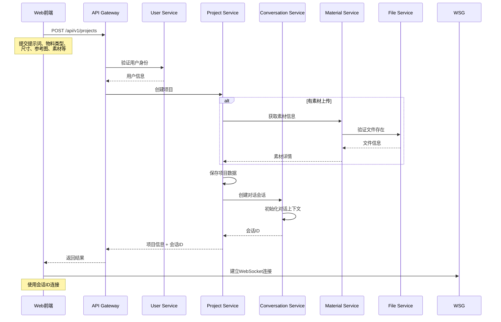
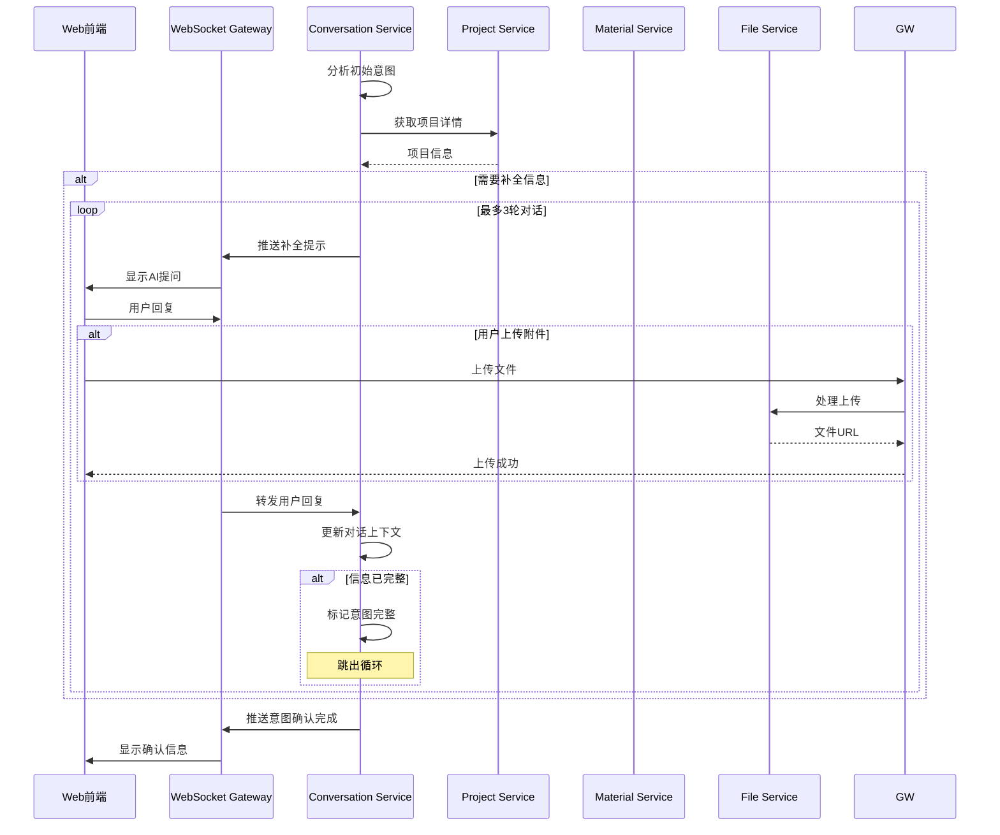
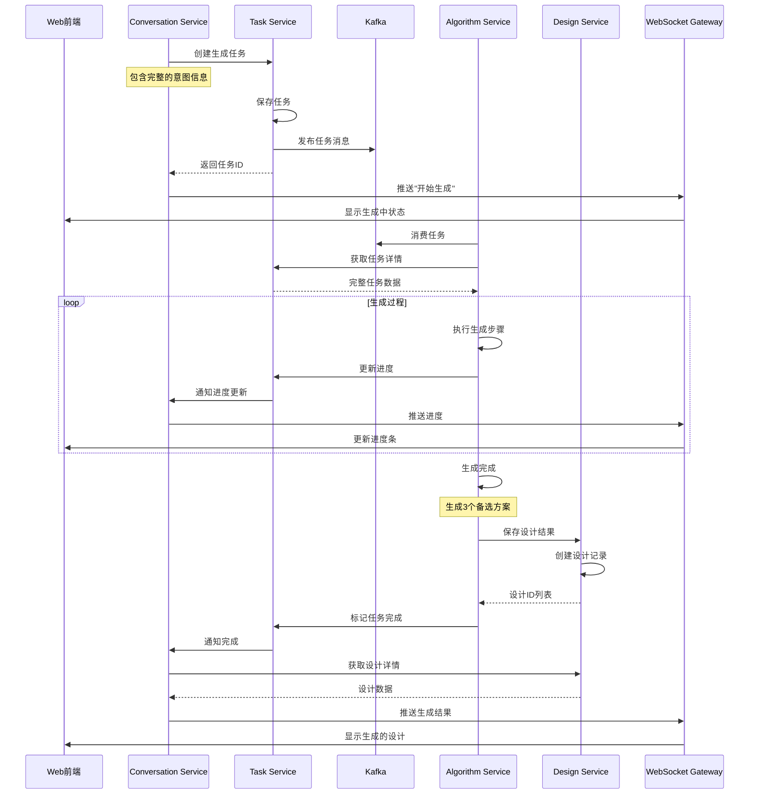
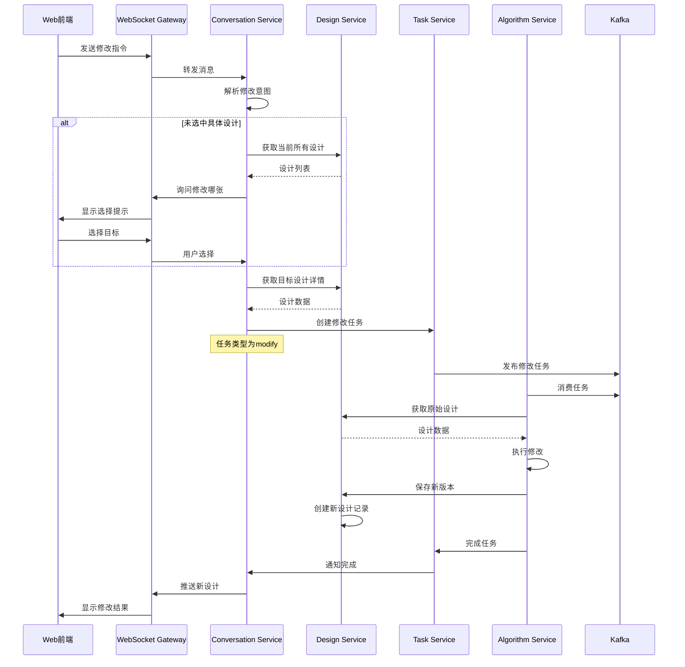
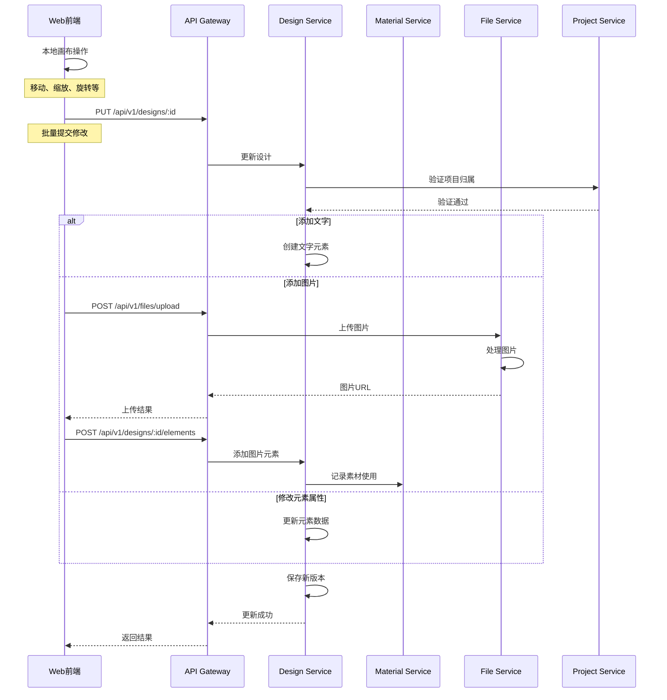
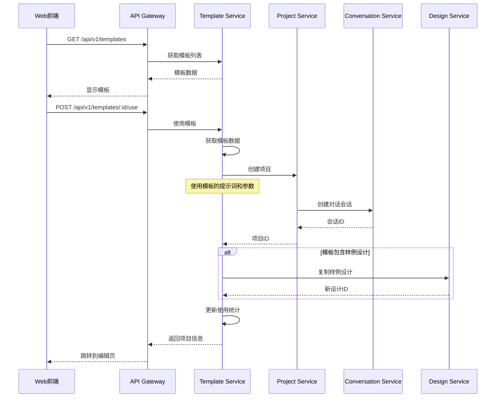
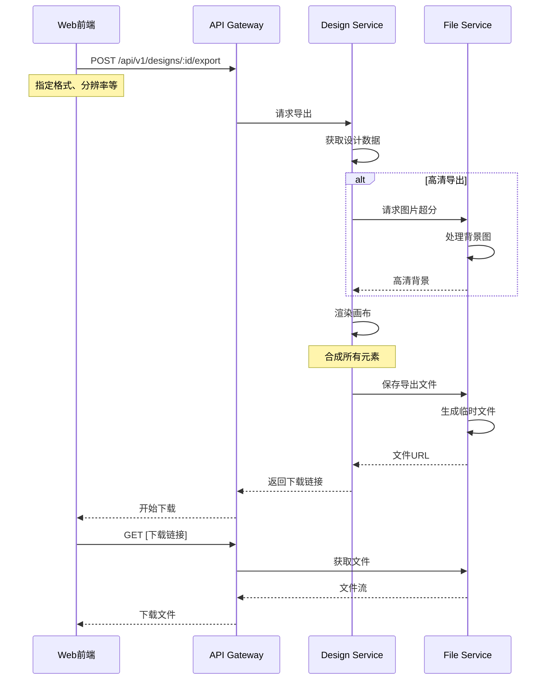
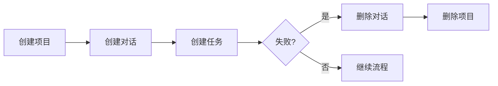

# WPS AI设计室 - 服务调用关系详解

## 1. 服务间调用关系总览

## 2. 核心业务流程中的服务调用

### 2.1 创建项目并开始设计

### 2.2 意图补全对话流程

### 2.3 生成任务执行流程

### 2.4 多轮对话修改流程

### 2.5 图上编辑流程

### 2.6 使用模板流程

### 2.7 导出设计流程

## 3. 服务间调用方式

### 3.1 同步调用（HTTP/gRPC）

| 调用方 | 被调用方 | 调用场景 | 接口类型 |
|--------|----------|----------|----------|
| Gateway | All Services | 所有客户端请求 | HTTP REST |
| Project Service | User Service | 验证用户权限 | gRPC |
| Project Service | Conversation Service | 创建对话会话 | gRPC |
| Conversation Service | Project Service | 获取项目信息 | gRPC |
| Conversation Service | Task Service | 创建任务 | gRPC |
| Conversation Service | Design Service | 获取/创建设计 | gRPC |
| Design Service | File Service | 文件处理 | gRPC |
| Design Service | Material Service | 素材管理 | gRPC |
| Material Service | File Service | 文件上传 | gRPC |
| Template Service | Project Service | 创建项目 | gRPC |
| Template Service | Design Service | 复制设计 | gRPC |

### 3.2 异步调用（Kafka）

| 生产者 | 消费者 | 消息类型 | 用途 |
|--------|---------|----------|------|
| Task Service | Algorithm Service | 生成任务 | 图文生成 |
| Task Service | Algorithm Service | 修改任务 | 设计修改 |
| Algorithm Service | Task Service | 进度更新 | 状态同步 |
| Algorithm Service | Design Service | 结果保存 | 保存生成结果 |

### 3.3 实时推送（WebSocket）

| 推送方 | 接收方 | 推送内容 |
|--------|---------|----------|
| Conversation Service | Web前端 | 对话消息、生成进度、任务状态 |
| Task Service | Conversation Service | 任务进度更新 |

## 4. 服务调用的关键原则

1. **最小依赖原则**：每个服务只依赖必要的其他服务
2. **异步优先**：耗时操作使用消息队列异步处理
3. **缓存策略**：高频访问的数据使用Redis缓存
4. **熔断保护**：服务间调用实现熔断机制
5. **幂等设计**：所有写操作支持幂等

## 5. 数据一致性保障

### 5.1 事务边界

- 单服务内：使用数据库事务
- 跨服务：使用Saga模式或最终一致性

### 5.2 补偿机制

这个服务调用关系设计确保了系统的高内聚低耦合，每个服务都有明确的职责和边界，通过合理的同步/异步调用组合，实现了良好的性能和用户体验。