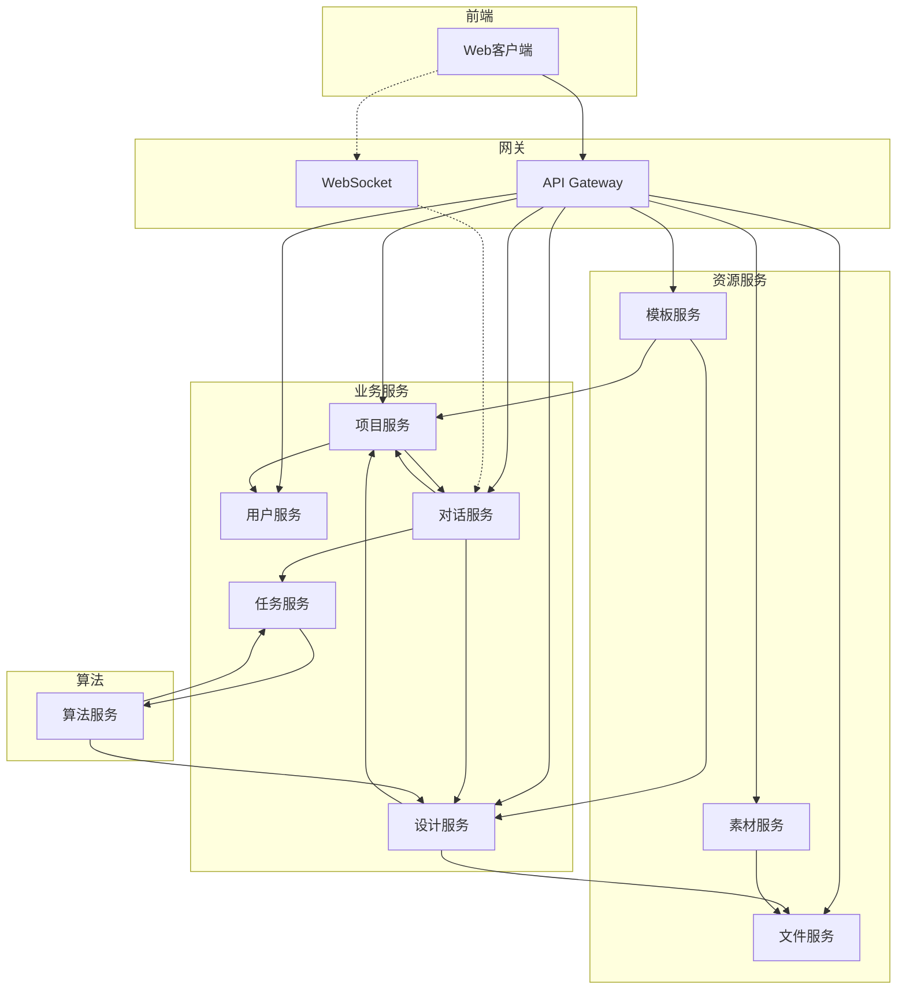
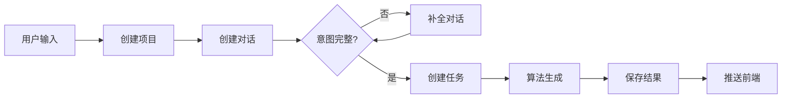

# WPS AI设计室 - 服务调用关系（简化版）

## 1. 服务间依赖关系



## 2. 核心业务流程

### 2.1 创建项目流程



### 2.2 服务调用时序

#### 创建项目
1. Web → Gateway → User Service (验证身份)
2. Gateway → Project Service (创建项目)
3. Project Service → Conversation Service (创建会话)
4. Web → WebSocket (建立连接)

#### 意图补全
1. Conversation Service → Project Service (获取项目信息)
2. Conversation Service → WebSocket → Web (推送问题)
3. Web → WebSocket → Conversation Service (用户回复)
4. 循环直到意图完整（最多3轮）

#### 任务执行
1. Conversation Service → Task Service (创建任务)
2. Task Service → Kafka → Algorithm Service (异步执行)
3. Algorithm Service → Task Service (更新进度)
4. Task Service → Conversation Service → WebSocket → Web (推送进度)
5. Algorithm Service → Design Service (保存结果)
6. Design Service → Conversation Service → WebSocket → Web (推送结果)

#### 图上编辑
1. Web → Gateway → Design Service (更新元素)
2. Design Service → Project Service (验证权限)
3. Design Service → File Service (处理文件)
4. Design Service → Web (返回结果)

## 3. 服务间通信方式

### 3.1 同步调用 (HTTP/gRPC)

| 调用方 | 被调用方 | 场景 |
|--------|----------|------|
| Gateway | 所有服务 | 路由请求 |
| Project Service | User Service | 验证用户 |
| Project Service | Conversation Service | 创建会话 |
| Conversation Service | Project Service | 获取项目 |
| Conversation Service | Task Service | 创建任务 |
| Conversation Service | Design Service | 获取设计 |
| Design Service | File Service | 文件处理 |
| Material Service | File Service | 文件上传 |
| Template Service | Project Service | 创建项目 |

### 3.2 异步调用 (Kafka)

| 生产者 | 消费者 | 消息类型 |
|--------|---------|----------|
| Task Service | Algorithm Service | 生成任务 |
| Algorithm Service | Task Service | 进度更新 |
| Algorithm Service | Design Service | 保存结果 |

### 3.3 实时推送 (WebSocket)

| 推送方 | 接收方 | 内容 |
|--------|---------|------|
| Conversation Service | Web | 对话消息 |
| Conversation Service | Web | 生成进度 |
| Conversation Service | Web | 任务状态 |

## 4. 数据流向

### 4.1 创建项目数据流

```
用户输入 → Project Service → MySQL (项目数据)
         → Conversation Service → Redis (会话状态)
         → Task Service → Kafka (任务队列)
         → Algorithm Service → Design Service → MySQL (设计数据)
                            → File Service → OSS (图片文件)
```

### 4.2 编辑设计数据流

```
画布操作 → Design Service → MySQL (更新元素)
         → File Service → OSS (新增素材)
         → Redis (缓存更新)
```

## 5. 关键设计原则

1. **服务自治**：每个服务管理自己的数据
2. **异步解耦**：耗时操作通过消息队列处理
3. **实时反馈**：WebSocket保证用户体验
4. **容错设计**：服务间调用有重试和降级机制
5. **数据一致性**：最终一致性模型

## 6. 服务调用链路示例

### 生成海报完整链路

```
1. 用户提交需求
   ↓
2. Gateway验证身份 → User Service
   ↓
3. 创建项目 → Project Service
   ↓
4. 创建对话 → Conversation Service
   ↓
5. 意图补全（多轮对话）
   ↓
6. 创建生成任务 → Task Service
   ↓
7. 发送到Kafka消息队列
   ↓
8. Algorithm Service消费任务
   ↓
9. 执行AI生成流程
   ↓
10. 保存结果 → Design Service
    ↓
11. 上传图片 → File Service → OSS
    ↓
12. 通知完成 → Task Service → Conversation Service
    ↓
13. 推送结果 → WebSocket → Web前端
```

这个简化版的服务调用关系图更清晰地展示了各个服务之间的依赖和调用关系，避免了复杂的Mermaid语法问题。