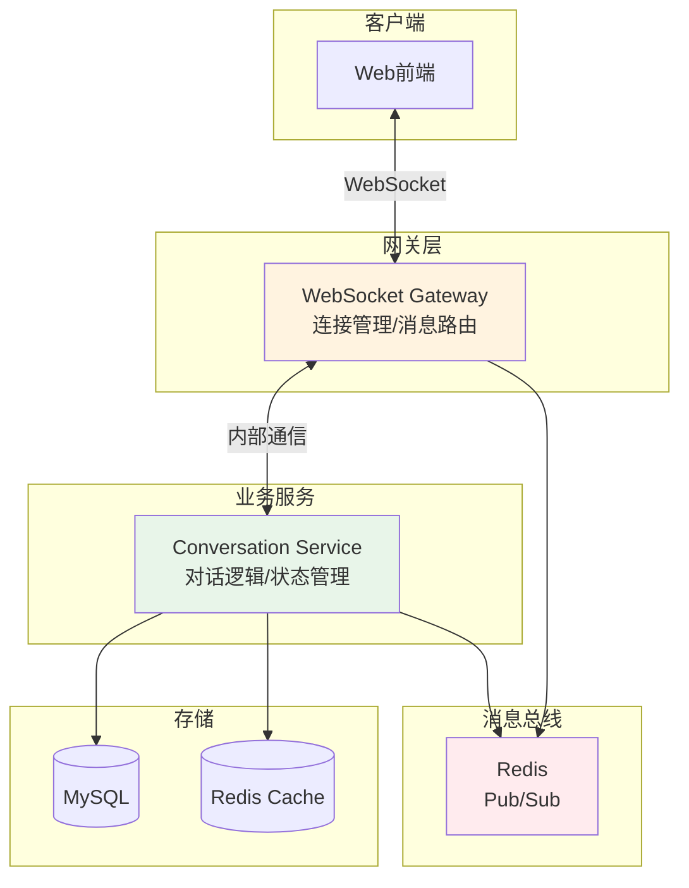
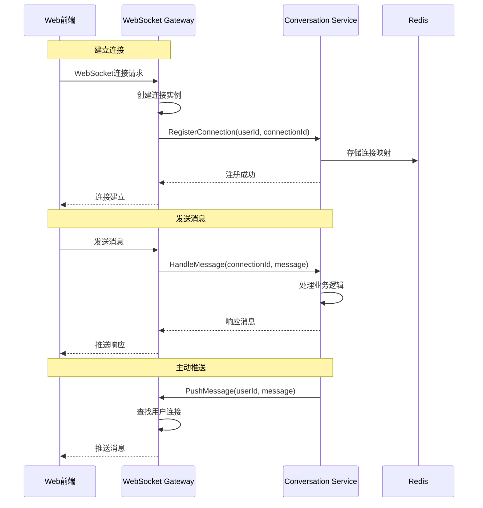
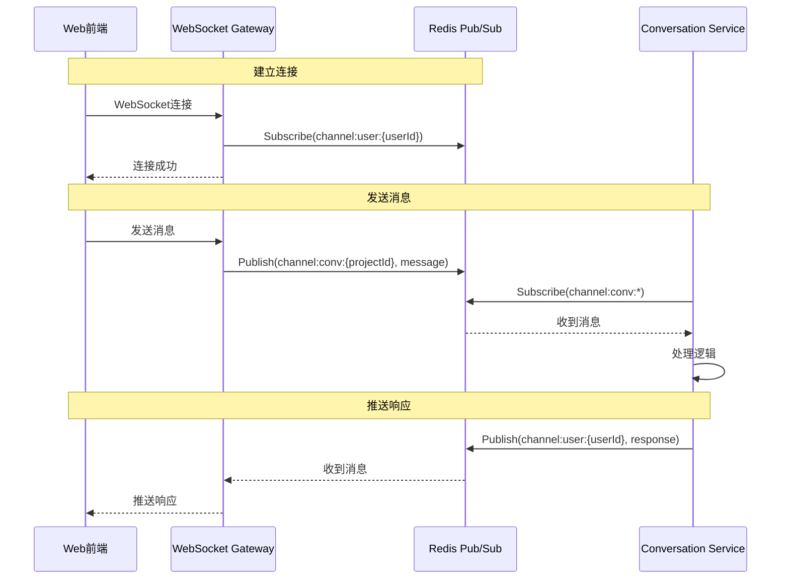

# Conversation Service与WebSocket Gateway交互设计

## 1. 架构概览



## 2. 交互方式设计

### 2.1 方案一：直接RPC调用（推荐）



**实现代码示例：**

```go
// websocket_gateway.go
package gateway

import (
    "github.com/gorilla/websocket"
    "sync"
)

type WebSocketGateway struct {
    connections    map[string]*Connection  // connectionId -> Connection
    userConnMap    map[string][]string    // userId -> []connectionId
    mu             sync.RWMutex
    convService    ConversationServiceClient
}

type Connection struct {
    ID         string
    UserID     string
    ProjectID  string
    Conn       *websocket.Conn
    Send       chan []byte
}

// 处理WebSocket连接
func (g *WebSocketGateway) HandleWebSocket(w http.ResponseWriter, r *http.Request) {
    // 升级连接
    conn, err := upgrader.Upgrade(w, r, nil)
    if err != nil {
        return
    }
    
    // 解析参数
    userID := r.Header.Get("User-ID")
    projectID := r.URL.Query().Get("project_id")
    connectionID := generateConnectionID()
    
    // 创建连接实例
    connection := &Connection{
        ID:        connectionID,
        UserID:    userID,
        ProjectID: projectID,
        Conn:      conn,
        Send:      make(chan []byte, 256),
    }
    
    // 注册连接
    g.registerConnection(connection)
    
    // 通知Conversation Service
    ctx := context.Background()
    _, err = g.convService.RegisterConnection(ctx, &RegisterConnectionRequest{
        ConnectionId: connectionID,
        UserId:      userID,
        ProjectId:   projectID,
    })
    
    // 启动读写协程
    go connection.writePump()
    go connection.readPump(g)
}

// 注册连接
func (g *WebSocketGateway) registerConnection(conn *Connection) {
    g.mu.Lock()
    defer g.mu.Unlock()
    
    g.connections[conn.ID] = conn
    g.userConnMap[conn.UserID] = append(g.userConnMap[conn.UserID], conn.ID)
}

// 处理来自客户端的消息
func (g *WebSocketGateway) handleClientMessage(connID string, message []byte) {
    ctx := context.Background()
    
    // 调用Conversation Service处理消息
    resp, err := g.convService.HandleMessage(ctx, &HandleMessageRequest{
        ConnectionId: connID,
        Message:      message,
    })
    
    if err != nil {
        // 错误处理
        return
    }
    
    // 如果有响应，发送给客户端
    if resp.Response != nil {
        g.sendToConnection(connID, resp.Response)
    }
}

// 发送消息到指定连接
func (g *WebSocketGateway) sendToConnection(connID string, message []byte) {
    g.mu.RLock()
    conn, exists := g.connections[connID]
    g.mu.RUnlock()
    
    if exists {
        select {
        case conn.Send <- message:
        default:
            // 连接阻塞，关闭连接
            g.closeConnection(connID)
        }
    }
}

// 实现推送接口（供Conversation Service调用）
func (g *WebSocketGateway) PushMessage(ctx context.Context, req *PushMessageRequest) (*PushMessageResponse, error) {
    g.mu.RLock()
    connIDs := g.userConnMap[req.UserId]
    g.mu.RUnlock()
    
    successCount := 0
    for _, connID := range connIDs {
        g.sendToConnection(connID, req.Message)
        successCount++
    }
    
    return &PushMessageResponse{
        Success: successCount > 0,
        Count:   int32(successCount),
    }, nil
}
```

```go
// conversation_service.go
package service

type ConversationService struct {
    wsGateway      WebSocketGatewayClient
    redis          *redis.Client
    db             *gorm.DB
    activeConvs    map[string]*ConversationContext
    mu             sync.RWMutex
}

// 注册WebSocket连接
func (s *ConversationService) RegisterConnection(ctx context.Context, req *RegisterConnectionRequest) (*RegisterConnectionResponse, error) {
    // 存储连接信息到Redis
    connInfo := map[string]interface{}{
        "user_id":    req.UserId,
        "project_id": req.ProjectId,
        "created_at": time.Now().Unix(),
    }
    
    key := fmt.Sprintf("ws:conn:%s", req.ConnectionId)
    err := s.redis.HMSet(ctx, key, connInfo).Err()
    if err != nil {
        return nil, err
    }
    
    // 设置过期时间（24小时）
    s.redis.Expire(ctx, key, 24*time.Hour)
    
    // 加载或创建对话上下文
    s.loadConversationContext(req.ProjectId)
    
    return &RegisterConnectionResponse{Success: true}, nil
}

// 处理客户端消息
func (s *ConversationService) HandleMessage(ctx context.Context, req *HandleMessageRequest) (*HandleMessageResponse, error) {
    // 获取连接信息
    connKey := fmt.Sprintf("ws:conn:%s", req.ConnectionId)
    connInfo := s.redis.HGetAll(ctx, connKey).Val()
    
    if len(connInfo) == 0 {
        return nil, errors.New("connection not found")
    }
    
    userID := connInfo["user_id"]
    projectID := connInfo["project_id"]
    
    // 解析消息
    var msg ClientMessage
    if err := json.Unmarshal(req.Message, &msg); err != nil {
        return nil, err
    }
    
    // 获取对话上下文
    conv := s.getConversationContext(projectID)
    if conv == nil {
        return nil, errors.New("conversation not found")
    }
    
    // 处理消息
    response, err := s.processMessage(ctx, conv, userID, msg)
    if err != nil {
        return nil, err
    }
    
    // 保存消息历史
    s.saveMessage(ctx, projectID, userID, msg, response)
    
    // 返回响应
    respData, _ := json.Marshal(response)
    return &HandleMessageResponse{
        Response: respData,
    }, nil
}

// 主动推送消息
func (s *ConversationService) pushToUser(ctx context.Context, userID string, message interface{}) error {
    data, err := json.Marshal(message)
    if err != nil {
        return err
    }
    
    // 调用WebSocket Gateway推送
    _, err = s.wsGateway.PushMessage(ctx, &PushMessageRequest{
        UserId:  userID,
        Message: data,
    })
    
    return err
}

// 处理业务逻辑并推送进度
func (s *ConversationService) handleGenerationTask(ctx context.Context, task *Task) {
    userID := task.UserID
    
    // 推送开始状态
    s.pushToUser(ctx, userID, &StatusMessage{
        Type:    "task_started",
        TaskID:  task.ID,
        Message: "开始生成设计...",
    })
    
    // 模拟进度更新
    for progress := 10; progress <= 100; progress += 10 {
        time.Sleep(1 * time.Second)
        
        s.pushToUser(ctx, userID, &ProgressMessage{
            Type:       "progress_update",
            TaskID:     task.ID,
            Progress:   progress,
            Message:    fmt.Sprintf("生成中...%d%%", progress),
        })
    }
    
    // 推送完成状态
    s.pushToUser(ctx, userID, &CompleteMessage{
        Type:    "task_completed",
        TaskID:  task.ID,
        Result:  task.Result,
        Message: "生成完成！",
    })
}
```

### 2.2 方案二：通过Redis Pub/Sub（备选）



**Redis Pub/Sub实现示例：**

```go
// websocket_gateway_pubsub.go
func (g *WebSocketGateway) setupRedisPubSub() {
    // 为每个用户连接订阅专属频道
    go func() {
        pubsub := g.redis.PSubscribe(ctx, "channel:user:*")
        defer pubsub.Close()
        
        ch := pubsub.Channel()
        for msg := range ch {
            // 解析频道名获取userId
            parts := strings.Split(msg.Channel, ":")
            if len(parts) >= 3 {
                userID := parts[2]
                g.broadcastToUser(userID, msg.Payload)
            }
        }
    }()
}

// conversation_service_pubsub.go
func (s *ConversationService) setupRedisPubSub() {
    // 订阅所有对话频道
    go func() {
        pubsub := s.redis.PSubscribe(ctx, "channel:conv:*")
        defer pubsub.Close()
        
        ch := pubsub.Channel()
        for msg := range ch {
            // 解析频道名获取projectId
            parts := strings.Split(msg.Channel, ":")
            if len(parts) >= 3 {
                projectID := parts[2]
                s.handleChannelMessage(projectID, msg.Payload)
            }
        }
    }()
}

func (s *ConversationService) pushToUser(ctx context.Context, userID string, message interface{}) error {
    data, _ := json.Marshal(message)
    channel := fmt.Sprintf("channel:user:%s", userID)
    return s.redis.Publish(ctx, channel, data).Err()
}
```

## 3. 消息类型定义

### 3.1 客户端消息

```go
// 客户端发送的消息类型
type ClientMessage struct {
    Type      string                 `json:"type"`      // chat/command/action
    Content   string                 `json:"content"`   // 消息内容
    Metadata  map[string]interface{} `json:"metadata"`  // 附加数据
    Timestamp int64                  `json:"timestamp"`
}

// 聊天消息
type ChatMessage struct {
    Type        string   `json:"type"`        // "chat"
    Content     string   `json:"content"`     // 用户输入
    Attachments []string `json:"attachments"` // 附件URL
    ReplyTo     string   `json:"reply_to"`    // 回复的消息ID
}

// 命令消息
type CommandMessage struct {
    Type    string                 `json:"type"`    // "command"
    Command string                 `json:"command"` // 命令类型
    Args    map[string]interface{} `json:"args"`    // 命令参数
}
```

### 3.2 服务端消息

```go
// 服务端推送的消息类型
type ServerMessage struct {
    Type      string      `json:"type"`
    Data      interface{} `json:"data"`
    Timestamp int64       `json:"timestamp"`
}

// AI回复消息
type AIReplyMessage struct {
    Type      string `json:"type"`       // "ai_reply"
    MessageID string `json:"message_id"`
    Content   string `json:"content"`
    Thinking  string `json:"thinking"`   // AI的思考过程
    NeedMore  bool   `json:"need_more"`  // 是否需要更多信息
}

// 进度更新消息
type ProgressMessage struct {
    Type     string  `json:"type"`     // "progress"
    TaskID   string  `json:"task_id"`
    Phase    string  `json:"phase"`    // 当前阶段
    Progress float64 `json:"progress"` // 0-100
    Message  string  `json:"message"`
}

// 状态变更消息
type StatusMessage struct {
    Type    string                 `json:"type"`   // "status"
    Status  string                 `json:"status"` // 新状态
    Details map[string]interface{} `json:"details"`
}

// 错误消息
type ErrorMessage struct {
    Type    string `json:"type"`    // "error"
    Code    string `json:"code"`
    Message string `json:"message"`
    Retry   bool   `json:"retry"`   // 是否可重试
}
```

## 4. 连接管理

### 4.1 连接生命周期

```go
// 连接状态
type ConnectionState int

const (
    StateConnecting ConnectionState = iota
    StateConnected
    StateReconnecting
    StateDisconnected
)

// 连接管理器
type ConnectionManager struct {
    connections map[string]*ConnectionInfo
    mu          sync.RWMutex
}

type ConnectionInfo struct {
    ID            string
    UserID        string
    ProjectID     string
    State         ConnectionState
    ConnectedAt   time.Time
    LastPingAt    time.Time
    LastMessageAt time.Time
}

// 心跳保活
func (c *Connection) startHeartbeat() {
    ticker := time.NewTicker(30 * time.Second)
    defer ticker.Stop()
    
    for {
        select {
        case <-ticker.C:
            if err := c.Conn.WriteMessage(websocket.PingMessage, nil); err != nil {
                return
            }
        case <-c.done:
            return
        }
    }
}
```

### 4.2 断线重连处理

```go
// 客户端重连逻辑
class WebSocketClient {
    constructor(url) {
        this.url = url;
        this.reconnectAttempts = 0;
        this.maxReconnectAttempts = 5;
        this.reconnectDelay = 1000; // 初始延迟1秒
    }
    
    connect() {
        this.ws = new WebSocket(this.url);
        
        this.ws.onopen = () => {
            console.log('WebSocket connected');
            this.reconnectAttempts = 0;
            this.reconnectDelay = 1000;
            
            // 恢复会话
            this.sendMessage({
                type: 'resume',
                sessionId: this.sessionId
            });
        };
        
        this.ws.onclose = () => {
            console.log('WebSocket disconnected');
            this.scheduleReconnect();
        };
        
        this.ws.onerror = (error) => {
            console.error('WebSocket error:', error);
        };
        
        this.ws.onmessage = (event) => {
            this.handleMessage(JSON.parse(event.data));
        };
    }
    
    scheduleReconnect() {
        if (this.reconnectAttempts >= this.maxReconnectAttempts) {
            console.error('Max reconnection attempts reached');
            return;
        }
        
        this.reconnectAttempts++;
        setTimeout(() => {
            console.log(`Reconnecting... (attempt ${this.reconnectAttempts})`);
            this.connect();
        }, this.reconnectDelay);
        
        // 指数退避
        this.reconnectDelay = Math.min(this.reconnectDelay * 2, 30000);
    }
}
```

## 5. 性能优化

### 5.1 消息批处理

```go
// 批量消息发送
type MessageBatcher struct {
    messages  [][]byte
    mu        sync.Mutex
    timer     *time.Timer
    batchSize int
    maxDelay  time.Duration
}

func (b *MessageBatcher) Add(message []byte) {
    b.mu.Lock()
    defer b.mu.Unlock()
    
    b.messages = append(b.messages, message)
    
    if len(b.messages) >= b.batchSize {
        b.flush()
    } else if b.timer == nil {
        b.timer = time.AfterFunc(b.maxDelay, b.flush)
    }
}

func (b *MessageBatcher) flush() {
    if len(b.messages) == 0 {
        return
    }
    
    // 批量发送
    batch := &BatchMessage{
        Messages: b.messages,
    }
    
    // 发送批量消息
    b.send(batch)
    
    // 清空缓冲区
    b.messages = nil
    b.timer = nil
}
```

### 5.2 消息压缩

```go
// 消息压缩中间件
func compressionMiddleware(next HandlerFunc) HandlerFunc {
    return func(conn *Connection, message []byte) {
        // 如果消息大于1KB，进行压缩
        if len(message) > 1024 {
            compressed := compress(message)
            conn.Send <- &CompressedMessage{
                Type:       "compressed",
                Original:   len(message),
                Compressed: compressed,
            }
        } else {
            next(conn, message)
        }
    }
}
```

## 6. 监控和日志

### 6.1 关键指标

```go
var (
    // WebSocket连接指标
    wsConnections = prometheus.NewGaugeVec(
        prometheus.GaugeOpts{
            Name: "websocket_connections_total",
            Help: "Total number of WebSocket connections",
        },
        []string{"status"},
    )
    
    // 消息指标
    wsMessages = prometheus.NewCounterVec(
        prometheus.CounterOpts{
            Name: "websocket_messages_total",
            Help: "Total number of WebSocket messages",
        },
        []string{"direction", "type"},
    )
    
    // 延迟指标
    wsLatency = prometheus.NewHistogramVec(
        prometheus.HistogramOpts{
            Name: "websocket_message_latency_seconds",
            Help: "WebSocket message processing latency",
        },
        []string{"type"},
    )
)
```

### 6.2 日志记录

```go
// 结构化日志
func (g *WebSocketGateway) logMessage(level, event string, fields map[string]interface{}) {
    log.WithFields(log.Fields{
        "service":   "websocket_gateway",
        "event":     event,
        "timestamp": time.Now().Unix(),
    }).WithFields(fields).Log(level)
}

// 使用示例
g.logMessage("info", "connection_established", map[string]interface{}{
    "user_id":       userID,
    "connection_id": connID,
    "project_id":    projectID,
})
```

## 7. 错误处理

### 7.1 错误类型

```go
type WSError struct {
    Code    string `json:"code"`
    Message string `json:"message"`
    Retry   bool   `json:"retry"`
}

var (
    ErrConnectionNotFound = &WSError{
        Code:    "CONN_NOT_FOUND",
        Message: "Connection not found",
        Retry:   false,
    }
    
    ErrMessageTooLarge = &WSError{
        Code:    "MSG_TOO_LARGE",
        Message: "Message exceeds size limit",
        Retry:   false,
    }
    
    ErrRateLimitExceeded = &WSError{
        Code:    "RATE_LIMIT",
        Message: "Rate limit exceeded",
        Retry:   true,
    }
)
```

### 7.2 错误恢复

```go
// 错误恢复中间件
func errorRecovery(next HandlerFunc) HandlerFunc {
    return func(conn *Connection, message []byte) {
        defer func() {
            if r := recover(); r != nil {
                log.Errorf("Panic recovered: %v", r)
                
                // 发送错误消息给客户端
                errMsg := &ErrorMessage{
                    Type:    "error",
                    Code:    "INTERNAL_ERROR",
                    Message: "Internal server error",
                }
                
                data, _ := json.Marshal(errMsg)
                conn.Send <- data
            }
        }()
        
        next(conn, message)
    }
}
```

这个设计确保了Conversation Service和WebSocket Gateway之间的高效交互，支持实时的双向通信，同时提供了良好的错误处理和性能优化机制。