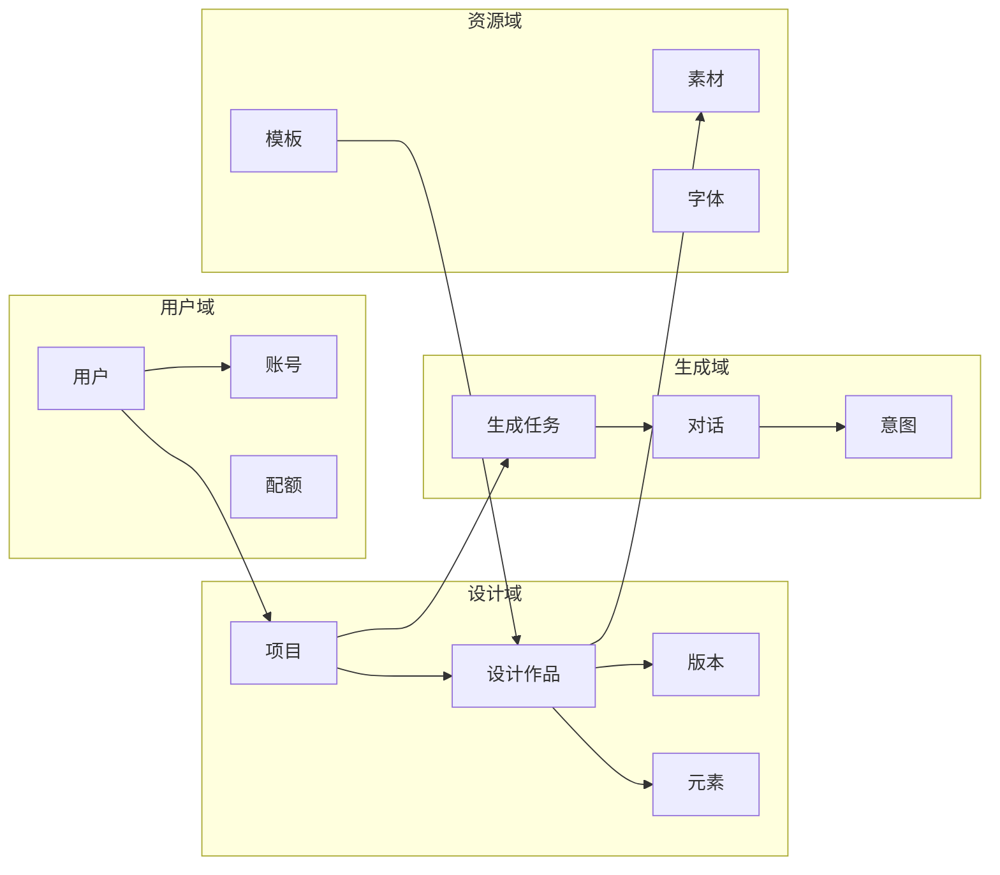
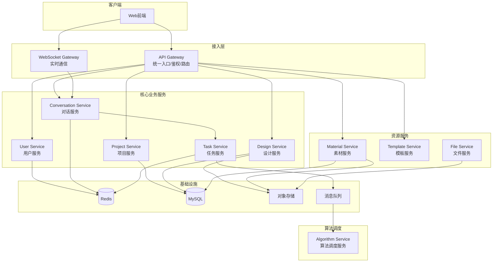
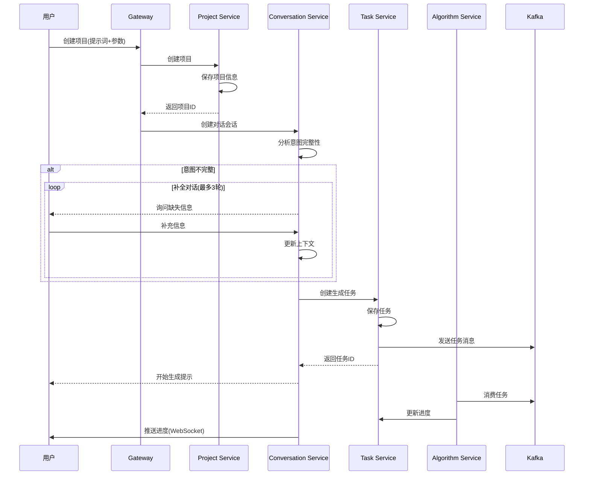
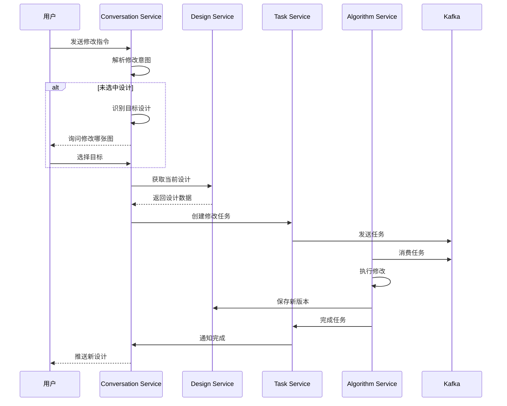
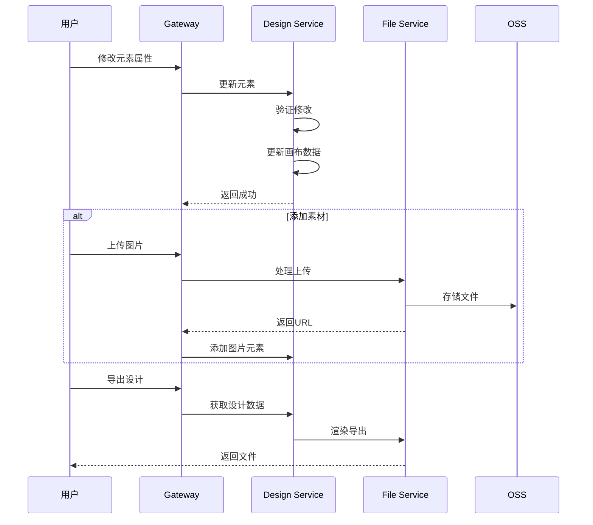

# WPS AI设计室 - 微服务架构设计

## 1. 业务分析与服务划分

基于产品需求，系统的核心业务流程为：
- 意图输入 → 意图补全 → 初稿生成 → 二次编辑（多轮对话/图上编辑）

### 1.1 领域模型



## 2. 微服务架构设计

### 2.1 整体架构图



### 2.2 服务职责详解

#### 2.2.1 User Service（用户服务）

**核心职责**：
- 用户认证（对接WPS账号体系）
- 用户信息管理
- 配额管理（预留）
- 权限控制（预留）

**数据模型**：
```go
// 用户信息
type User struct {
    ID          string    `json:"id"`
    WpsUID      string    `json:"wps_uid"`      // WPS账号ID
    Nickname    string    `json:"nickname"`     
    Avatar      string    `json:"avatar"`
    Email       string    `json:"email"`
    Phone       string    `json:"phone"`
    Status      string    `json:"status"`       // active/blocked
    CreatedAt   time.Time `json:"created_at"`
    UpdatedAt   time.Time `json:"updated_at"`
}

// 用户偏好设置
type UserPreference struct {
    UserID              string   `json:"user_id"`
    DefaultStyle        string   `json:"default_style"`        // 默认风格
    DefaultDimensions   []string `json:"default_dimensions"`   // 常用尺寸
    RecentColors        []string `json:"recent_colors"`        // 最近使用的颜色
    CustomDimensions    []Dimension `json:"custom_dimensions"` // 自定义尺寸
}

// 用户会话
type UserSession struct {
    SessionID   string    `json:"session_id"`
    UserID      string    `json:"user_id"`
    Token       string    `json:"token"`
    ExpireAt    time.Time `json:"expire_at"`
}
```

**核心接口**：
```yaml
# 用户认证
POST /api/v1/auth/login
POST /api/v1/auth/logout
POST /api/v1/auth/refresh

# 用户信息
GET  /api/v1/users/profile
PUT  /api/v1/users/profile
GET  /api/v1/users/preferences
PUT  /api/v1/users/preferences
```

#### 2.2.2 Project Service（项目服务）

**核心职责**：
- 项目创建和管理
- 项目列表和搜索
- 项目分享（预留）
- 项目协作（预留）

**数据模型**：
```go
// 项目
type Project struct {
    ID          string    `json:"id"`
    UserID      string    `json:"user_id"`
    Name        string    `json:"name"`
    Type        string    `json:"type"`         // poster/social_cover/social_page
    Status      string    `json:"status"`       // draft/completed
    PreviewURL  string    `json:"preview_url"`  // 预览图
    Metadata    ProjectMeta `json:"metadata"`
    CreatedAt   time.Time `json:"created_at"`
    UpdatedAt   time.Time `json:"updated_at"`
}

// 项目元数据
type ProjectMeta struct {
    MaterialType    string   `json:"material_type"`    // 物料类型
    Dimensions      Dimension `json:"dimensions"`      // 尺寸
    InitialPrompt   string   `json:"initial_prompt"`   // 初始提示词
    ReferenceImages []string `json:"reference_images"` // 参考图
    Materials       []string `json:"materials"`        // 使用的素材
    Documents       []string `json:"documents"`        // 参考文档
}
```

**核心接口**：
```yaml
# 项目管理
POST /api/v1/projects            # 创建项目
GET  /api/v1/projects            # 项目列表
GET  /api/v1/projects/:id        # 项目详情
PUT  /api/v1/projects/:id        # 更新项目
DELETE /api/v1/projects/:id      # 删除项目

# 项目搜索
GET  /api/v1/projects/search     # 搜索项目
```

#### 2.2.3 Design Service（设计服务）

**核心职责**：
- 设计作品管理
- 版本控制
- 元素管理
- 画布操作

**数据模型**：
```go
// 设计作品
type Design struct {
    ID          string    `json:"id"`
    ProjectID   string    `json:"project_id"`
    Version     int       `json:"version"`      // 版本号
    Name        string    `json:"name"`         // 作品名称
    Status      string    `json:"status"`       // draft/final
    Canvas      Canvas    `json:"canvas"`       // 画布数据
    PreviewURL  string    `json:"preview_url"`
    SourceURL   string    `json:"source_url"`   // 源文件
    Metadata    DesignMeta `json:"metadata"`
    CreatedAt   time.Time `json:"created_at"`
}

// 画布数据
type Canvas struct {
    Width       int        `json:"width"`
    Height      int        `json:"height"`
    Background  Background `json:"background"`
    Elements    []Element  `json:"elements"`     // 所有元素
}

// 元素
type Element struct {
    ID          string     `json:"id"`
    Type        string     `json:"type"`         // text/image/shape
    Layer       int        `json:"layer"`        // 图层顺序
    Position    Position   `json:"position"`     // 位置
    Size        Size       `json:"size"`         // 尺寸
    Rotation    float64    `json:"rotation"`     // 旋转角度
    Style       StyleProps `json:"style"`        // 样式属性
    Content     Content    `json:"content"`      // 内容
    Editable    bool       `json:"editable"`     // 是否可编辑
    Locked      bool       `json:"locked"`       // 是否锁定
}

// 文字样式
type TextStyle struct {
    FontFamily  string  `json:"font_family"`
    FontSize    int     `json:"font_size"`
    FontWeight  string  `json:"font_weight"`
    FontStyle   string  `json:"font_style"`
    Color       string  `json:"color"`
    Alignment   string  `json:"alignment"`
    LineHeight  float64 `json:"line_height"`
    Opacity     float64 `json:"opacity"`
}
```

**核心接口**：
```yaml
# 设计管理
POST /api/v1/designs                      # 创建设计
GET  /api/v1/projects/:projectId/designs # 获取项目的所有设计
GET  /api/v1/designs/:id                  # 获取设计详情
PUT  /api/v1/designs/:id                  # 更新设计
DELETE /api/v1/designs/:id                # 删除设计

# 元素操作
POST /api/v1/designs/:id/elements         # 添加元素
PUT  /api/v1/designs/:id/elements/:elemId # 更新元素
DELETE /api/v1/designs/:id/elements/:elemId # 删除元素

# 版本管理
GET  /api/v1/designs/:id/versions         # 获取版本历史
POST /api/v1/designs/:id/versions         # 创建新版本
```

#### 2.2.4 Conversation Service（对话服务）

**核心职责**：
- 管理多轮对话
- 意图识别和补全
- 对话历史记录
- 实时消息推送

**数据模型**：
```go
// 对话会话
type Conversation struct {
    ID          string    `json:"id"`
    ProjectID   string    `json:"project_id"`
    UserID      string    `json:"user_id"`
    Status      string    `json:"status"`       // active/completed
    Messages    []Message `json:"messages"`
    Context     Context   `json:"context"`      // 对话上下文
    CreatedAt   time.Time `json:"created_at"`
    UpdatedAt   time.Time `json:"updated_at"`
}

// 消息
type Message struct {
    ID          string      `json:"id"`
    Role        string      `json:"role"`         // user/assistant/system
    Content     string      `json:"content"`
    Attachments []Attachment `json:"attachments"`  // 附件
    Metadata    MessageMeta  `json:"metadata"`
    Timestamp   time.Time   `json:"timestamp"`
}

// 对话上下文
type Context struct {
    CurrentPhase    string                 `json:"current_phase"`    // 当前阶段
    IntentComplete  bool                   `json:"intent_complete"`  // 意图是否完整
    MissingInfo     []string               `json:"missing_info"`     // 缺失信息
    ExtractedInfo   map[string]interface{} `json:"extracted_info"`   // 已提取信息
    SelectedDesign  string                 `json:"selected_design"`  // 当前选中的设计
}
```

**核心接口**：
```yaml
# 对话管理
POST /api/v1/conversations                    # 创建对话
GET  /api/v1/conversations/:id                # 获取对话详情
POST /api/v1/conversations/:id/messages       # 发送消息
GET  /api/v1/conversations/:id/messages       # 获取消息历史

# WebSocket接口
WS   /ws/conversations/:id                    # 实时对话连接
```

#### 2.2.5 Task Service（任务服务）

**核心职责**：
- 生成任务管理
- 任务调度
- 进度跟踪
- 结果回调

**数据模型**：
```go
// 生成任务
type GenerationTask struct {
    ID              string    `json:"id"`
    ConversationID  string    `json:"conversation_id"`
    ProjectID       string    `json:"project_id"`
    Type            string    `json:"type"`          // generate/modify/batch
    Status          string    `json:"status"`        // pending/processing/completed/failed
    Progress        Progress  `json:"progress"`
    Input           TaskInput `json:"input"`         // 输入参数
    Result          TaskResult `json:"result"`       // 生成结果
    CreatedAt       time.Time `json:"created_at"`
    CompletedAt     *time.Time `json:"completed_at"`
}

// 任务输入
type TaskInput struct {
    Prompt          string         `json:"prompt"`
    Style           string         `json:"style"`
    Dimensions      Dimension      `json:"dimensions"`
    Elements        []ElementSpec  `json:"elements"`       // 必需元素
    ColorScheme     []string       `json:"color_scheme"`
    ReferenceImages []string       `json:"reference_images"`
    Materials       []MaterialSpec `json:"materials"`      // 素材规格
    ExtractedTexts  []string       `json:"extracted_texts"` // 从文档提取的文本
}

// 任务进度
type Progress struct {
    Phase       string  `json:"phase"`        // 当前阶段
    Percentage  int     `json:"percentage"`   // 百分比
    Message     string  `json:"message"`      // 进度消息
}
```

**核心接口**：
```yaml
# 任务管理
POST /api/v1/tasks                    # 创建任务
GET  /api/v1/tasks/:id                # 获取任务详情
GET  /api/v1/tasks/:id/status         # 获取任务状态
PUT  /api/v1/tasks/:id/cancel         # 取消任务

# 算法端回调
PUT  /api/v1/tasks/:id/progress       # 更新进度
POST /api/v1/tasks/:id/complete       # 完成任务
```

#### 2.2.6 Material Service（素材服务）

**核心职责**：
- 用户素材管理
- 素材分类和搜索
- 素材使用记录
- 存储空间管理

**数据模型**：
```go
// 素材
type Material struct {
    ID          string    `json:"id"`
    UserID      string    `json:"user_id"`
    Name        string    `json:"name"`
    Type        string    `json:"type"`         // image/icon/illustration
    Category    string    `json:"category"`     // 分类
    FileURL     string    `json:"file_url"`
    ThumbURL    string    `json:"thumb_url"`    // 缩略图
    FileSize    int64     `json:"file_size"`
    Metadata    MaterialMeta `json:"metadata"`
    Usage       []UsageRecord `json:"usage"`     // 使用记录
    CreatedAt   time.Time `json:"created_at"`
}

// 素材元数据
type MaterialMeta struct {
    Width       int      `json:"width"`
    Height      int      `json:"height"`
    Format      string   `json:"format"`
    Tags        []string `json:"tags"`
    Purpose     string   `json:"purpose"`      // 用途说明
}
```

**核心接口**：
```yaml
# 素材管理
POST /api/v1/materials                # 上传素材
GET  /api/v1/materials                # 素材列表
GET  /api/v1/materials/:id            # 素材详情
PUT  /api/v1/materials/:id            # 更新素材信息
DELETE /api/v1/materials/:id          # 删除素材

# 素材搜索
GET  /api/v1/materials/search         # 搜索素材
GET  /api/v1/materials/recent         # 最近使用
```

#### 2.2.7 Template Service（模板服务）

**核心职责**：
- 模板管理
- 样例展示
- 模板分类
- 使用统计

**数据模型**：
```go
// 模板
type Template struct {
    ID          string    `json:"id"`
    Name        string    `json:"name"`
    Type        string    `json:"type"`         // 物料类型
    Category    string    `json:"category"`     // 分类
    PreviewURL  string    `json:"preview_url"`
    Prompt      string    `json:"prompt"`       // 提示词
    Style       string    `json:"style"`        // 风格
    Tags        []string  `json:"tags"`
    Usage       int       `json:"usage"`        // 使用次数
    DemoData    DemoData  `json:"demo_data"`    // 演示数据
    CreatedAt   time.Time `json:"created_at"`
}

// 演示数据
type DemoData struct {
    Conversation    []Message `json:"conversation"`     // 对话记录
    GeneratedDesigns []string `json:"generated_designs"` // 生成的设计
}
```

**核心接口**：
```yaml
# 模板管理
GET  /api/v1/templates                # 模板列表
GET  /api/v1/templates/:id            # 模板详情
GET  /api/v1/templates/:id/demo       # 获取演示数据
POST /api/v1/templates/:id/use        # 使用模板
```

#### 2.2.8 File Service（文件服务）

**核心职责**：
- 文件上传下载
- 格式转换
- 图片处理
- CDN管理

**核心接口**：
```yaml
# 文件操作
POST /api/v1/files/upload             # 上传文件
GET  /api/v1/files/:id                # 下载文件
POST /api/v1/files/upload-token       # 获取上传凭证

# 图片处理
POST /api/v1/images/process           # 图片处理（抠图、压缩等）
POST /api/v1/images/extract-text      # 文档文字提取
```

## 3. 核心流程实现

### 3.1 项目创建与意图补全流程



### 3.2 多轮对话修改流程



### 3.3 图上编辑流程



## 4. 技术选型建议

### 4.1 服务框架
- **Go服务**：Gin + gRPC
- **WebSocket**：gorilla/websocket
- **任务队列**：Kafka
- **缓存**：Redis

### 4.2 存储方案
- **MySQL**：业务数据
- **Redis**：会话、缓存、实时状态
- **OSS**：文件存储（图片、素材、导出文件）

### 4.3 部署架构
```yaml
# Kubernetes部署示例
apiVersion: apps/v1
kind: Deployment
metadata:
  name: conversation-service
spec:
  replicas: 3
  selector:
    matchLabels:
      app: conversation-service
  template:
    metadata:
      labels:
        app: conversation-service
    spec:
      containers:
      - name: service
        image: wps-ai-design/conversation-service:latest
        ports:
        - containerPort: 8080
        - containerPort: 9090
        env:
        - name: SERVICE_NAME
          value: "conversation-service"
        - name: REDIS_URL
          value: "redis://redis:6379"
```

## 5. 扩展性考虑

### 5.1 功能扩展点
- **批量生成**：Task Service支持批量任务
- **协作功能**：Project Service添加协作者管理
- **商业化**：User Service添加配额和计费
- **内容审核**：增加审核服务

### 5.2 性能优化
- **缓存策略**：热门模板、用户偏好缓存
- **异步处理**：生成任务异步化
- **CDN加速**：静态资源CDN分发
- **限流降级**：API网关限流

### 5.3 监控指标
- 生成任务成功率
- 平均生成时间
- 对话轮次分布
- 模板使用率
- 用户活跃度

这个微服务设计充分考虑了WPS AI设计室的业务特点，通过合理的服务划分，既保证了系统的可扩展性，又避免了过度设计。每个服务都有明确的职责边界，便于团队并行开发和独立部署。